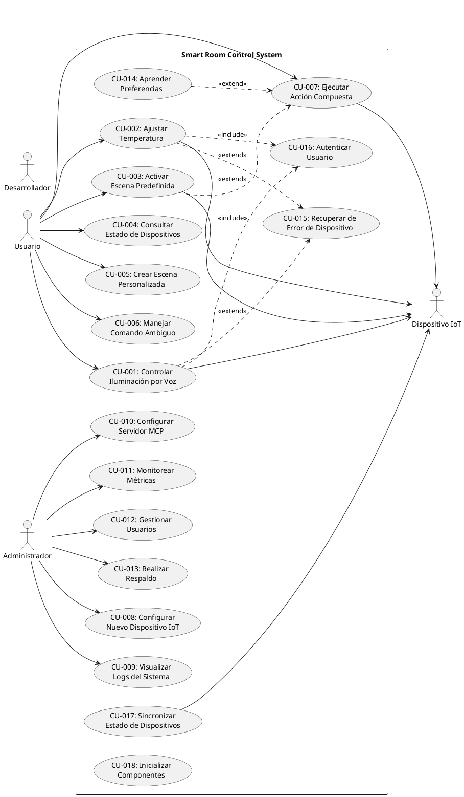

# Casos de Uso
## Smart Room Control System (SRCS)

**Universidad Tecnológica de Panamá**
**Facultad de Ingeniería de Sistemas Computacionales**

**Autores:** Alejandro Mosquera, Victor Rodríguez
**Versión:** 1.0
**Fecha:** Enero 2025

---

## Tabla de Contenido

1. [Introducción](#1-introducción)
2. [Diagrama General de Casos de Uso](#2-diagrama-general-de-casos-de-uso)
3. [Casos de Uso - Interacción con Usuario](#3-casos-de-uso---interacción-con-usuario)
4. [Casos de Uso - Administración](#4-casos-de-uso---administración)
5. [Casos de Uso - Sistema](#5-casos-de-uso---sistema)
6. [Estado de Implementación en mcp-client](#6-estado-de-implementación-en-mcp-client)
7. [Resumen de Casos de Uso](#7-resumen-de-casos-de-uso)
8. [Mapeo con Historias de Usuario](#8-mapeo-con-historias-de-usuario)

---

## 1. Introducción

Este documento especifica los **casos de uso** del Smart Room Control System (SRCS), describiendo las interacciones entre actores externos y el sistema para lograr objetivos específicos.

### 1.1 Propósito

- Documentar las funcionalidades del sistema desde la perspectiva de interacciones actor-sistema
- Proporcionar base para diseño de pruebas de sistema
- Guiar el desarrollo de diagramas de secuencia
- Facilitar la validación de requisitos con stakeholders

### 1.2 Actores

- **Usuario**: Persona que utiliza el Smart Room mediante comandos de voz o texto
- **Administrador**: Responsable de configurar y mantener el sistema
- **Sistema Externo**: Dispositivos IoT que ejecutan acciones físicas
- **LLM Agent**: Componente interno que procesa lenguaje natural
- **MCP Coordinator**: Componente interno que gestiona servidores MCP

### 1.3 Formato de Casos de Uso

Cada caso de uso incluye:
- **ID y Título**: Identificador único y nombre descriptivo
- **Actores**: Quién inicia y participa en el caso de uso
- **Descripción**: Resumen breve del objetivo
- **Precondiciones**: Estado del sistema antes de la interacción
- **Flujo Principal**: Secuencia de pasos en escenario exitoso
- **Flujos Alternativos**: Variaciones del flujo principal
- **Flujos de Excepción**: Manejo de errores y situaciones anormales
- **Postcondiciones**: Estado del sistema después de la interacción
- **Frecuencia de Uso**: Estimación de cuán a menudo ocurre
- **Requisitos Relacionados**: Referencias a RF-XXX, RNF-XXX
- **Historias de Usuario**: Referencias a HU-XXX

---

## 2. Diagrama General de Casos de Uso



---

## 3. Casos de Uso - Interacción con Usuario

### CU-001: Controlar Iluminación por Comando de Voz

**Actores**: Usuario (primario), LLM Agent, MCP Lighting Server, Dispositivo de Iluminación

**Descripción**: El usuario controla la iluminación del Smart Room mediante comandos de voz en lenguaje natural.

**Precondiciones**:
- El sistema está en ejecución
- Al menos un dispositivo de iluminación está conectado y operativo
- El micrófono está disponible y funcional

**Flujo Principal**:
1. El usuario emite comando de voz: "Enciende las luces de la sala"
2. El sistema captura el audio mediante Whisper STT
3. El LLM Agent procesa el texto y determina la intención: control de iluminación
4. El LLM Agent identifica el dispositivo objetivo: "luces de la sala"
5. El MCP Coordinator invoca la herramienta `lighting_turn_on()` del MCP Lighting Server
6. El MCP Lighting Server se comunica con el dispositivo vía conector IoT (Philips Hue API)
7. El dispositivo ejecuta la acción y confirma el cambio de estado
8. El MCP Lighting Server retorna resultado exitoso al MCP Coordinator
9. El LLM Agent genera respuesta natural: "He encendido las luces de la sala"
10. El sistema reproduce la respuesta mediante TTS
11. El sistema registra la acción en `action_logs`

**Flujos Alternativos**:

**FA-1: Ajustar Brillo**
- En paso 1, el usuario dice: "Pon las luces al 50%"
- En paso 5, se invoca `lighting_set_brightness(device_id="sala", level=50)`
- El flujo continúa en paso 6

**FA-2: Cambiar Color**
- En paso 1, el usuario dice: "Cambia las luces a azul"
- En paso 5, se invoca `lighting_set_color(device_id="sala", color="blue")`
- El flujo continúa en paso 6

**FA-3: Apagar Luces**
- En paso 1, el usuario dice: "Apaga las luces"
- En paso 5, se invoca `lighting_turn_off(device_id="sala")`
- El flujo continúa en paso 6

**Flujos de Excepción**:

**FE-1: Dispositivo No Disponible**
- En paso 7, el dispositivo no responde (timeout después de 5 segundos)
- El MCP Lighting Server retorna error: "Device unreachable"
- El LLM Agent genera respuesta: "No pude conectar con las luces de la sala. ¿Quieres que intente de nuevo?"
- El sistema espera confirmación del usuario
- Si el usuario confirma, el sistema reintenta (máximo 3 intentos)
- Si falla nuevamente, el sistema registra el error y termina

**FE-2: Comando Ambiguo** (ver CU-006)
- En paso 4, el LLM Agent detecta múltiples dispositivos que coinciden ("luces")
- El sistema solicita aclaración al usuario
- El usuario especifica el dispositivo
- El flujo continúa en paso 5

**Postcondiciones**:
- El estado del dispositivo de iluminación ha cambiado según el comando
- La acción se registró en `action_logs` con timestamp y resultado
- El estado del dispositivo se actualizó en la base de datos

**Frecuencia de Uso**: Muy Alta (10-50 veces por día por usuario)

**Requisitos Relacionados**: RF-001, RF-002, RF-012, RF-016, RF-019, RNF-001

**Historias de Usuario**: HU-001, HU-006, HU-010, HU-014

---

### CU-002: Ajustar Temperatura del Ambiente

**Actores**: Usuario (primario), LLM Agent, MCP Climate Server, Termostato

**Descripción**: El usuario ajusta la temperatura del Smart Room mediante comando en lenguaje natural.

**Precondiciones**:
- El sistema está en ejecución
- Al menos un termostato está conectado y operativo
- El usuario está autenticado

**Flujo Principal**:
1. El usuario emite comando de texto: "Sube la temperatura a 22 grados"
2. El LLM Agent procesa el texto y determina la intención: ajuste de clima
3. El LLM Agent extrae parámetros: temperatura=22, zona=default
4. El LLM Agent consulta la temperatura actual mediante `climate_get_current_temperature()`
5. El MCP Coordinator invoca `climate_set_temperature(zone="default", temperature=22)`
6. El MCP Climate Server valida que 22°C está dentro del rango permitido (16-30°C)
7. El MCP Climate Server envía comando al termostato vía API REST (Nest/Ecobee)
8. El termostato ajusta la configuración y confirma
9. El MCP Climate Server retorna resultado exitoso
10. El LLM Agent genera respuesta: "He ajustado la temperatura a 22 grados. Temperatura actual: 20 grados"
11. El sistema muestra la respuesta en CLI
12. El sistema registra la acción en `action_logs`

**Flujos Alternativos**:

**FA-1: Comando Relativo**
- En paso 1, el usuario dice: "Hace frío" o "sube un poco la temperatura"
- En paso 3, el LLM Agent interpreta el comando relativo
- El LLM Agent consulta temperatura actual (ej: 20°C)
- El LLM Agent calcula nuevo objetivo (ej: 20°C + 2°C = 22°C)
- El flujo continúa en paso 5

**FA-2: Cambiar Modo de Operación**
- En paso 1, el usuario dice: "Pon el aire en modo ventilador"
- En paso 5, se invoca `climate_set_mode(zone="default", mode="fan")`
- El flujo continúa en paso 6

**FA-3: Consultar Temperatura Actual**
- En paso 1, el usuario pregunta: "¿Qué temperatura hay?"
- En paso 4, el sistema solo consulta la temperatura actual
- En paso 10, el LLM Agent responde: "La temperatura actual es 20 grados"
- El flujo termina sin realizar ajustes

**Flujos de Excepción**:

**FE-1: Temperatura Fuera de Rango**
- En paso 6, el MCP Climate Server detecta que la temperatura solicitada (35°C) excede el límite máximo (30°C)
- El MCP Climate Server retorna error: "Temperature out of safe range"
- El LLM Agent responde: "La temperatura máxima permitida es 30 grados por seguridad"
- El sistema termina sin realizar cambios

**FE-2: Termostato Desconectado** (similar a FE-1 de CU-001)
- En paso 8, el termostato no responde
- El sistema maneja el error como en CU-001/FE-1

**Postcondiciones**:
- El termostato está configurado con la nueva temperatura objetivo
- El estado del clima se actualizó en la base de datos
- La acción se registró en `action_logs`

**Frecuencia de Uso**: Alta (5-20 veces por día por usuario)

**Requisitos Relacionados**: RF-001, RF-002, RF-013, RF-016, RF-020, RNF-001

**Historias de Usuario**: HU-002, HU-006, HU-010

---

### CU-003: Activar Escena Predefinida

**Actores**: Usuario (primario), LLM Agent, MCP Coordinator, Múltiples Dispositivos IoT

**Descripción**: El usuario activa una escena predefinida que configura múltiples dispositivos coordinadamente.

**Precondiciones**:
- El sistema está en ejecución
- La escena solicitada existe en la base de datos (tabla `scenes`)
- Los dispositivos de la escena están operativos

**Flujo Principal**:
1. El usuario emite comando: "Activa modo cine"
2. El LLM Agent procesa el texto y determina la intención: activar escena
3. El LLM Agent identifica la escena: "modo cine" (scene_id=2)
4. El LLM Agent consulta la configuración de la escena desde la tabla `scenes`
5. La escena incluye:
   - Iluminación: luces al 20%, color cálido
   - Clima: temperatura 20°C
   - Entretenimiento: activar proyector, volumen al 60%
6. El MCP Coordinator ejecuta las acciones en paralelo:
   - Invoca `lighting_set_brightness(device_id="sala", level=20)`
   - Invoca `lighting_set_color(device_id="sala", color="warm")`
   - Invoca `climate_set_temperature(zone="sala", temperature=20)`
   - Invoca `entertainment_select_source(device_id="proyector", source="HDMI1")`
   - Invoca `entertainment_set_volume(device_id="audio", level=60)`
7. Cada MCP Server ejecuta su acción respectiva
8. El MCP Coordinator consolida los resultados
9. El LLM Agent genera respuesta: "He activado el modo cine"
10. El sistema registra la activación en `action_logs`

**Flujos Alternativos**:

**FA-1: Escena Personalizada**
- En paso 4, la escena es personalizada por el usuario (creada en CU-005)
- El flujo continúa normalmente

**FA-2: Activación Parcial**
- En paso 7, uno de los dispositivos (ej: proyector) no está disponible
- El MCP Coordinator continúa con los demás dispositivos
- En paso 9, el LLM Agent informa: "He activado el modo cine, pero el proyector no está disponible"

**Flujos de Excepción**:

**FE-1: Escena No Encontrada**
- En paso 4, la escena solicitada no existe
- El LLM Agent consulta escenas similares por nombre
- El LLM Agent sugiere: "No encontré 'modo cine'. ¿Te refieres a 'modo película'?"
- El usuario confirma o cancela

**FE-2: Fallo Masivo de Dispositivos**
- En paso 7, más del 50% de los dispositivos fallan
- El MCP Coordinator aborta la activación de la escena
- El LLM Agent informa: "No pude activar el modo cine porque varios dispositivos no están disponibles"
- El sistema revierte cambios realizados

**Postcondiciones**:
- Los dispositivos están configurados según la escena
- El estado de la escena activa se registró en base de datos
- La activación se registró en `action_logs`

**Frecuencia de Uso**: Media (2-10 veces por día por usuario)

**Requisitos Relacionados**: RF-005, RF-024, RF-026, RNF-001

**Historias de Usuario**: HU-005, HU-007

---

### CU-004: Consultar Estado de Dispositivos

**Actores**: Usuario (primario), LLM Agent, MCP Coordinator, Dispositivos IoT

**Descripción**: El usuario consulta el estado actual de dispositivos del Smart Room.

**Precondiciones**:
- El sistema está en ejecución
- Al menos un dispositivo está conectado

**Flujo Principal**:
1. El usuario pregunta: "¿Cómo está la habitación?"
2. El LLM Agent procesa el texto y determina la intención: consulta de estado
3. El LLM Agent determina que debe consultar todos los dispositivos
4. El MCP Coordinator invoca en paralelo:
   - `lighting_get_status()`
   - `climate_get_status()`
   - `security_get_status()`
   - `entertainment_get_status()`
5. Cada MCP Server consulta sus dispositivos y retorna estado actual
6. El MCP Coordinator consolida las respuestas
7. El LLM Agent genera respuesta natural:
   "Las luces de la sala están encendidas al 75%, la temperatura es 22 grados, el sistema de seguridad está desarmado, y el audio está reproduciendo."
8. El sistema muestra la respuesta al usuario

**Flujos Alternativos**:

**FA-1: Consulta Específica**
- En paso 1, el usuario pregunta: "¿Están encendidas las luces?"
- En paso 3, el LLM Agent determina que solo debe consultar iluminación
- En paso 4, solo se invoca `lighting_get_status()`
- El flujo continúa normalmente

**FA-2: Consulta por Categoría**
- En paso 1, el usuario pregunta: "¿Qué dispositivos están encendidos?"
- En paso 7, el LLM Agent filtra solo dispositivos activos en la respuesta

**Flujos de Excepción**:

**FE-1: Sin Dispositivos Disponibles**
- En paso 5, todos los servidores MCP retornan errores
- El LLM Agent responde: "No pude conectar con ningún dispositivo. Verifica el sistema"

**Postcondiciones**:
- No hay cambios de estado en el sistema
- La consulta se registra en `conversation_history`

**Frecuencia de Uso**: Media (3-15 veces por día por usuario)

**Requisitos Relacionados**: RF-003, RF-004, RF-011

**Historias de Usuario**: HU-003

---

### CU-005: Crear Escena Personalizada

**Actores**: Usuario (primario), LLM Agent, Sistema de Base de Datos

**Descripción**: El usuario crea una nueva escena personalizada con configuración específica de dispositivos.

**Precondiciones**:
- El sistema está en ejecución
- El usuario está autenticado
- El usuario tiene menos de 10 escenas personalizadas

**Flujo Principal**:
1. El usuario dice: "Crea una nueva escena llamada 'modo estudio'"
2. El LLM Agent procesa el texto y determina la intención: crear escena
3. El LLM Agent extrae el nombre: "modo estudio"
4. El LLM Agent solicita la configuración: "¿Cómo quieres configurar el modo estudio?"
5. El usuario describe: "Luces al 100% blancas, temperatura 21 grados, sin audio"
6. El LLM Agent procesa la configuración y genera un objeto de escena:
   ```json
   {
     "name": "modo estudio",
     "user_id": 1,
     "config": {
       "lighting": {"brightness": 100, "color": "white"},
       "climate": {"temperature": 21},
       "entertainment": {"power": "off"}
     }
   }
   ```
7. El sistema valida que no existe una escena con el mismo nombre para el usuario
8. El sistema inserta la escena en la tabla `scenes`
9. El LLM Agent confirma: "He creado la escena 'modo estudio'"
10. El sistema registra la creación en `action_logs`

**Flujos Alternativos**:

**FA-1: Basada en Estado Actual**
- En paso 1, el usuario dice: "Guarda la configuración actual como 'modo noche'"
- En paso 5, el sistema consulta el estado actual de todos los dispositivos
- En paso 6, el LLM Agent genera la configuración basada en estado actual
- El flujo continúa en paso 7

**FA-2: Copia de Escena Existente**
- En paso 1, el usuario dice: "Crea una escena como 'modo cine' pero con luces al 30%"
- El LLM Agent consulta la escena "modo cine"
- El LLM Agent modifica solo el parámetro de luces
- El flujo continúa en paso 6

**Flujos de Excepción**:

**FE-1: Nombre Duplicado**
- En paso 7, el sistema detecta que ya existe una escena "modo estudio" para el usuario
- El LLM Agent pregunta: "Ya tienes una escena llamada 'modo estudio'. ¿Quieres sobrescribirla?"
- Si el usuario confirma, el sistema actualiza la escena existente
- Si el usuario cancela, el flujo termina sin cambios

**FE-2: Límite de Escenas Alcanzado**
- Antes del paso 8, el sistema detecta que el usuario ya tiene 10 escenas
- El LLM Agent informa: "Has alcanzado el límite de 10 escenas. Elimina una escena antes de crear una nueva"
- El flujo termina sin crear la escena

**Postcondiciones**:
- Una nueva escena existe en la tabla `scenes`
- La escena está disponible para activación inmediata
- La creación se registró en `action_logs`

**Frecuencia de Uso**: Baja (1-5 veces por semana por usuario)

**Requisitos Relacionados**: RF-024, RF-025, RF-029

**Historias de Usuario**: HU-004

---

### CU-006: Manejar Comando Ambiguo

**Actores**: Usuario (primario), LLM Agent

**Descripción**: El sistema detecta y resuelve ambigüedad en comandos del usuario solicitando aclaración.

**Precondiciones**:
- El sistema está en ejecución
- Existen múltiples dispositivos que coinciden con el comando

**Flujo Principal**:
1. El usuario dice: "Enciende la luz"
2. El LLM Agent procesa el texto y determina la intención: control de iluminación
3. El LLM Agent consulta dispositivos de iluminación disponibles
4. El LLM Agent detecta ambigüedad: existen 3 dispositivos que coinciden:
   - "Luz sala principal"
   - "Luz escritorio"
   - "Luz ambiente"
5. El LLM Agent genera solicitud de aclaración: "Hay varias luces disponibles. ¿A cuál te refieres?"
6. El LLM Agent presenta opciones:
   - "1. Luz sala principal"
   - "2. Luz escritorio"
   - "3. Luz ambiente"
   - "4. Todas"
7. El usuario responde: "Escritorio"
8. El LLM Agent identifica el dispositivo: "Luz escritorio"
9. El LLM Agent continúa con la ejecución del comando (CU-001)

**Flujos Alternativos**:

**FA-1: Selección por Número**
- En paso 7, el usuario responde: "2"
- El LLM Agent mapea el número a "Luz escritorio"
- El flujo continúa en paso 9

**FA-2: Selección de Todas**
- En paso 7, el usuario responde: "Todas" o "4"
- El LLM Agent ejecuta el comando para los 3 dispositivos
- El flujo continúa con ejecución paralela

**FA-3: Cancelación**
- En paso 7, el usuario responde: "Cancela" o "ninguna"
- El LLM Agent confirma: "Comando cancelado"
- El flujo termina sin ejecutar acciones

**Flujos de Excepción**:

**FE-1: Respuesta Ambigua**
- En paso 7, el usuario responde de forma ambigua: "la de la derecha"
- El LLM Agent no puede resolver la referencia
- El LLM Agent solicita nueva aclaración: "No entendí. ¿Puedes especificar por nombre o número?"
- El flujo vuelve al paso 7 (máximo 2 reintentos)

**FE-2: Timeout de Respuesta**
- Después del paso 6, el usuario no responde en 30 segundos
- El LLM Agent cancela el comando: "Comando cancelado por timeout"
- El flujo termina

**Postcondiciones**:
- El comando original se ejecutó con el dispositivo específico
- La interacción se registró en `conversation_history`
- El sistema aprendió la preferencia del usuario para futuras interacciones (CU-014)

**Frecuencia de Uso**: Media (1-5 veces por día por usuario)

**Requisitos Relacionados**: RF-003, RF-031

**Historias de Usuario**: HU-007, HU-009

---

### CU-007: Ejecutar Acción Compuesta

**Actores**: Usuario (primario), LLM Agent, MCP Coordinator, Múltiples Dispositivos IoT

**Descripción**: El usuario solicita ejecutar múltiples acciones en un solo comando.

**Precondiciones**:
- El sistema está en ejecución
- Los dispositivos objetivo están operativos

**Flujo Principal**:
1. El usuario dice: "Enciende las luces y sube la temperatura a 23 grados"
2. El LLM Agent procesa el texto y determina que hay múltiples intenciones:
   - Intención 1: control de iluminación (encender luces)
   - Intención 2: control de clima (ajustar temperatura a 23°C)
3. El LLM Agent genera un plan de acción con 2 tareas paralelas
4. El MCP Coordinator ejecuta las tareas en paralelo:
   - Tarea 1: `lighting_turn_on(device_id="sala")`
   - Tarea 2: `climate_set_temperature(zone="sala", temperature=23)`
5. Ambos MCP Servers ejecutan sus acciones respectivas
6. El MCP Coordinator espera a que ambas tareas completen
7. El MCP Coordinator consolida los resultados:
   - Tarea 1: exitosa
   - Tarea 2: exitosa
8. El LLM Agent genera respuesta: "He encendido las luces y ajustado la temperatura a 23 grados"
9. El sistema registra ambas acciones en `action_logs`

**Flujos Alternativos**:

**FA-1: Más de 2 Acciones**
- En paso 1, el usuario dice: "Enciende las luces, sube la temperatura y pon música"
- En paso 2, el LLM Agent detecta 3 intenciones
- El flujo continúa normalmente con 3 tareas paralelas

**FA-2: Acciones Secuenciales**
- En paso 1, el usuario dice: "Apaga las luces y luego activa la alarma"
- En paso 3, el LLM Agent detecta que las acciones deben ser secuenciales (palabra clave: "luego")
- En paso 4, las tareas se ejecutan secuencialmente en lugar de en paralelo

**Flujos de Excepción**:

**FE-1: Fallo Parcial**
- En paso 7, una de las tareas falla (ej: temperatura fuera de rango)
- El MCP Coordinator marca la tarea como fallida
- En paso 8, el LLM Agent informa: "He encendido las luces, pero no pude ajustar la temperatura porque 35 grados excede el límite permitido"

**FE-2: Conflicto de Acciones**
- En paso 2, el LLM Agent detecta acciones conflictivas: "Enciende y apaga las luces"
- El LLM Agent solicita aclaración: "Detecté comandos conflictivos. ¿Quieres encender o apagar las luces?"
- El usuario aclara y el flujo continúa

**Postcondiciones**:
- Todas las acciones exitosas se ejecutaron
- Los estados de dispositivos se actualizaron
- Todas las acciones se registraron en `action_logs`

**Frecuencia de Uso**: Alta (5-15 veces por día por usuario)

**Requisitos Relacionados**: RF-005, RF-006, RF-010

**Historias de Usuario**: HU-006

---

## 4. Casos de Uso - Administración

### CU-008: Configurar Nuevo Dispositivo IoT

**Actores**: Administrador (primario), Sistema de Configuración, Dispositivo IoT

**Descripción**: El administrador registra un nuevo dispositivo IoT en el sistema para hacerlo disponible para control.

**Precondiciones**:
- El administrador está autenticado con permisos de administración
- El dispositivo IoT está en la red y accesible
- El sistema de configuración está en ejecución

**Flujo Principal**:
1. El administrador ejecuta comando CLI: `srcs device add`
2. El sistema solicita información del dispositivo:
   - Nombre: "Luz Pasillo"
   - Tipo: "light"
   - Servidor MCP: "lighting"
   - Protocolo: "philips_hue"
   - Dirección IP: "192.168.1.100"
   - Credenciales: API Key
3. El administrador proporciona la información
4. El sistema valida el formato de los datos ingresados
5. El sistema intenta conectar con el dispositivo para verificar conectividad
6. El dispositivo responde correctamente
7. El sistema inserta el registro en la tabla `devices`:
   ```sql
   INSERT INTO devices (name, type, server_mcp, config, enabled)
   VALUES ('Luz Pasillo', 'light', 'lighting', '{"protocol": "philips_hue", "ip": "192.168.1.100", "api_key": "xxx"}', true)
   ```
8. El sistema notifica al MCP Lighting Server sobre el nuevo dispositivo
9. El MCP Lighting Server actualiza su caché de dispositivos
10. El sistema confirma: "Dispositivo 'Luz Pasillo' registrado exitosamente"
11. El sistema registra la acción en logs de auditoría

**Flujos Alternativos**:

**FA-1: Registro Mediante Archivo de Configuración**
- En paso 1, el administrador edita `config/devices.json`
- El administrador reinicia el sistema o ejecuta `srcs reload-config`
- El sistema lee el archivo y registra todos los dispositivos nuevos
- El flujo continúa en paso 10

**FA-2: Descubrimiento Automático**
- En paso 1, el administrador ejecuta: `srcs device discover`
- El sistema escanea la red en busca de dispositivos compatibles
- El sistema presenta lista de dispositivos encontrados
- El administrador selecciona cuáles registrar
- El flujo continúa en paso 7

**Flujos de Excepción**:

**FE-1: Dispositivo No Alcanzable**
- En paso 6, el dispositivo no responde al ping o verificación de conectividad
- El sistema informa: "No pude conectar con el dispositivo en 192.168.1.100"
- El administrador verifica la dirección IP y reintenta
- Si persiste el error, el flujo termina sin registrar el dispositivo

**FE-2: Credenciales Inválidas**
- En paso 6, el dispositivo rechaza las credenciales proporcionadas
- El sistema informa: "Credenciales inválidas. Verifica el API Key"
- El administrador corrige las credenciales
- El flujo vuelve al paso 5

**FE-3: Nombre Duplicado**
- En paso 7, el sistema detecta que ya existe un dispositivo con nombre "Luz Pasillo"
- El sistema pregunta: "Ya existe un dispositivo con ese nombre. ¿Usar nombre 'Luz Pasillo 2'?"
- El administrador confirma o proporciona nombre alternativo

**Postcondiciones**:
- El nuevo dispositivo está registrado en la tabla `devices`
- El dispositivo está disponible para control inmediato
- El servidor MCP correspondiente conoce el nuevo dispositivo
- La acción se registró en logs de auditoría

**Frecuencia de Uso**: Baja (1-5 veces por mes)

**Requisitos Relacionados**: RF-016, RF-027, RNF-007

**Historias de Usuario**: HU-016, HU-023

---

### CU-009: Visualizar Logs del Sistema

**Actores**: Administrador (primario), Sistema de Logging

**Descripción**: El administrador consulta logs del sistema para diagnosticar problemas o auditar uso.

**Precondiciones**:
- El administrador está autenticado
- El sistema de logging está activo
- Existen logs disponibles

**Flujo Principal**:
1. El administrador ejecuta: `srcs logs show`
2. El sistema muestra los últimos 50 logs en formato legible:
   ```
   [2025-01-15 10:30:45] [INFO] [LLM Agent] Processing command: "enciende las luces"
   [2025-01-15 10:30:46] [INFO] [MCP Coordinator] Invoking lighting_turn_on(device_id="sala")
   [2025-01-15 10:30:47] [INFO] [MCP Lighting] Command successful
   [2025-01-15 10:30:48] [INFO] [LLM Agent] Response generated: "He encendido las luces"
   ```
3. El administrador revisa los logs
4. El administrador puede aplicar filtros adicionales si es necesario

**Flujos Alternativos**:

**FA-1: Filtrar por Nivel**
- En paso 1, el administrador ejecuta: `srcs logs show --level ERROR`
- En paso 2, el sistema muestra solo logs de nivel ERROR

**FA-2: Filtrar por Componente**
- En paso 1, el administrador ejecuta: `srcs logs show --component "MCP Coordinator"`
- En paso 2, el sistema muestra solo logs del MCP Coordinator

**FA-3: Filtrar por Fecha**
- En paso 1, el administrador ejecuta: `srcs logs show --from "2025-01-14" --to "2025-01-15"`
- En paso 2, el sistema muestra logs en el rango de fechas

**FA-4: Búsqueda por Texto**
- En paso 1, el administrador ejecuta: `srcs logs search "timeout"`
- En paso 2, el sistema muestra todos los logs que contienen "timeout"

**FA-5: Seguimiento en Tiempo Real**
- En paso 1, el administrador ejecuta: `srcs logs tail`
- El sistema muestra logs en tiempo real conforme se generan
- El administrador presiona Ctrl+C para detener

**Flujos de Excepción**:

**FE-1: Sin Logs Disponibles**
- En paso 2, no existen logs que coincidan con los criterios
- El sistema informa: "No se encontraron logs"

**Postcondiciones**:
- No hay cambios en el sistema
- La consulta de logs no se registra (para evitar recursión infinita)

**Frecuencia de Uso**: Media (2-10 veces por día)

**Requisitos Relacionados**: RF-029, RNF-025

**Historias de Usuario**: HU-018, HU-030

---

### CU-010: Configurar Servidor MCP

**Actores**: Administrador (primario), MCP Coordinator

**Descripción**: El administrador configura un nuevo servidor MCP o modifica la configuración de uno existente.

**Precondiciones**:
- El administrador tiene acceso al archivo de configuración
- El servidor MCP a configurar está instalado en el sistema

**Flujo Principal**:
1. El administrador edita el archivo `config/mcp-servers-config.json`
2. El administrador agrega nueva configuración de servidor:
   ```json
   {
     "weather": {
       "command": "python",
       "args": ["-m", "mcp_weather_server"],
       "env": {
         "API_KEY": "xxx"
       },
       "enabled": true,
       "exclude_tools": [],
       "requires_confirmation": []
     }
   }
   ```
3. El administrador guarda el archivo
4. El administrador ejecuta: `srcs reload-config`
5. El sistema lee el archivo de configuración
6. El sistema valida el formato JSON y los campos requeridos
7. El sistema detecta el nuevo servidor "weather"
8. El MCP Coordinator inicia el nuevo servidor MCP:
   - Ejecuta el comando: `python -m mcp_weather_server`
   - Establece variables de entorno
   - Establece conexión stdio con el servidor
9. El MCP Coordinator descubre las herramientas del servidor mediante protocolo MCP
10. El servidor responde con lista de herramientas disponibles
11. El MCP Coordinator actualiza el caché de herramientas
12. El sistema confirma: "Servidor MCP 'weather' configurado exitosamente. 5 herramientas disponibles"

**Flujos Alternativos**:

**FA-1: Deshabilitar Servidor Existente**
- En paso 2, el administrador cambia `"enabled": true` a `"enabled": false`
- En paso 8, el MCP Coordinator detiene el servidor en lugar de iniciarlo
- En paso 12, el sistema confirma: "Servidor MCP 'weather' deshabilitado"

**FA-2: Modificar Configuración Existente**
- En paso 2, el administrador modifica argumentos o variables de entorno
- En paso 8, el MCP Coordinator reinicia el servidor con nueva configuración

**Flujos de Excepción**:

**FE-1: Error de Sintaxis JSON**
- En paso 6, el sistema detecta JSON inválido
- El sistema informa: "Error de sintaxis en línea 15: coma faltante"
- El administrador corrige el error y vuelve al paso 4

**FE-2: Comando No Encontrado**
- En paso 8, el sistema no puede ejecutar el comando (ej: Python no instalado)
- El sistema informa: "Error: comando 'python' no encontrado"
- El flujo termina sin configurar el servidor

**FE-3: Servidor No Responde**
- En paso 10, el servidor no responde al protocolo MCP (timeout 10s)
- El sistema informa: "Error: servidor 'weather' no respondió al protocolo MCP"
- El sistema marca el servidor como "error" y continúa

**Postcondiciones**:
- El servidor MCP está configurado y en ejecución
- Las herramientas del servidor están disponibles para el LLM Agent
- La configuración se persistió en el archivo
- La acción se registró en logs

**Frecuencia de Uso**: Baja (1-10 veces por mes)

**Requisitos Relacionados**: RF-007, RF-028, RNF-021

**Historias de Usuario**: HU-017, HU-026

---

### CU-011: Monitorear Métricas de Rendimiento

**Actores**: Administrador (primario), Sistema de Métricas

**Descripción**: El administrador monitorea métricas de rendimiento del sistema en tiempo real.

**Precondiciones**:
- El administrador está autenticado
- El sistema de métricas está activo
- Interfaz web o dashboard está disponible

**Flujo Principal**:
1. El administrador accede a la interfaz web: `http://localhost:8080/dashboard`
2. El sistema muestra dashboard con métricas clave:
   - **Latencia promedio**: 450ms (última hora)
   - **Tasa de éxito**: 98.5%
   - **Comandos/hora**: 45
   - **Uso de CPU**: 12%
   - **Uso de memoria**: 320MB / 2GB
   - **Dispositivos online**: 8/10
3. El administrador visualiza gráficos de tendencias (últimas 24 horas)
4. El administrador puede hacer drill-down en métricas específicas

**Flujos Alternativos**:

**FA-1: Exportar Métricas**
- En paso 2, el administrador hace clic en "Exportar"
- El sistema genera archivo CSV con métricas históricas (30 días)
- El administrador descarga el archivo

**FA-2: Configurar Alertas**
- El administrador accede a sección "Alertas"
- El administrador configura umbral: "Latencia > 1000ms"
- El sistema guarda la configuración de alerta
- Cuando la métrica excede el umbral, el sistema envía notificación

**FA-3: Ver Métricas Históricas**
- El administrador selecciona rango de fechas: "Últimos 7 días"
- El sistema muestra gráficos y estadísticas del período seleccionado

**Flujos de Excepción**:

**FE-1: Dashboard No Disponible**
- En paso 1, el servicio web no responde
- El administrador usa CLI alternativa: `srcs metrics show`
- El sistema muestra métricas en formato texto

**Postcondiciones**:
- No hay cambios en el sistema
- La visualización de métricas no se registra

**Frecuencia de Uso**: Alta (10-30 veces por día)

**Requisitos Relacionados**: RF-030, RNF-001, RNF-002

**Historias de Usuario**: HU-019, HU-025

---

### CU-012: Gestionar Usuarios

**Actores**: Administrador (primario), Sistema de Base de Datos

**Descripción**: El administrador crea, modifica o elimina usuarios del sistema.

**Precondiciones**:
- El administrador está autenticado con permisos de administración

**Flujo Principal (Crear Usuario)**:
1. El administrador ejecuta: `srcs user create`
2. El sistema solicita información del usuario:
   - Nombre: "Victor Rodríguez"
   - ID de voz: "victor_voice_profile"
   - Permisos: "user" (o "admin")
3. El administrador proporciona la información
4. El sistema valida que el nombre de usuario no existe
5. El sistema inserta el registro en la tabla `users`:
   ```sql
   INSERT INTO users (name, voice_profile, created_at)
   VALUES ('Victor Rodríguez', 'victor_voice_profile', '2025-01-15T10:30:00Z')
   ```
6. El sistema confirma: "Usuario 'Victor Rodríguez' creado exitosamente"
7. El sistema registra la acción en logs de auditoría

**Flujos Alternativos**:

**FA-1: Modificar Usuario**
- En paso 1, el administrador ejecuta: `srcs user update --id 5`
- El sistema muestra información actual del usuario
- El administrador modifica campos necesarios
- El sistema actualiza el registro
- El flujo continúa en paso 6

**FA-2: Eliminar Usuario**
- En paso 1, el administrador ejecuta: `srcs user delete --id 5`
- El sistema solicita confirmación: "¿Eliminar usuario 'Victor Rodríguez'? (s/n)"
- El administrador confirma: "s"
- El sistema marca el usuario como inactivo (soft delete)
- El flujo continúa en paso 6

**FA-3: Listar Usuarios**
- El administrador ejecuta: `srcs user list`
- El sistema muestra todos los usuarios con: ID, nombre, fecha de creación, estado

**Flujos de Excepción**:

**FE-1: Usuario Duplicado**
- En paso 4, el sistema detecta que ya existe un usuario con ese nombre
- El sistema informa: "Ya existe un usuario con el nombre 'Victor Rodríguez'"
- El flujo termina sin crear el usuario

**Postcondiciones**:
- El usuario está creado/modificado/eliminado en la tabla `users`
- La acción se registró en logs de auditoría
- Los cambios están disponibles inmediatamente

**Frecuencia de Uso**: Baja (1-5 veces por mes)

**Requisitos Relacionados**: RF-029, RNF-007, RNF-009

**Historias de Usuario**: HU-020, HU-024

---

### CU-013: Realizar Respaldo de Configuración

**Actores**: Administrador (primario), Sistema de Base de Datos, Sistema de Archivos

**Descripción**: El administrador crea un respaldo completo de la configuración y datos del sistema.

**Precondiciones**:
- El administrador está autenticado
- Espacio en disco suficiente (mínimo 100MB)

**Flujo Principal**:
1. El administrador ejecuta: `srcs backup create`
2. El sistema genera timestamp para el respaldo: `2025-01-15T103000Z`
3. El sistema crea directorio de respaldo: `backups/backup-2025-01-15T103000Z/`
4. El sistema realiza dump de la base de datos SQLite:
   - Copia `database/smart_room.db` → `backups/.../smart_room.db`
5. El sistema copia archivos de configuración:
   - `config/config.json` → `backups/.../config/config.json`
   - `config/mcp-servers-config.json` → `backups/.../config/mcp-servers-config.json`
   - `config/devices.json` → `backups/.../config/devices.json`
6. El sistema genera checksum SHA256 de todos los archivos
7. El sistema crea archivo de manifiesto: `backups/.../manifest.json`:
   ```json
   {
     "timestamp": "2025-01-15T10:30:00Z",
     "version": "1.0.0",
     "files": [
       {"path": "smart_room.db", "size": 524288, "checksum": "abc123..."}
     ]
   }
   ```
8. El sistema comprime el directorio: `backup-2025-01-15T103000Z.tar.gz`
9. El sistema muestra resumen: "Respaldo creado: backup-2025-01-15T103000Z.tar.gz (512 KB)"
10. El sistema registra la acción en logs

**Flujos Alternativos**:

**FA-1: Respaldo Automático Programado**
- El sistema ejecuta respaldo automáticamente cada 24 horas
- El sistema mantiene los últimos 7 respaldos y elimina los más antiguos
- El flujo continúa normalmente desde paso 2

**FA-2: Restaurar desde Respaldo**
- El administrador ejecuta: `srcs backup restore --file backup-2025-01-15T103000Z.tar.gz`
- El sistema solicita confirmación (acción destructiva)
- El administrador confirma
- El sistema detiene servicios activos
- El sistema descomprime el archivo
- El sistema verifica checksums
- El sistema restaura base de datos y configuración
- El sistema reinicia servicios
- El flujo termina con confirmación de restauración

**FA-3: Listar Respaldos**
- El administrador ejecuta: `srcs backup list`
- El sistema muestra lista de respaldos disponibles con tamaño y fecha

**Flujos de Excepción**:

**FE-1: Espacio Insuficiente**
- En paso 4, el sistema detecta que no hay espacio suficiente en disco
- El sistema informa: "Error: espacio insuficiente. Se requieren 512 MB"
- El flujo termina sin crear respaldo

**FE-2: Error de Verificación**
- Al restaurar, en paso de verificación de checksums, se detecta corrupción
- El sistema informa: "Error: archivo de respaldo corrupto (checksum inválido)"
- El sistema aborta la restauración sin hacer cambios

**Postcondiciones**:
- Existe un archivo de respaldo comprimido con timestamp
- El respaldo contiene copia completa de configuración y datos
- El respaldo está verificado con checksums
- La acción se registró en logs

**Frecuencia de Uso**: Baja (1-7 veces por semana, automático diario)

**Requisitos Relacionados**: RNF-016, RNF-019

**Historias de Usuario**: HU-021

---

## 5. Casos de Uso - Sistema

### CU-014: Aprender Preferencias del Usuario

**Actores**: Sistema de Aprendizaje, LLM Agent, Base de Datos

**Descripción**: El sistema detecta patrones en el comportamiento del usuario y aprende preferencias automáticamente.

**Precondiciones**:
- El sistema está en ejecución
- Existen al menos 5 interacciones registradas en `action_logs`

**Flujo Principal**:
1. El sistema ejecuta análisis de patrones cada hora (tarea programada)
2. El sistema consulta `action_logs` para el usuario (user_id=1) de los últimos 7 días
3. El sistema detecta patrón:
   - El usuario solicita temperatura 22°C en horario 18:00-22:00 (5 ocurrencias)
   - El usuario solicita luces al 30% en horario 20:00-23:00 (6 ocurrencias)
4. El sistema calcula confianza del patrón: 85% (basado en consistencia)
5. El sistema verifica que la preferencia no existe en `user_preferences`
6. El sistema inserta nueva preferencia:
   ```sql
   INSERT INTO user_preferences (user_id, preference_key, preference_value, learned_at)
   VALUES (1, 'evening_temperature', '{"time": "18:00-22:00", "value": 22, "confidence": 0.85}', '2025-01-15T10:30:00Z')
   ```
7. El sistema registra el aprendizaje en logs
8. El sistema notifica al LLM Agent sobre la nueva preferencia

**Flujos Alternativos**:

**FA-1: Sugerencia Proactiva**
- Después del paso 8, cuando el usuario interactúa en horario 18:00-22:00
- El LLM Agent sugiere: "He notado que sueles preferir 22 grados a esta hora. ¿Quieres que ajuste la temperatura?"
- Si el usuario confirma, el sistema ejecuta la acción
- Si el usuario rechaza 3 veces, el sistema descarta la preferencia

**FA-2: Actualización de Preferencia Existente**
- En paso 5, el sistema detecta que la preferencia ya existe pero con valor diferente
- El sistema compara confianzas: preferencia actual (0.75) vs nueva (0.85)
- Como la nueva tiene mayor confianza, el sistema actualiza la preferencia
- El flujo continúa en paso 7

**Flujos de Excepción**:

**FE-1: Confianza Baja**
- En paso 4, la confianza del patrón es < 70%
- El sistema no crea la preferencia (evitar falsos positivos)
- El flujo termina sin cambios

**FE-2: Datos Insuficientes**
- En paso 2, el usuario tiene menos de 5 interacciones
- El sistema no tiene datos suficientes para análisis
- El flujo termina sin cambios

**Postcondiciones**:
- Una nueva preferencia existe en `user_preferences`
- El LLM Agent conoce la preferencia para futuras sugerencias
- El aprendizaje se registró en logs

**Frecuencia de Uso**: Automática (cada hora)

**Requisitos Relacionados**: RF-031, RF-032, RF-033

**Historias de Usuario**: HU-009, HU-014

---

### CU-015: Recuperar de Error de Dispositivo

**Actores**: MCP Server, IoT Connector, Sistema de Monitoreo

**Descripción**: El sistema detecta y recupera automáticamente de errores de comunicación con dispositivos IoT.

**Precondiciones**:
- El sistema está en ejecución
- Un dispositivo IoT presenta fallo de comunicación

**Flujo Principal**:
1. El MCP Lighting Server intenta enviar comando a dispositivo "Luz Sala"
2. El conector IoT (Philips Hue) envía request HTTP a la API del dispositivo
3. El request timeout después de 5 segundos (sin respuesta)
4. El conector IoT lanza excepción: `DeviceTimeoutError`
5. El MCP Lighting Server captura la excepción
6. El MCP Lighting Server inicia mecanismo de retry:
   - Intento 1: espera 2 segundos, reintenta
   - El request falla nuevamente (timeout)
   - Intento 2: espera 4 segundos, reintenta
   - El request falla nuevamente
   - Intento 3: espera 8 segundos, reintenta
   - El request tiene éxito
7. El MCP Lighting Server retorna resultado exitoso al MCP Coordinator
8. El MCP Coordinator retorna resultado al LLM Agent
9. El LLM Agent responde al usuario: "He encendido la luz de la sala" (sin mencionar el error transitorio)
10. El sistema registra el evento en logs con nivel WARNING: "Device 'Luz Sala' recovered after 3 retries"

**Flujos Alternativos**:

**FA-1: Recuperación Inmediata**
- En paso 6, el primer retry tiene éxito
- El flujo continúa en paso 7 sin más intentos

**Flujos de Excepción**:

**FE-1: Fallo Permanente**
- En paso 6, los 3 intentos de retry fallan
- El MCP Lighting Server marca el dispositivo como "offline"
- El MCP Lighting Server retorna error al MCP Coordinator: `DeviceUnreachableError`
- El MCP Coordinator retorna el error al LLM Agent
- El LLM Agent informa al usuario: "No pude conectar con la luz de la sala. El dispositivo parece estar desconectado"
- El sistema registra el error en logs con nivel ERROR
- El sistema activa alerta para el administrador

**FE-2: Circuit Breaker Activado**
- Si el dispositivo ha fallado 5 veces en los últimos 5 minutos, el circuit breaker se activa
- Durante los próximos 60 segundos, el MCP Server rechaza requests al dispositivo inmediatamente
- El sistema informa al usuario: "La luz de la sala está temporalmente no disponible"
- Después de 60 segundos, el circuit breaker intenta "half-open" (permite 1 request de prueba)
- Si el request de prueba tiene éxito, el circuit breaker se cierra (vuelve a estado normal)
- Si falla, el circuit breaker se mantiene abierto por otros 60 segundos

**Postcondiciones**:
- El comando se ejecutó exitosamente (o falló permanentemente)
- Los eventos de error y recuperación se registraron en logs
- El estado del dispositivo se actualizó en base de datos
- Si es fallo permanente, el administrador recibió alerta

**Frecuencia de Uso**: Variable (depende de estabilidad de red/dispositivos)

**Requisitos Relacionados**: RF-018, RNF-016, RNF-017, RNF-018

**Historias de Usuario**: HU-039

---

### CU-016: Autenticar Usuario

**Actores**: Usuario, Sistema de Autenticación, Base de Datos

**Descripción**: El sistema autentica al usuario mediante perfil de voz o credenciales.

**Precondiciones**:
- El sistema está en ejecución
- Existe al menos un usuario registrado en la tabla `users`

**Flujo Principal (Autenticación por Voz)**:
1. El usuario emite comando de voz: "Hola"
2. El sistema captura el audio mediante Whisper STT
3. El sistema extrae características de voz (voice fingerprint)
4. El sistema compara el fingerprint con perfiles almacenados en `users.voice_profile`
5. El sistema encuentra coincidencia con usuario "Victor Rodríguez" (confidence: 92%)
6. El sistema valida que confidence > 80% (umbral mínimo)
7. El sistema crea sesión de usuario:
   ```json
   {
     "user_id": 5,
     "name": "Victor Rodríguez",
     "authenticated_at": "2025-01-15T10:30:00Z",
     "auth_method": "voice",
     "confidence": 0.92
   }
   ```
8. El sistema saluda al usuario: "Hola Victor, ¿en qué puedo ayudarte?"
9. El sistema registra la autenticación en logs

**Flujos Alternativos**:

**FA-1: Autenticación por Texto (CLI)**
- En paso 1, el usuario ejecuta: `srcs --user victor`
- En paso 3-6, el sistema salta la verificación de voz
- El sistema autentica directamente por argumento CLI
- El flujo continúa en paso 7

**FA-2: Múltiples Usuarios con Voz Similar**
- En paso 5, el sistema encuentra múltiples coincidencias con confidence similar
- El sistema solicita confirmación: "¿Eres Victor Rodríguez o Alejandro Mosquera?"
- El usuario confirma su identidad
- El flujo continúa en paso 7

**FA-3: Usuario Invitado (Sin Autenticación)**
- El sistema permite modo invitado sin autenticación
- El usuario tiene permisos limitados (solo comandos básicos)
- No se guarda historial ni preferencias

**Flujos de Excepción**:

**FE-1: Usuario No Reconocido**
- En paso 5, el sistema no encuentra ninguna coincidencia (confidence < 80%)
- El sistema responde: "No te reconozco. ¿Cómo te llamas?"
- El usuario proporciona su nombre
- Si el nombre existe en la base de datos, el sistema actualiza el perfil de voz
- Si el nombre no existe, el sistema sugiere contactar al administrador

**FE-2: Base de Datos No Disponible**
- En paso 4, el sistema no puede conectar con la base de datos
- El sistema permite modo degradado sin autenticación (invitado)
- El sistema registra el error en logs
- El sistema notifica al administrador

**Postcondiciones**:
- El usuario está autenticado con sesión activa
- Los comandos subsecuentes se asocian al user_id correcto
- La autenticación se registró en logs
- El sistema tiene contexto de usuario para personalización

**Frecuencia de Uso**: Alta (cada vez que el usuario inicia interacción)

**Requisitos Relacionados**: RNF-006, RNF-007, RNF-009

**Historias de Usuario**: HU-011, HU-016

---

### CU-017: Sincronizar Estado de Dispositivos

**Actores**: Sistema de Sincronización, MCP Servers, Dispositivos IoT, Base de Datos

**Descripción**: El sistema sincroniza periódicamente el estado de dispositivos IoT con la base de datos.

**Precondiciones**:
- El sistema está en ejecución
- Existen dispositivos registrados en la tabla `devices`

**Flujo Principal**:
1. El sistema ejecuta tarea programada de sincronización cada 60 segundos
2. El sistema consulta la lista de dispositivos habilitados desde la tabla `devices`
3. Para cada dispositivo, el sistema invoca el método `get_status()` del MCP Server correspondiente:
   - `lighting_get_status()` → Luz Sala: {power: on, brightness: 75, color: warm}
   - `climate_get_status()` → Termostato: {temperature: 22, mode: heat, target: 23}
   - `security_get_status()` → Alarma: {armed: false}
4. Cada MCP Server consulta el dispositivo físico vía conector IoT
5. Los dispositivos responden con su estado actual
6. El sistema compara el estado nuevo con el estado en caché (última sincronización)
7. El sistema detecta cambios:
   - Luz Sala: brightness cambió de 80 a 75 (cambio externo, no por el sistema)
8. El sistema actualiza el estado en base de datos:
   ```sql
   UPDATE devices
   SET config = JSON_SET(config, '$.state', '{"power": "on", "brightness": 75, "color": "warm"}'),
       updated_at = '2025-01-15T10:30:00Z'
   WHERE id = 1
   ```
9. El sistema registra el cambio en `action_logs`:
   ```sql
   INSERT INTO action_logs (user_id, action, device_id, result, timestamp)
   VALUES (NULL, 'sync_state_change', 1, 'brightness: 80 -> 75', '2025-01-15T10:30:00Z')
   ```
10. El sistema notifica a componentes interesados del cambio de estado
11. El sistema registra métricas de sincronización (latencia, dispositivos sincronizados)

**Flujos Alternativos**:

**FA-1: Sin Cambios de Estado**
- En paso 7, el estado nuevo es idéntico al estado en caché
- El sistema no actualiza la base de datos
- El sistema solo actualiza timestamp de última sincronización

**FA-2: Sincronización Bajo Demanda**
- El usuario o administrador solicita: `srcs sync now`
- El sistema ejecuta sincronización inmediatamente en lugar de esperar al ciclo programado
- El flujo continúa desde paso 2

**Flujos de Excepción**:

**FE-1: Dispositivo No Responde**
- En paso 5, un dispositivo no responde (timeout)
- El sistema marca el dispositivo como "possibly_offline"
- El sistema continúa sincronizando los demás dispositivos
- El sistema registra el error en logs
- Si el dispositivo no responde en 3 sincronizaciones consecutivas (3 minutos), se marca como "offline"

**FE-2: Conflicto de Estado**
- El sistema detecta un conflicto: el usuario cambió la configuración mientras la sincronización estaba en progreso
- El sistema usa estrategia last-write-wins basada en timestamps
- El cambio más reciente prevalece

**FE-3: Múltiples Cambios Simultáneos**
- Múltiples dispositivos cambiaron al mismo tiempo
- El sistema procesa los cambios en paralelo para minimizar latencia
- El sistema asegura que todas las actualizaciones de base de datos son atómicas

**Postcondiciones**:
- La base de datos refleja el estado actual de los dispositivos IoT
- Los cambios de estado se registraron en `action_logs`
- Las métricas de sincronización se actualizaron
- Los componentes del sistema tienen información actualizada

**Frecuencia de Uso**: Muy Alta (cada 60 segundos, automático)

**Requisitos Relacionados**: RF-011, RF-018, RNF-019

**Historias de Usuario**: HU-038

---

### CU-018: Inicializar Componentes del Sistema

**Actores**: Sistema Principal, Componentes Internos

**Descripción**: El sistema inicializa todos sus componentes en el orden correcto al arrancar.

**Precondiciones**:
- El sistema está apagado o se está reiniciando
- Los archivos de configuración son válidos

**Flujo Principal**:
1. El usuario ejecuta: `srcs start`
2. El sistema imprime banner y versión:
   ```
   Smart Room Control System v1.0.0
   Starting services...
   ```
3. El sistema ejecuta fase 1: Inicialización de Base de Datos
   - Conecta con SQLite: `database/smart_room.db`
   - Ejecuta migraciones pendientes de Alembic
   - Valida integridad del esquema
   - Estado: ✓ Base de datos inicializada
4. El sistema ejecuta fase 2: Carga de Configuración
   - Lee `config/config.json`
   - Lee `config/mcp-servers-config.json`
   - Lee `config/devices.json`
   - Valida formato y campos requeridos
   - Estado: ✓ Configuración cargada
5. El sistema ejecuta fase 3: Inicialización de MCP Servers
   - Inicia servidor "lighting" (comando: `python -m mcp_lighting`)
   - Inicia servidor "climate" (comando: `python -m mcp_climate`)
   - Inicia servidor "security" (comando: `python -m mcp_security`)
   - Inicia servidor "entertainment" (comando: `python -m mcp_entertainment`)
   - Descubre herramientas de cada servidor
   - Estado: ✓ 4 servidores MCP iniciados (18 herramientas disponibles)
6. El sistema ejecuta fase 4: Inicialización de LLM Agent
   - Conecta con Ollama (modelo: llama3.1)
   - Valida que el modelo está disponible
   - Carga system prompt
   - Inicializa memoria de conversación
   - Estado: ✓ LLM Agent inicializado
7. El sistema ejecuta fase 5: Inicialización de Interfaces de Usuario
   - Inicia servicio STT (Whisper)
   - Inicia servicio TTS (Piper)
   - Inicia CLI interface
   - (Opcional) Inicia interfaz web en puerto 8080
   - Estado: ✓ Interfaces de usuario listas
8. El sistema ejecuta fase 6: Tareas en Background
   - Inicia tarea de sincronización de estado (cada 60s)
   - Inicia tarea de análisis de preferencias (cada hora)
   - Inicia tarea de limpieza de logs (diaria)
   - Estado: ✓ Tareas en background programadas
9. El sistema imprime resumen:
   ```
   ✓ Smart Room Control System iniciado exitosamente
   - 4 servidores MCP activos
   - 10 dispositivos IoT registrados (8 online, 2 offline)
   - LLM: Ollama Llama 3.1
   - Interfaz: CLI + Web (http://localhost:8080)

   Sistema listo para recibir comandos.
   ```
10. El sistema registra la inicialización exitosa en logs
11. El sistema entra en modo activo esperando comandos

**Flujos Alternativos**:

**FA-1: Inicio en Modo Debug**
- En paso 1, el usuario ejecuta: `srcs start --debug`
- El sistema habilita logging detallado (nivel DEBUG)
- El sistema imprime información adicional de cada fase
- El flujo continúa normalmente

**FA-2: Inicio Sin Interfaz Web**
- En paso 7, el sistema detecta que la configuración tiene `web.enabled = false`
- El sistema salta la inicialización de interfaz web
- El flujo continúa sin ese componente

**Flujos de Excepción**:

**FE-1: Error en Base de Datos**
- En paso 3, la conexión a la base de datos falla (archivo corrupto)
- El sistema imprime: ✗ Error: Base de datos corrupta
- El sistema ofrece opciones:
   - [1] Restaurar desde último respaldo
   - [2] Crear nueva base de datos
   - [3] Salir
- El administrador selecciona opción
- Si elige [1] o [2], el sistema intenta recuperar y reinicia desde fase 3

**FE-2: Servidor MCP No Inicia**
- En paso 5, el servidor "climate" no inicia (comando no encontrado)
- El sistema registra el error pero continúa con los demás servidores
- El sistema marca "climate" como "error"
- Al final, el sistema imprime advertencia: ⚠ Servidor 'climate' no disponible
- El sistema inicia en modo degradado (sin funcionalidad de clima)

**FE-3: LLM No Disponible**
- En paso 6, Ollama no está corriendo o el modelo no está descargado
- El sistema imprime: ✗ Error: LLM no disponible (Ollama no encontrado)
- El sistema aborta el inicio (componente crítico)
- El sistema sugiere: "Instala Ollama y ejecuta: ollama pull llama3.1"

**FE-4: Puerto Web Ocupado**
- En paso 7, el puerto 8080 ya está en uso por otra aplicación
- El sistema intenta puertos alternativos: 8081, 8082, ...
- Si encuentra puerto disponible, inicia la interfaz web allí
- Si no encuentra puerto disponible, el sistema salta la interfaz web y continúa

**Postcondiciones**:
- Todos los componentes críticos están inicializados y operativos
- El sistema está listo para recibir y procesar comandos
- Los componentes opcionales que fallaron están marcados como no disponibles
- La inicialización se registró en logs con detalles de éxito/errores
- El sistema tiene estado global consistente

**Frecuencia de Uso**: Baja (cada vez que se inicia el sistema, 1-5 veces por día)

**Requisitos Relacionados**: RF-007, RF-009, RNF-020, RNF-021

**Historias de Usuario**: HU-036

---

## 6. Estado de Implementación en mcp-client

### 6.1 Nota sobre Base Tecnológica

Como se documenta en [00-ADR-Base-Tecnologica.md](./00-ADR-Base-Tecnologica.md#adr-001-uso-de-mcp-client-cli-como-base-del-proyecto), SRCS se construye sobre **mcp-client-cli**. Esta tabla indica qué **pasos de flujo** en cada caso de uso están parcial o totalmente implementados por componentes existentes.

**Leyenda de Estados:**
- ✅ **Implementado**: Flujo completamente cubierto por mcp-client
- 🔄 **Parcial**: Algunos pasos implementados, otros requieren extensión
- ❌ **Pendiente**: Requiere implementación completa

---

### 6.2 Tabla de Estado por Caso de Uso

| ID | Título | Estado | Flujo Principal Implementado | Componentes a Crear |
|----|--------|--------|------------------------------|---------------------|
| **Interacción con Usuario** |
| CU-001 | Controlar Iluminación por Voz | 🔄 Parcial | Pasos 1-3, 6-7 (STT, LLM, respuesta) | Paso 4-5 (Servidor MCP Lighting, Conector Hue) |
| CU-002 | Ajustar Temperatura del Ambiente | 🔄 Parcial | Pasos 1-3, 6-7 (STT, LLM, respuesta) | Paso 4-5 (Servidor MCP Climate, Conector Nest) |
| CU-003 | Activar Escena Predefinida | 🔄 Parcial | Pasos 1-2 (STT, interpretación LLM) | Pasos 3-6 (Scene Manager, coordinación multi-tool) |
| CU-004 | Consultar Estado de Dispositivos | 🔄 Parcial | Pasos 1-2, 5-6 (STT, LLM, respuesta) | Pasos 3-4 (Query a servidores MCP IoT) |
| CU-005 | Crear Escena Personalizada | 🔄 Parcial | Pasos 1-2 (STT, LLM), Paso 6 (guardar en DB) | Pasos 3-5 (UI de creación, validación) |
| CU-006 | Manejar Comando Ambiguo | ✅ Implementado | Pasos 1-7 (ReAct loop, conversación) | Prompts específicos Smart Room |
| CU-007 | Ejecutar Acción Compuesta | 🔄 Parcial | Pasos 1-2 (STT, parsing LLM), Paso 5 (respuesta) | Pasos 3-4 (Coordinación transaccional IoT) |
| **Administración** |
| CU-008 | Configurar Nuevo Dispositivo IoT | 🔄 Parcial | Paso 5 (guardar config en DB) | Pasos 1-4 (Device Registry UI, validación) |
| CU-009 | Visualizar Logs del Sistema | 🔄 Parcial | Paso 2 (logging Python) | Pasos 1, 3-6 (UI de logs, filtros, exportación) |
| CU-010 | Configurar Servidor MCP | ✅ Implementado | Pasos 1-5 (Config.json, validación, reinicio) | Validación específica IoT |
| CU-011 | Monitorear Métricas de Rendimiento | ❌ Pendiente | Ninguno | Todos (Metrics Collector, Dashboard) |
| CU-012 | Gestionar Usuarios | ❌ Pendiente | Ninguno | Todos (User Manager, CRUD) |
| CU-013 | Realizar Respaldo de Configuración | 🔄 Parcial | Paso 1 (SQLite DB existe) | Pasos 2-6 (Backup scheduler, UI, validación) |
| **Sistema** |
| CU-014 | Aprender Preferencias de Usuario | 🔄 Parcial | Pasos 1-2 (tracking acciones), Paso 5 (save_memory tool) | Pasos 3-4 (Algoritmo de aprendizaje, análisis de patrones) |
| CU-015 | Recuperar de Error de Dispositivo | 🔄 Parcial | Paso 1 (detección vía tool result) | Pasos 2-6 (Retry logic, fallback, notificación) |
| CU-016 | Autenticar Usuario | ❌ Pendiente | Ninguno | Todos (Auth sistema, Voz recognition) |
| CU-017 | Sincronizar Estado de Dispositivos | 🔄 Parcial | Paso 2 (query via MCP tools) | Pasos 1, 3-4 (Polling automático, cache update) |
| CU-018 | Inicializar Componentes del Sistema | ✅ Implementado | Pasos 1-5 (Inicialización MCP, LangGraph, DB) | Inicialización servidores MCP IoT |

**Resumen de Estado:**
- ✅ **Implementado**: 3 casos (16.7%)
- 🔄 **Parcial**: 12 casos (66.7%)
- ❌ **Pendiente**: 3 casos (16.7%)

**Análisis de Flujos:**
- **~83% de casos** tienen al menos algunos pasos implementados en mcp-client
- **Los pasos más reutilizados**: STT (Whisper), Agente LLM (ReAct), Cliente MCP, Memoria (SqliteStore)
- **Los pasos que más requieren desarrollo**: Servidores MCP IoT, Conectores IoT, Scene Manager, UIs administrativas

---

## 7. Resumen de Casos de Uso

### Casos de Uso por Categoría

**Interacción con Usuario (7 casos)**:
- CU-001: Controlar Iluminación por Comando de Voz
- CU-002: Ajustar Temperatura del Ambiente
- CU-003: Activar Escena Predefinida
- CU-004: Consultar Estado de Dispositivos
- CU-005: Crear Escena Personalizada
- CU-006: Manejar Comando Ambiguo
- CU-007: Ejecutar Acción Compuesta

**Administración (6 casos)**:
- CU-008: Configurar Nuevo Dispositivo IoT
- CU-009: Visualizar Logs del Sistema
- CU-010: Configurar Servidor MCP
- CU-011: Monitorear Métricas de Rendimiento
- CU-012: Gestionar Usuarios
- CU-013: Realizar Respaldo de Configuración

**Sistema (5 casos)**:
- CU-014: Aprender Preferencias del Usuario
- CU-015: Recuperar de Error de Dispositivo
- CU-016: Autenticar Usuario
- CU-017: Sincronizar Estado de Dispositivos
- CU-018: Inicializar Componentes del Sistema

**Total: 18 Casos de Uso**

### Frecuencia de Uso

| Frecuencia | Casos de Uso | Cantidad |
|------------|-------------|----------|
| Muy Alta | CU-001, CU-017 | 2 |
| Alta | CU-002, CU-007, CU-011, CU-016 | 4 |
| Media | CU-003, CU-004, CU-006, CU-009 | 4 |
| Baja | CU-005, CU-008, CU-010, CU-012, CU-013, CU-018 | 6 |
| Automática | CU-014, CU-015, CU-017 | 3 (overlap con CU-017) |

---

## 8. Mapeo con Historias de Usuario

| Caso de Uso | Historias de Usuario Relacionadas |
|-------------|-----------------------------------|
| CU-001 | HU-001, HU-006, HU-010, HU-014 |
| CU-002 | HU-002, HU-006, HU-010 |
| CU-003 | HU-005, HU-007 |
| CU-004 | HU-003 |
| CU-005 | HU-004 |
| CU-006 | HU-007, HU-009 |
| CU-007 | HU-006 |
| CU-008 | HU-016, HU-023 |
| CU-009 | HU-018, HU-030 |
| CU-010 | HU-017, HU-026 |
| CU-011 | HU-019, HU-025 |
| CU-012 | HU-020, HU-024 |
| CU-013 | HU-021 |
| CU-014 | HU-009, HU-014 |
| CU-015 | HU-039 |
| CU-016 | HU-011, HU-016 |
| CU-017 | HU-038 |
| CU-018 | HU-036 |

---

## Notas Finales

Este documento será actualizado iterativamente a medida que se desarrollen los diagramas de secuencia detallados para cada caso de uso.

**Próximos pasos:**
1. Validar casos de uso con asesor
2. Crear diagramas de secuencia detallados (documento 07)
3. Mapear casos de uso con casos de prueba (documento 08)
4. Refinar flujos alternativos y de excepción durante implementación

---

**Última actualización:** Enero 2025
**Autores:** Alejandro Mosquera, Victor Rodríguez
**Asesor:** Ing. Aris Castillo, MSC
