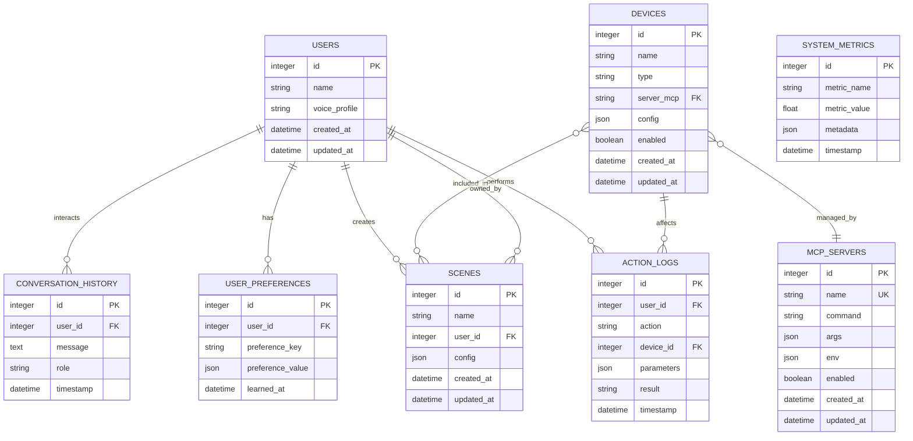

# Modelo de Datos
## Smart Room Control System (SRCS)

**Universidad Tecnológica de Panamá**
**Facultad de Ingeniería de Sistemas Computacionales**

**Autores:** Alejandro Mosquera, Victor Rodríguez
**Versión:** 1.0
**Fecha:** Enero 2025

---

## Tabla de Contenido

1. [Introducción](#1-introducción)
2. [Diagrama Entidad-Relación](#2-diagrama-entidad-relación)
3. [Esquema de Base de Datos SQLite](#3-esquema-de-base-de-datos-sqlite)
4. [JSON Schemas de Configuración](#4-json-schemas-de-configuración)
5. [Índices y Optimizaciones](#5-índices-y-optimizaciones)
6. [Estrategia de Migrations](#6-estrategia-de-migrations)
7. [Políticas de Retención de Datos](#7-políticas-de-retención-de-datos)

---

## 1. Introducción

Este documento especifica el **modelo de datos** del Smart Room Control System (SRCS), incluyendo el esquema de base de datos relacional (SQLite) y los esquemas de archivos de configuración en formato JSON.

### 1.1 Propósito

- Definir la estructura de datos persistente del sistema
- Documentar relaciones entre entidades
- Especificar constraints e índices para optimización
- Proveer esquemas de validación para archivos de configuración
- Guiar la implementación de la capa de acceso a datos

### 1.2 Tecnologías de Persistencia

- **Base de Datos**: SQLite 3.x
  - Seleccionada por: simplicidad, zero-configuration, sin servidor, ideal para proyectos de investigación
  - Ubicación: `database/smart_room.db`
- **Archivos de Configuración**: JSON con comentarios (commentjson)
  - Ubicación: `config/`
- **Migrations**: Alembic (Python migration tool)
- **ORM**: SQLAlchemy 2.x

### 1.3 Convenciones de Nomenclatura

- **Tablas**: snake_case, plural (ej: `users`, `action_logs`)
- **Columnas**: snake_case (ej: `user_id`, `created_at`)
- **Índices**: `idx_<table>_<column>` (ej: `idx_devices_type`)
- **Foreign Keys**: `fk_<table>_<column>` (ej: `fk_scenes_user_id`)
- **Timestamps**: UTC timezone, formato ISO 8601

---

## 2. Diagrama Entidad-Relación



---

## 3. Esquema de Base de Datos SQLite

### 3.1 Tabla: `users`

**Descripción**: Almacena información de usuarios del sistema.

**Columnas**:

| Columna | Tipo | Constraints | Descripción |
|---------|------|-------------|-------------|
| id | INTEGER | PRIMARY KEY AUTOINCREMENT | Identificador único del usuario |
| name | TEXT | NOT NULL | Nombre completo del usuario |
| voice_profile | TEXT | NULL | Identificador del perfil de voz para autenticación |
| created_at | TEXT | NOT NULL DEFAULT CURRENT_TIMESTAMP | Fecha de creación (ISO 8601) |
| updated_at | TEXT | NOT NULL DEFAULT CURRENT_TIMESTAMP | Fecha de última actualización |

**Constraints**:
- PRIMARY KEY: `id`
- UNIQUE: `name`

**Índices**:
- `idx_users_name` en `name` (para búsquedas por nombre)

**Ejemplo de Datos**:
```sql
INSERT INTO users (name, voice_profile)
VALUES ('Victor Rodríguez', 'victor_voice_fp_abc123');
```

---

### 3.2 Tabla: `devices`

**Descripción**: Registro de dispositivos IoT conectados al sistema.

**Columnas**:

| Columna | Tipo | Constraints | Descripción |
|---------|------|-------------|-------------|
| id | INTEGER | PRIMARY KEY AUTOINCREMENT | Identificador único del dispositivo |
| name | TEXT | NOT NULL | Nombre descriptivo del dispositivo |
| type | TEXT | NOT NULL | Tipo de dispositivo (light, thermostat, camera, speaker) |
| server_mcp | TEXT | NOT NULL | Nombre del servidor MCP que gestiona este dispositivo |
| config | TEXT | NOT NULL | Configuración del dispositivo en formato JSON |
| enabled | INTEGER | NOT NULL DEFAULT 1 | Estado habilitado (1) o deshabilitado (0) |
| created_at | TEXT | NOT NULL DEFAULT CURRENT_TIMESTAMP | Fecha de creación |
| updated_at | TEXT | NOT NULL DEFAULT CURRENT_TIMESTAMP | Fecha de última actualización |

**Constraints**:
- PRIMARY KEY: `id`
- FOREIGN KEY: `server_mcp` REFERENCES `mcp_servers(name)`
- CHECK: `type IN ('light', 'thermostat', 'camera', 'speaker', 'sensor', 'lock', 'switch')`
- CHECK: `enabled IN (0, 1)`

**Índices**:
- `idx_devices_type` en `type` (para filtrar por tipo)
- `idx_devices_server_mcp` en `server_mcp` (para consultas por servidor MCP)
- `idx_devices_enabled` en `enabled` (para obtener solo dispositivos activos)

**Estructura del campo `config`** (JSON):
```json
{
  "protocol": "philips_hue",
  "ip": "192.168.1.100",
  "api_key": "encrypted_key_here",
  "port": 80,
  "state": {
    "power": "on",
    "brightness": 75,
    "color": "warm"
  },
  "capabilities": ["brightness", "color", "scheduling"]
}
```

**Ejemplo de Datos**:
```sql
INSERT INTO devices (name, type, server_mcp, config, enabled)
VALUES (
  'Luz Sala Principal',
  'light',
  'lighting',
  '{"protocol":"philips_hue","ip":"192.168.1.100","api_key":"xxx","state":{"power":"on","brightness":75}}',
  1
);
```

---

### 3.3 Tabla: `mcp_servers`

**Descripción**: Configuración de servidores MCP activos en el sistema.

**Columnas**:

| Columna | Tipo | Constraints | Descripción |
|---------|------|-------------|-------------|
| id | INTEGER | PRIMARY KEY AUTOINCREMENT | Identificador único del servidor MCP |
| name | TEXT | NOT NULL UNIQUE | Nombre identificador del servidor (ej: "lighting", "climate") |
| command | TEXT | NOT NULL | Comando para ejecutar el servidor (ej: "python", "npx") |
| args | TEXT | NOT NULL | Argumentos del comando en formato JSON array |
| env | TEXT | NULL | Variables de entorno en formato JSON object |
| enabled | INTEGER | NOT NULL DEFAULT 1 | Estado habilitado (1) o deshabilitado (0) |
| created_at | TEXT | NOT NULL DEFAULT CURRENT_TIMESTAMP | Fecha de creación |
| updated_at | TEXT | NOT NULL DEFAULT CURRENT_TIMESTAMP | Fecha de última actualización |

**Constraints**:
- PRIMARY KEY: `id`
- UNIQUE: `name`
- CHECK: `enabled IN (0, 1)`

**Índices**:
- `idx_mcp_servers_name` en `name` (búsqueda principal)
- `idx_mcp_servers_enabled` en `enabled` (filtrar servidores activos)

**Estructura del campo `args`** (JSON Array):
```json
["-m", "mcp_lighting_server", "--config", "/path/to/config.json"]
```

**Estructura del campo `env`** (JSON Object):
```json
{
  "PHILIPS_HUE_BRIDGE_IP": "192.168.1.2",
  "API_KEY": "encrypted_key",
  "LOG_LEVEL": "INFO"
}
```

**Ejemplo de Datos**:
```sql
INSERT INTO mcp_servers (name, command, args, env, enabled)
VALUES (
  'lighting',
  'python',
  '["-m", "mcp_lighting_server"]',
  '{"LOG_LEVEL":"DEBUG"}',
  1
);
```

---

### 3.4 Tabla: `scenes`

**Descripción**: Escenas predefinidas y personalizadas de configuración de dispositivos.

**Columnas**:

| Columna | Tipo | Constraints | Descripción |
|---------|------|-------------|-------------|
| id | INTEGER | PRIMARY KEY AUTOINCREMENT | Identificador único de la escena |
| name | TEXT | NOT NULL | Nombre descriptivo de la escena |
| user_id | INTEGER | NULL | ID del usuario propietario (NULL para escenas predefinidas del sistema) |
| config | TEXT | NOT NULL | Configuración de la escena en formato JSON |
| created_at | TEXT | NOT NULL DEFAULT CURRENT_TIMESTAMP | Fecha de creación |
| updated_at | TEXT | NOT NULL DEFAULT CURRENT_TIMESTAMP | Fecha de última actualización |

**Constraints**:
- PRIMARY KEY: `id`
- FOREIGN KEY: `user_id` REFERENCES `users(id)` ON DELETE CASCADE
- UNIQUE: `(name, user_id)` (nombre único por usuario)

**Índices**:
- `idx_scenes_user_id` en `user_id` (para obtener escenas de un usuario)
- `idx_scenes_name` en `name` (búsquedas por nombre)

**Estructura del campo `config`** (JSON):
```json
{
  "description": "Escena para ver películas",
  "devices": {
    "lighting": {
      "Luz Sala Principal": {"power": "on", "brightness": 20, "color": "warm"},
      "Luz Ambiente": {"power": "off"}
    },
    "climate": {
      "Termostato Sala": {"temperature": 20, "mode": "heat"}
    },
    "entertainment": {
      "Proyector": {"power": "on", "source": "HDMI1"},
      "Audio Sala": {"power": "on", "volume": 60}
    }
  }
}
```

**Ejemplo de Datos**:
```sql
INSERT INTO scenes (name, user_id, config)
VALUES (
  'Modo Cine',
  1,
  '{"description":"Escena para ver películas","devices":{"lighting":{"Luz Sala Principal":{"brightness":20}}}}'
);
```

---

### 3.5 Tabla: `conversation_history`

**Descripción**: Historial de conversaciones entre usuarios y el sistema.

**Columnas**:

| Columna | Tipo | Constraints | Descripción |
|---------|------|-------------|-------------|
| id | INTEGER | PRIMARY KEY AUTOINCREMENT | Identificador único del mensaje |
| user_id | INTEGER | NULL | ID del usuario (NULL para mensajes del sistema) |
| message | TEXT | NOT NULL | Contenido del mensaje |
| role | TEXT | NOT NULL | Rol del emisor (user, assistant, system) |
| timestamp | TEXT | NOT NULL DEFAULT CURRENT_TIMESTAMP | Fecha y hora del mensaje |

**Constraints**:
- PRIMARY KEY: `id`
- FOREIGN KEY: `user_id` REFERENCES `users(id)` ON DELETE CASCADE
- CHECK: `role IN ('user', 'assistant', 'system')`

**Índices**:
- `idx_conversation_user_id` en `user_id` (para obtener conversaciones de un usuario)
- `idx_conversation_timestamp` en `timestamp` (ordenar por fecha)

**Ejemplo de Datos**:
```sql
INSERT INTO conversation_history (user_id, message, role, timestamp)
VALUES
  (1, 'Enciende las luces de la sala', 'user', '2025-01-15T10:30:45Z'),
  (1, 'He encendido las luces de la sala', 'assistant', '2025-01-15T10:30:47Z');
```

---

### 3.6 Tabla: `user_preferences`

**Descripción**: Preferencias aprendidas del comportamiento de usuarios.

**Columnas**:

| Columna | Tipo | Constraints | Descripción |
|---------|------|-------------|-------------|
| id | INTEGER | PRIMARY KEY AUTOINCREMENT | Identificador único de la preferencia |
| user_id | INTEGER | NOT NULL | ID del usuario |
| preference_key | TEXT | NOT NULL | Clave de la preferencia (ej: "evening_temperature") |
| preference_value | TEXT | NOT NULL | Valor de la preferencia en formato JSON |
| learned_at | TEXT | NOT NULL DEFAULT CURRENT_TIMESTAMP | Fecha en que se aprendió la preferencia |

**Constraints**:
- PRIMARY KEY: `id`
- FOREIGN KEY: `user_id` REFERENCES `users(id)` ON DELETE CASCADE
- UNIQUE: `(user_id, preference_key)` (una preferencia por clave por usuario)

**Índices**:
- `idx_preferences_user_id` en `user_id` (consultas por usuario)
- `idx_preferences_key` en `preference_key` (búsqueda por tipo de preferencia)

**Estructura del campo `preference_value`** (JSON):
```json
{
  "time_range": "18:00-22:00",
  "value": 22,
  "unit": "celsius",
  "confidence": 0.85,
  "sample_size": 7
}
```

**Ejemplo de Datos**:
```sql
INSERT INTO user_preferences (user_id, preference_key, preference_value, learned_at)
VALUES (
  1,
  'evening_temperature',
  '{"time_range":"18:00-22:00","value":22,"confidence":0.85}',
  '2025-01-15T10:30:00Z'
);
```

---

### 3.7 Tabla: `action_logs`

**Descripción**: Registro de auditoría de todas las acciones ejecutadas en el sistema.

**Columnas**:

| Columna | Tipo | Constraints | Descripción |
|---------|------|-------------|-------------|
| id | INTEGER | PRIMARY KEY AUTOINCREMENT | Identificador único del log |
| user_id | INTEGER | NULL | ID del usuario que inició la acción (NULL para acciones del sistema) |
| action | TEXT | NOT NULL | Tipo de acción ejecutada |
| device_id | INTEGER | NULL | ID del dispositivo afectado (NULL si no aplica) |
| parameters | TEXT | NULL | Parámetros de la acción en formato JSON |
| result | TEXT | NOT NULL | Resultado de la acción (success, error, partial) |
| error_message | TEXT | NULL | Mensaje de error si result = 'error' |
| timestamp | TEXT | NOT NULL DEFAULT CURRENT_TIMESTAMP | Fecha y hora de la acción |

**Constraints**:
- PRIMARY KEY: `id`
- FOREIGN KEY: `user_id` REFERENCES `users(id)` ON DELETE SET NULL
- FOREIGN KEY: `device_id` REFERENCES `devices(id)` ON DELETE SET NULL
- CHECK: `result IN ('success', 'error', 'partial')`

**Índices**:
- `idx_action_logs_user_id` en `user_id` (auditoría por usuario)
- `idx_action_logs_device_id` en `device_id` (historial por dispositivo)
- `idx_action_logs_timestamp` en `timestamp` (consultas por fecha)
- `idx_action_logs_action` en `action` (filtrar por tipo de acción)

**Estructura del campo `parameters`** (JSON):
```json
{
  "brightness": 75,
  "color": "warm",
  "transition_time": 1000
}
```

**Ejemplo de Datos**:
```sql
INSERT INTO action_logs (user_id, action, device_id, parameters, result, timestamp)
VALUES (
  1,
  'lighting_turn_on',
  5,
  '{"brightness":75,"color":"warm"}',
  'success',
  '2025-01-15T10:30:47Z'
);
```

---

### 3.8 Tabla: `system_metrics`

**Descripción**: Métricas de rendimiento y salud del sistema.

**Columnas**:

| Columna | Tipo | Constraints | Descripción |
|---------|------|-------------|-------------|
| id | INTEGER | PRIMARY KEY AUTOINCREMENT | Identificador único de la métrica |
| metric_name | TEXT | NOT NULL | Nombre de la métrica (ej: "command_latency", "cpu_usage") |
| metric_value | REAL | NOT NULL | Valor numérico de la métrica |
| metadata | TEXT | NULL | Metadata adicional en formato JSON |
| timestamp | TEXT | NOT NULL DEFAULT CURRENT_TIMESTAMP | Fecha y hora de la medición |

**Constraints**:
- PRIMARY KEY: `id`

**Índices**:
- `idx_metrics_name` en `metric_name` (filtrar por tipo de métrica)
- `idx_metrics_timestamp` en `timestamp` (consultas por rango de fechas)
- `idx_metrics_name_timestamp` en `(metric_name, timestamp)` (consultas combinadas optimizadas)

**Estructura del campo `metadata`** (JSON):
```json
{
  "component": "mcp_coordinator",
  "server": "lighting",
  "operation": "tool_invocation"
}
```

**Ejemplo de Datos**:
```sql
INSERT INTO system_metrics (metric_name, metric_value, metadata, timestamp)
VALUES (
  'command_latency',
  0.450,
  '{"component":"llm_agent","operation":"process_command"}',
  '2025-01-15T10:30:47Z'
);
```

---

## 4. JSON Schemas de Configuración

### 4.1 Schema: `config/config.json`

**Descripción**: Configuración principal del sistema.

**Schema**:
```json
{
  "$schema": "http://json-schema.org/draft-07/schema#",
  "type": "object",
  "required": ["llm", "systemPrompt"],
  "properties": {
    "systemPrompt": {
      "type": "string",
      "description": "System prompt para el LLM Agent"
    },
    "llm": {
      "type": "object",
      "required": ["provider", "model"],
      "properties": {
        "provider": {
          "type": "string",
          "enum": ["openai", "anthropic", "groq", "ollama"],
          "description": "Proveedor del LLM"
        },
        "model": {
          "type": "string",
          "description": "Nombre del modelo (ej: gpt-4, llama3.1)"
        },
        "api_key": {
          "type": "string",
          "description": "API key (opcional para Ollama)"
        },
        "base_url": {
          "type": "string",
          "format": "uri",
          "description": "URL base del servicio (para Ollama: http://localhost:11434)"
        },
        "temperature": {
          "type": "number",
          "minimum": 0,
          "maximum": 2,
          "default": 0.7,
          "description": "Temperatura de generación"
        },
        "max_tokens": {
          "type": "integer",
          "minimum": 1,
          "default": 1000,
          "description": "Máximo de tokens en respuesta"
        }
      }
    },
    "voice": {
      "type": "object",
      "properties": {
        "stt_model": {
          "type": "string",
          "default": "whisper-base",
          "description": "Modelo de Whisper para STT"
        },
        "tts_model": {
          "type": "string",
          "default": "piper",
          "description": "Modelo de TTS"
        },
        "language": {
          "type": "string",
          "default": "es",
          "description": "Idioma para STT/TTS"
        }
      }
    },
    "database": {
      "type": "object",
      "properties": {
        "path": {
          "type": "string",
          "default": "database/smart_room.db",
          "description": "Ruta al archivo SQLite"
        },
        "backup_retention_days": {
          "type": "integer",
          "minimum": 1,
          "default": 7,
          "description": "Días de retención de respaldos"
        }
      }
    },
    "web": {
      "type": "object",
      "properties": {
        "enabled": {
          "type": "boolean",
          "default": true,
          "description": "Habilitar interfaz web"
        },
        "port": {
          "type": "integer",
          "minimum": 1024,
          "maximum": 65535,
          "default": 8080,
          "description": "Puerto de la interfaz web"
        },
        "host": {
          "type": "string",
          "default": "0.0.0.0",
          "description": "Host de la interfaz web"
        }
      }
    },
    "logging": {
      "type": "object",
      "properties": {
        "level": {
          "type": "string",
          "enum": ["DEBUG", "INFO", "WARNING", "ERROR"],
          "default": "INFO",
          "description": "Nivel de logging"
        },
        "file": {
          "type": "string",
          "default": "logs/smart_room.log",
          "description": "Archivo de logs"
        },
        "max_size_mb": {
          "type": "integer",
          "minimum": 1,
          "default": 10,
          "description": "Tamaño máximo del archivo de log en MB"
        },
        "retention_days": {
          "type": "integer",
          "minimum": 1,
          "default": 30,
          "description": "Días de retención de logs"
        }
      }
    }
  }
}
```

**Ejemplo de Archivo**:
```json
{
  "systemPrompt": "You are a helpful AI assistant controlling a smart room...",
  "llm": {
    "provider": "ollama",
    "model": "llama3.1",
    "base_url": "http://localhost:11434",
    "temperature": 0.7,
    "max_tokens": 1000
  },
  "voice": {
    "stt_model": "whisper-base",
    "tts_model": "piper",
    "language": "es"
  },
  "database": {
    "path": "database/smart_room.db",
    "backup_retention_days": 7
  },
  "web": {
    "enabled": true,
    "port": 8080,
    "host": "0.0.0.0"
  },
  "logging": {
    "level": "INFO",
    "file": "logs/smart_room.log",
    "max_size_mb": 10,
    "retention_days": 30
  }
}
```

---

### 4.2 Schema: `config/mcp-servers-config.json`

**Descripción**: Configuración de servidores MCP.

**Schema**:
```json
{
  "$schema": "http://json-schema.org/draft-07/schema#",
  "type": "object",
  "patternProperties": {
    "^[a-zA-Z0-9_-]+$": {
      "type": "object",
      "required": ["command", "args"],
      "properties": {
        "command": {
          "type": "string",
          "description": "Comando para ejecutar el servidor MCP"
        },
        "args": {
          "type": "array",
          "items": {"type": "string"},
          "description": "Argumentos del comando"
        },
        "env": {
          "type": "object",
          "additionalProperties": {"type": "string"},
          "description": "Variables de entorno"
        },
        "enabled": {
          "type": "boolean",
          "default": true,
          "description": "Habilitar o deshabilitar el servidor"
        },
        "exclude_tools": {
          "type": "array",
          "items": {"type": "string"},
          "default": [],
          "description": "Lista de herramientas a excluir"
        },
        "requires_confirmation": {
          "type": "array",
          "items": {"type": "string"},
          "default": [],
          "description": "Herramientas que requieren confirmación del usuario"
        }
      }
    }
  }
}
```

**Ejemplo de Archivo**:
```json
{
  "lighting": {
    "command": "python",
    "args": ["-m", "mcp_lighting_server"],
    "env": {
      "PHILIPS_HUE_BRIDGE_IP": "192.168.1.2",
      "API_KEY": "encrypted_key_here"
    },
    "enabled": true,
    "exclude_tools": [],
    "requires_confirmation": []
  },
  "climate": {
    "command": "python",
    "args": ["-m", "mcp_climate_server"],
    "env": {
      "NEST_API_KEY": "encrypted_key_here"
    },
    "enabled": true,
    "exclude_tools": [],
    "requires_confirmation": []
  },
  "security": {
    "command": "python",
    "args": ["-m", "mcp_security_server"],
    "env": {},
    "enabled": true,
    "exclude_tools": [],
    "requires_confirmation": ["security_arm", "security_disarm"]
  },
  "entertainment": {
    "command": "python",
    "args": ["-m", "mcp_entertainment_server"],
    "env": {},
    "enabled": true,
    "exclude_tools": [],
    "requires_confirmation": []
  }
}
```

---

### 4.3 Schema: `config/devices-config.json`

**Descripción**: Configuración inicial de dispositivos IoT (opcional, también se pueden registrar vía CLI).

**Schema**:
```json
{
  "$schema": "http://json-schema.org/draft-07/schema#",
  "type": "object",
  "properties": {
    "devices": {
      "type": "array",
      "items": {
        "type": "object",
        "required": ["name", "type", "server_mcp", "protocol"],
        "properties": {
          "name": {
            "type": "string",
            "description": "Nombre del dispositivo"
          },
          "type": {
            "type": "string",
            "enum": ["light", "thermostat", "camera", "speaker", "sensor", "lock", "switch"],
            "description": "Tipo de dispositivo"
          },
          "server_mcp": {
            "type": "string",
            "description": "Servidor MCP que gestiona el dispositivo"
          },
          "protocol": {
            "type": "string",
            "description": "Protocolo de comunicación"
          },
          "ip": {
            "type": "string",
            "format": "ipv4",
            "description": "Dirección IP del dispositivo"
          },
          "port": {
            "type": "integer",
            "minimum": 1,
            "maximum": 65535,
            "default": 80,
            "description": "Puerto de comunicación"
          },
          "credentials": {
            "type": "object",
            "description": "Credenciales de acceso"
          },
          "enabled": {
            "type": "boolean",
            "default": true,
            "description": "Estado habilitado/deshabilitado"
          }
        }
      }
    }
  }
}
```

**Ejemplo de Archivo**:
```json
{
  "devices": [
    {
      "name": "Luz Sala Principal",
      "type": "light",
      "server_mcp": "lighting",
      "protocol": "philips_hue",
      "ip": "192.168.1.100",
      "port": 80,
      "credentials": {
        "api_key": "encrypted_key_here"
      },
      "enabled": true
    },
    {
      "name": "Termostato Sala",
      "type": "thermostat",
      "server_mcp": "climate",
      "protocol": "nest",
      "ip": "192.168.1.101",
      "credentials": {
        "api_key": "encrypted_key_here"
      },
      "enabled": true
    }
  ]
}
```

---

## 5. Índices y Optimizaciones

### 5.1 Índices Principales

**Propósito**: Optimizar consultas frecuentes del sistema.

```sql
-- Users
CREATE INDEX idx_users_name ON users(name);

-- Devices
CREATE INDEX idx_devices_type ON devices(type);
CREATE INDEX idx_devices_server_mcp ON devices(server_mcp);
CREATE INDEX idx_devices_enabled ON devices(enabled);

-- MCP Servers
CREATE INDEX idx_mcp_servers_name ON mcp_servers(name);
CREATE INDEX idx_mcp_servers_enabled ON mcp_servers(enabled);

-- Scenes
CREATE INDEX idx_scenes_user_id ON scenes(user_id);
CREATE INDEX idx_scenes_name ON scenes(name);

-- Conversation History
CREATE INDEX idx_conversation_user_id ON conversation_history(user_id);
CREATE INDEX idx_conversation_timestamp ON conversation_history(timestamp);

-- User Preferences
CREATE INDEX idx_preferences_user_id ON user_preferences(user_id);
CREATE INDEX idx_preferences_key ON user_preferences(preference_key);

-- Action Logs
CREATE INDEX idx_action_logs_user_id ON action_logs(user_id);
CREATE INDEX idx_action_logs_device_id ON action_logs(device_id);
CREATE INDEX idx_action_logs_timestamp ON action_logs(timestamp);
CREATE INDEX idx_action_logs_action ON action_logs(action);

-- System Metrics
CREATE INDEX idx_metrics_name ON system_metrics(metric_name);
CREATE INDEX idx_metrics_timestamp ON system_metrics(timestamp);
CREATE INDEX idx_metrics_name_timestamp ON system_metrics(metric_name, timestamp);
```

### 5.2 Triggers para Actualización Automática de `updated_at`

```sql
-- Trigger para tabla users
CREATE TRIGGER update_users_timestamp
AFTER UPDATE ON users
FOR EACH ROW
BEGIN
  UPDATE users SET updated_at = CURRENT_TIMESTAMP WHERE id = NEW.id;
END;

-- Trigger para tabla devices
CREATE TRIGGER update_devices_timestamp
AFTER UPDATE ON devices
FOR EACH ROW
BEGIN
  UPDATE devices SET updated_at = CURRENT_TIMESTAMP WHERE id = NEW.id;
END;

-- Trigger para tabla mcp_servers
CREATE TRIGGER update_mcp_servers_timestamp
AFTER UPDATE ON mcp_servers
FOR EACH ROW
BEGIN
  UPDATE mcp_servers SET updated_at = CURRENT_TIMESTAMP WHERE id = NEW.id;
END;

-- Trigger para tabla scenes
CREATE TRIGGER update_scenes_timestamp
AFTER UPDATE ON scenes
FOR EACH ROW
BEGIN
  UPDATE scenes SET updated_at = CURRENT_TIMESTAMP WHERE id = NEW.id;
END;
```

---

## 6. Estrategia de Migrations

### 6.1 Alembic Configuration

**Descripción**: Uso de Alembic para gestionar cambios de esquema de forma versionada.

**Directorio de Migrations**: `database/migrations/`

**Archivo de Configuración**: `alembic.ini`

**Comandos Clave**:
```bash
# Crear nueva migration
alembic revision -m "Add column X to table Y"

# Aplicar migrations
alembic upgrade head

# Revertir última migration
alembic downgrade -1

# Ver historial de migrations
alembic history
```

### 6.2 Naming Convention

**Formato de Archivos de Migration**:
- `<timestamp>_<descripcion>.py`
- Ejemplo: `2025011500_create_users_table.py`

**Estándar de Mensajes de Migration**:
- `create_<table>_table` - Creación de tabla
- `add_<column>_to_<table>` - Agregar columna
- `remove_<column>_from_<table>` - Eliminar columna
- `add_index_<table>_<column>` - Agregar índice
- `modify_<column>_in_<table>` - Modificar tipo/constraint de columna

---

## 7. Políticas de Retención de Datos

### 7.1 Retención de Logs

**Tabla**: `conversation_history`, `action_logs`

**Política**:
- Retención: **30 días**
- Limpieza automática: Tarea diaria elimina registros > 30 días
- Exportación: Los administradores pueden exportar logs antes de eliminación

**Script de Limpieza**:
```sql
DELETE FROM conversation_history
WHERE timestamp < datetime('now', '-30 days');

DELETE FROM action_logs
WHERE timestamp < datetime('now', '-30 days');
```

### 7.2 Retención de Métricas

**Tabla**: `system_metrics`

**Política**:
- Retención detallada: **7 días**
- Retención agregada (promedios por hora): **30 días**
- Limpieza automática: Tarea diaria

**Agregación de Métricas**:
```sql
-- Calcular promedios por hora antes de eliminar
INSERT INTO system_metrics_hourly (metric_name, metric_avg, timestamp_hour)
SELECT
  metric_name,
  AVG(metric_value) as metric_avg,
  strftime('%Y-%m-%dT%H:00:00Z', timestamp) as timestamp_hour
FROM system_metrics
WHERE timestamp < datetime('now', '-7 days')
GROUP BY metric_name, timestamp_hour;

-- Eliminar métricas detalladas
DELETE FROM system_metrics
WHERE timestamp < datetime('now', '-7 days');
```

### 7.3 Retención de Respaldos

**Política**:
- Respaldos diarios automáticos
- Retención: **7 respaldos más recientes**
- Los respaldos más antiguos se eliminan automáticamente

---

## Notas Finales

Este documento será actualizado a medida que evolucione el sistema y se identifiquen nuevas necesidades de datos.

**Próximos pasos:**
1. Implementar script SQL completo (`database/schema.sql`)
2. Configurar Alembic para migrations
3. Implementar modelos SQLAlchemy
4. Crear fixtures de datos de prueba
5. Implementar validación de JSON schemas en código

---

**Última actualización:** Enero 2025
**Autores:** Alejandro Mosquera, Victor Rodríguez
**Asesor:** Ing. Aris Castillo, MSC
