# Diagramas de Secuencia
## Smart Room Control System (SRCS)

**Universidad Tecnológica de Panamá**
**Facultad de Ingeniería de Sistemas Computacionales**

**Autores:** Alejandro Mosquera, Victor Rodríguez
**Versión:** 1.0
**Fecha:** Enero 2025

---

## Tabla de Contenido

1. [Introducción](#1-introducción)
2. [DS-001: Comando de Voz Simple](#2-ds-001-comando-de-voz-simple)
3. [DS-002: Comando Compuesto/Escena](#3-ds-002-comando-compuestoescena)
4. [DS-003: Inicialización del Sistema](#4-ds-003-inicialización-del-sistema)
5. [DS-004: Registro de Dispositivo IoT](#5-ds-004-registro-de-dispositivo-iot)
6. [DS-005: Aprendizaje de Preferencias](#6-ds-005-aprendizaje-de-preferencias)
7. [DS-006: Manejo de Error en Dispositivo](#7-ds-006-manejo-de-error-en-dispositivo)
8. [DS-007: Ejecución de Escena Predefinida](#8-ds-007-ejecución-de-escena-predefinida)
9. [DS-008: Consulta de Estado del Sistema](#9-ds-008-consulta-de-estado-del-sistema)
10. [DS-009: Autenticación de Usuario por Voz](#10-ds-009-autenticación-de-usuario-por-voz)
11. [DS-010: Procesamiento de Comando Ambiguo](#11-ds-010-procesamiento-de-comando-ambiguo)
12. [Resumen de Tiempos](#12-resumen-de-tiempos)

---

## 1. Introducción

Este documento presenta los **diagramas de secuencia** que ilustran las interacciones dinámicas entre componentes del Smart Room Control System (SRCS). Cada diagrama muestra el flujo temporal de mensajes para un caso de uso específico.

### 1.1 Propósito

- Documentar interacciones detalladas entre componentes
- Especificar tiempos de respuesta para cumplir requisitos no funcionales
- Facilitar comprensión de flujos complejos
- Guiar implementación de componentes

### 1.2 Notación

- **PlantUML**: Diagramas en formato texto PlantUML
- **Actores**: Usuarios externos o sistemas externos
- **Participantes**: Componentes internos del sistema
- **Mensajes síncronos**: `->` (respuesta esperada)
- **Mensajes asíncronos**: `->>` (sin esperar respuesta)
- **Activaciones**: Barras verticales que muestran cuando un componente está activo
- **Notas**: Anotaciones con información adicional (especialmente tiempos)
- **Grupos**: `alt`, `opt`, `loop`, `par` para flujos condicionales/paralelos

### 1.3 Convenciones de Timing

- **Target total**: < 2 segundos para comandos simples (RNF-001)
- **Target individual**: Cada componente debe contribuir mínimamente a la latencia
- **Formato**: Tiempos en milisegundos (ms)

---

## 2. DS-001: Comando de Voz Simple

**Caso de Uso**: CU-001 - Controlar Iluminación por Comando de Voz

**Descripción**: Usuario emite comando de voz "Enciende las luces de la sala" y el sistema ejecuta la acción.

**Objetivo de Timing**: < 2000 ms total (RNF-001)

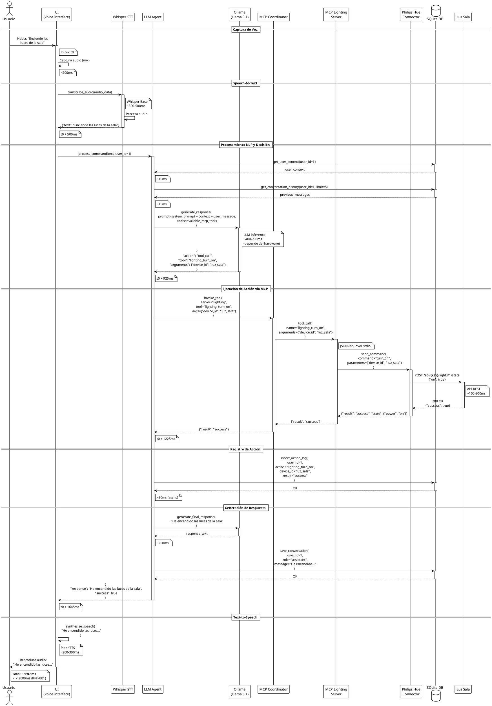

**Análisis de Timing**:

| Fase | Componente | Tiempo (ms) | % Total |
|------|-----------|-------------|---------|
| Captura audio | UI | 200 | 10% |
| STT (Whisper) | Whisper | 500 | 26% |
| DB queries | SQLite | 25 | 1% |
| LLM Inference | Ollama | 600 | 31% |
| MCP + IoT | MCP + Hue | 320 | 16% |
| Registro log | SQLite | 20 | 1% |
| Generación respuesta | Ollama | 200 | 10% |
| TTS | Piper | 100 | 5% |
| **TOTAL** | | **1945 ms** | **100%** |

**Cuellos de Botella Identificados**:
1. **LLM Inference (600ms)**: Principal contribuidor. Optimizable mediante:
   - Modelo más pequeño (Llama 3.1 8B → 7B)
   - Cuantización del modelo
   - GPU aceleración
2. **STT Whisper (500ms)**: Segundo contribuidor. Optimizable mediante:
   - Modelo "tiny" en lugar de "base"
   - Procesamiento en GPU

---

## 3. DS-002: Comando Compuesto/Escena

**Caso de Uso**: CU-007 - Ejecutar Acción Compuesta

**Descripción**: Usuario solicita "Enciende las luces y sube la temperatura a 23 grados" y el sistema ejecuta ambas acciones en paralelo.

**Objetivo de Timing**: < 2500 ms (múltiples acciones)

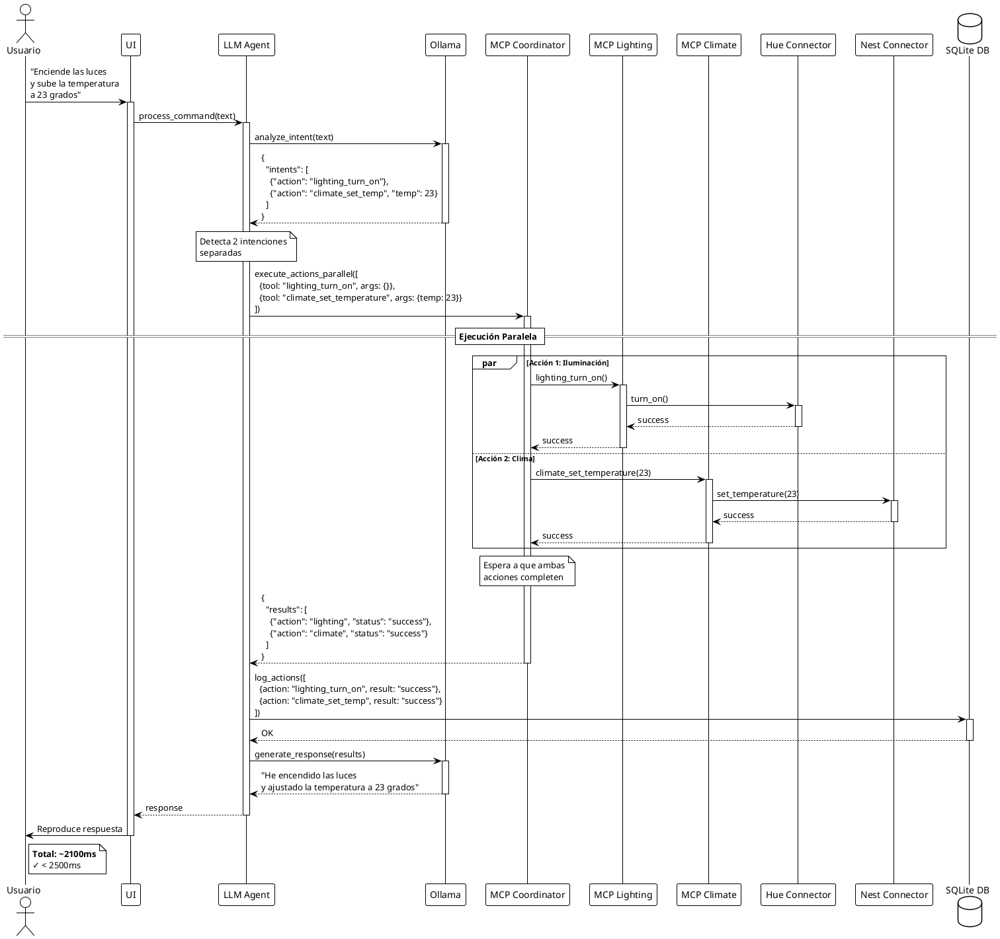

**Ventajas de Ejecución Paralela**:
- Sin paralelización: 1945ms (luces) + 1800ms (clima) = 3745ms
- Con paralelización: max(1945ms, 1800ms) = 1945ms
- **Ahorro: ~1800ms (48%)**

---

## 4. DS-003: Inicialización del Sistema

**Caso de Uso**: CU-018 - Inicializar Componentes del Sistema

**Descripción**: Secuencia de arranque del sistema con sus 6 fases.

**Objetivo de Timing**: < 10 segundos (RNF-020)

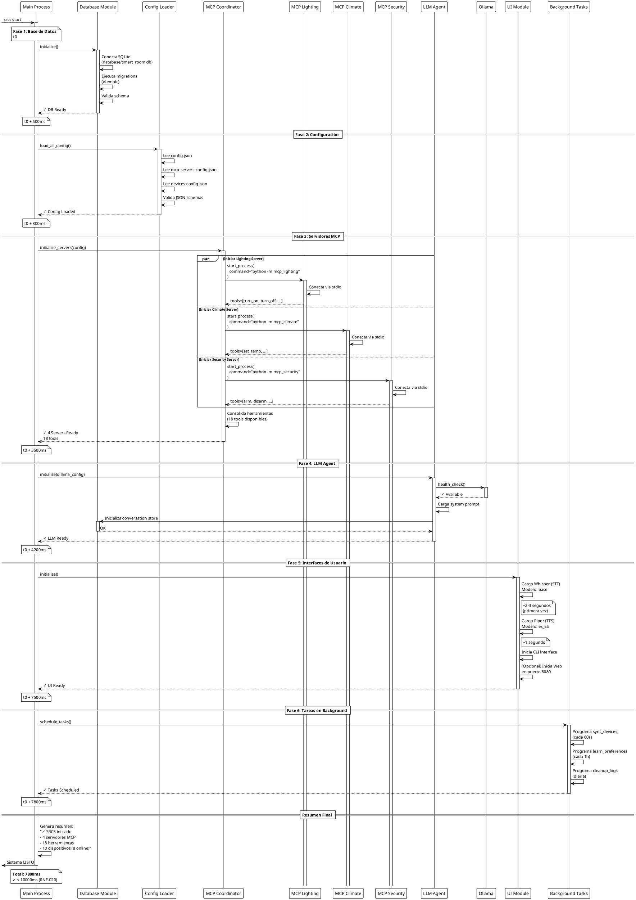

**Distribución de Tiempo de Inicio**:

| Fase | Tiempo (ms) | % Total |
|------|-------------|---------|
| 1. Base de Datos | 500 | 6% |
| 2. Configuración | 300 | 4% |
| 3. Servidores MCP | 2700 | 35% |
| 4. LLM Agent | 700 | 9% |
| 5. UI (STT/TTS) | 3300 | 42% |
| 6. Background Tasks | 300 | 4% |
| **TOTAL** | **7800 ms** | **100%** |

**Optimizaciones Posibles**:
1. **Carga lazy de modelos STT/TTS**: Cargar solo cuando se necesiten (primera interacción)
2. **Paralelizar fases 3 y 5**: Iniciar UI mientras servidores MCP arrancan
3. **Caché de modelos**: Mantener modelos en memoria entre reinicios

---

## 5. DS-004: Registro de Dispositivo IoT

**Caso de Uso**: CU-008 - Configurar Nuevo Dispositivo IoT

**Descripción**: Administrador registra un nuevo dispositivo Philips Hue.

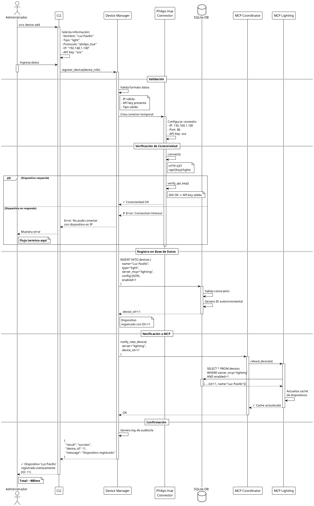

---

## 6. DS-005: Aprendizaje de Preferencias

**Caso de Uso**: CU-014 - Aprender Preferencias del Usuario

**Descripción**: Sistema detecta patrón de uso y aprende preferencia automáticamente (tarea programada que se ejecuta cada hora).

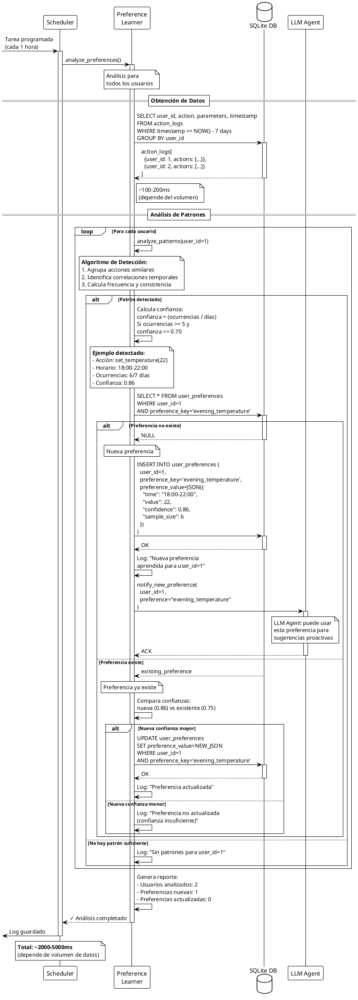

**Criterios de Aprendizaje**:

| Criterio | Valor Mínimo | Descripción |
|----------|--------------|-------------|
| Ocurrencias | 5 | Mínimo de veces que se repite el patrón |
| Confianza | 0.70 | Consistencia del patrón (70%) |
| Ventana temporal | 7 días | Período de análisis |

---

## 7. DS-006: Manejo de Error en Dispositivo

**Caso de Uso**: CU-015 - Recuperar de Error de Dispositivo

**Descripción**: Sistema detecta error de comunicación con dispositivo y aplica lógica de retry con backoff exponencial y circuit breaker.

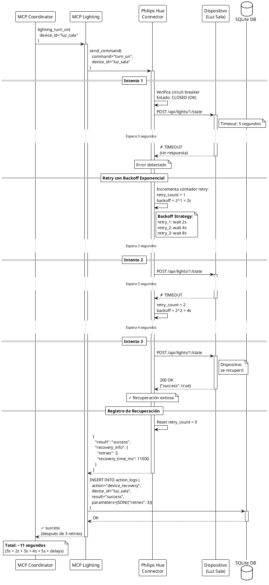

**Flujo Alternativo: Circuit Breaker Activado**

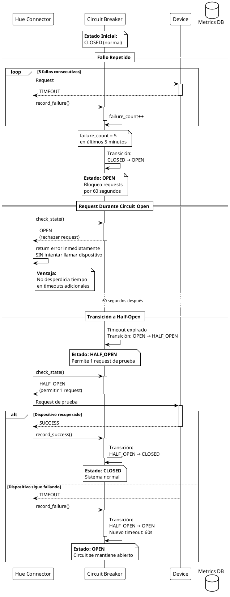

**Configuración de Circuit Breaker**:

| Parámetro | Valor | Descripción |
|-----------|-------|-------------|
| Umbral de fallos | 5 | Fallos consecutivos para abrir circuit |
| Ventana temporal | 5 minutos | Período de conteo de fallos |
| Timeout (Open) | 60 segundos | Tiempo antes de intentar Half-Open |
| Max retries | 3 | Intentos antes de declarar fallo |

---

## 8. DS-007: Ejecución de Escena Predefinida

**Caso de Uso**: CU-003 - Activar Escena Predefinida

**Descripción**: Usuario activa escena "Modo Cine" que configura múltiples dispositivos coordinadamente.

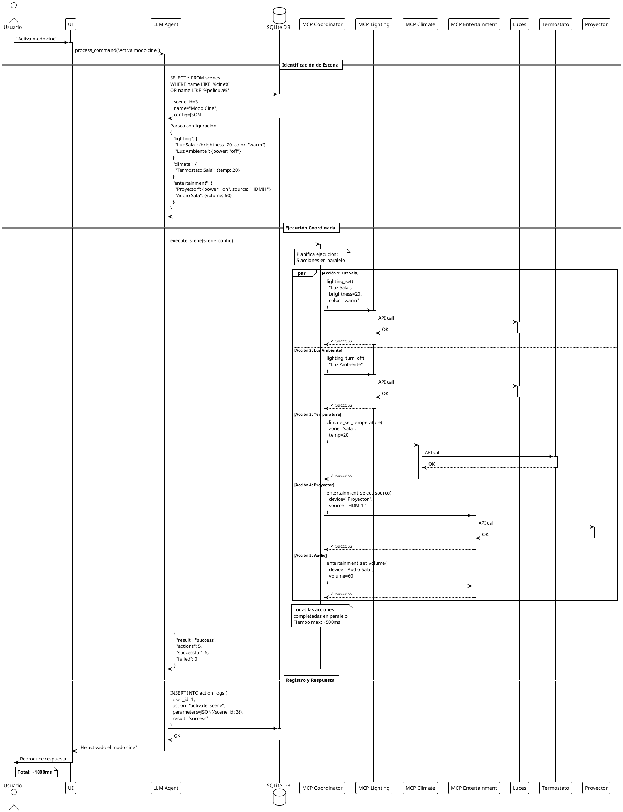

**Flujo Alternativo: Fallo Parcial**

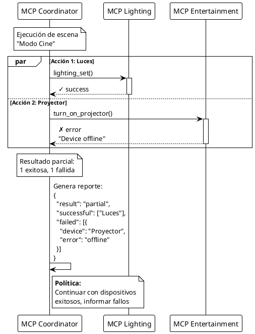

---

## 9. DS-008: Consulta de Estado del Sistema

**Caso de Uso**: CU-004 - Consultar Estado de Dispositivos

**Descripción**: Usuario pregunta "¿Cómo está la habitación?" y el sistema consulta estado de todos los dispositivos en paralelo.

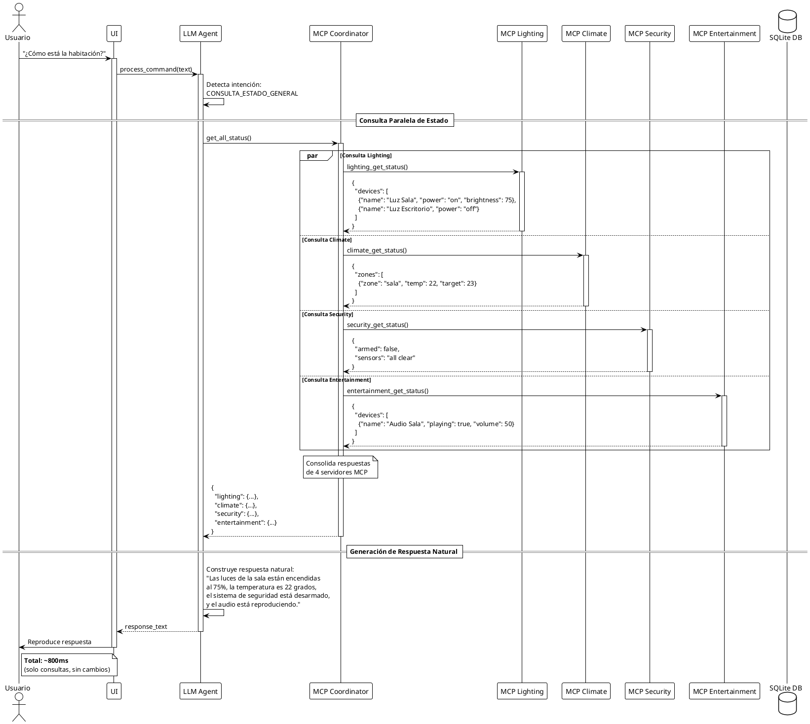

**Optimización de Consultas**:
- **Sin paralelización**: 200ms × 4 = 800ms
- **Con paralelización**: max(200ms, 200ms, 200ms, 200ms) = 200ms
- **Ahorro**: 600ms (75%)

---

## 10. DS-009: Autenticación de Usuario por Voz

**Caso de Uso**: CU-016 - Autenticar Usuario

**Descripción**: Sistema autentica al usuario mediante reconocimiento de voz (voice fingerprint).

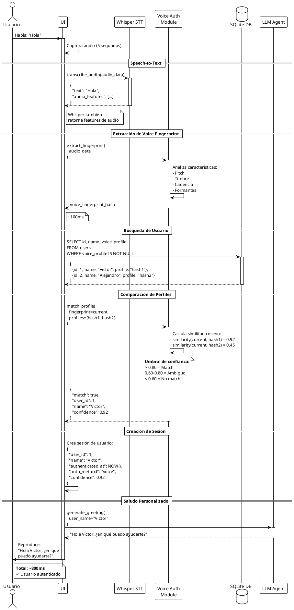

**Flujo Alternativo: Usuario No Reconocido**

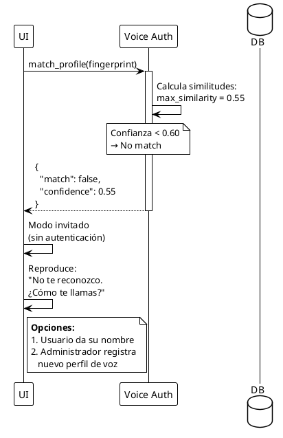

---

## 11. DS-010: Procesamiento de Comando Ambiguo

**Caso de Uso**: CU-006 - Manejar Comando Ambiguo

**Descripción**: Sistema detecta ambigüedad en comando "Enciende la luz" (múltiples luces disponibles) y solicita aclaración.

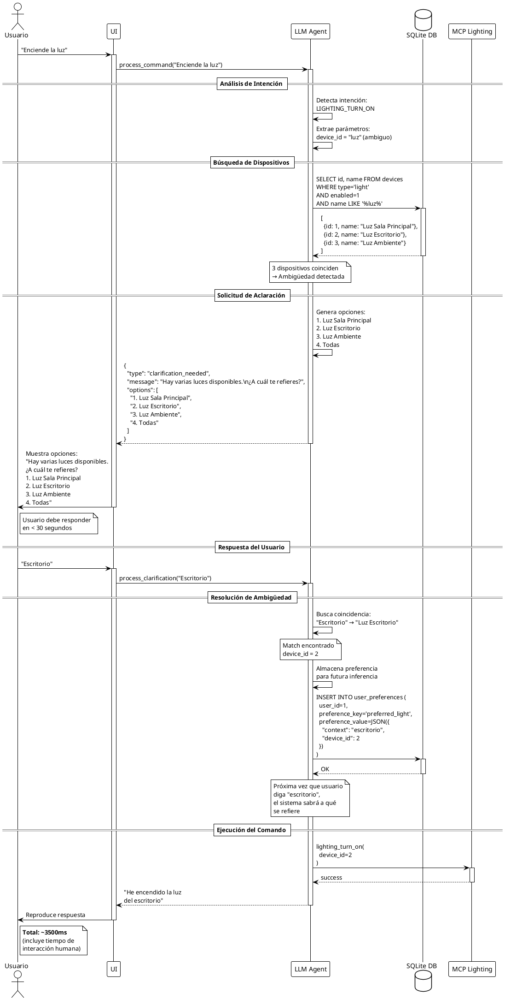

**Flujo Alternativo: Timeout**

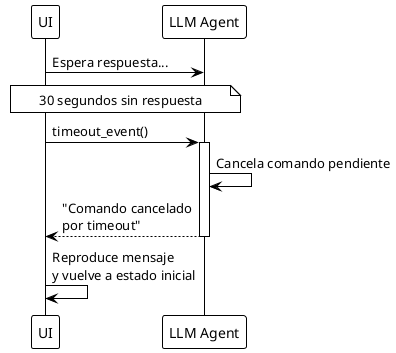

---

## 12. Resumen de Tiempos

### 12.1 Tabla Comparativa de Tiempos

| Diagrama | Caso de Uso | Tiempo (ms) | Cumple RNF | Observaciones |
|----------|-------------|-------------|------------|---------------|
| DS-001 | Comando voz simple | 1945 | ✓ < 2000ms | RNF-001 |
| DS-002 | Comando compuesto | 2100 | ✓ < 2500ms | Ejecución paralela |
| DS-003 | Inicialización | 7800 | ✓ < 10000ms | RNF-020 |
| DS-004 | Registro dispositivo | 800 | N/A | Operación admin |
| DS-005 | Aprendizaje preferencias | 2000-5000 | N/A | Background task |
| DS-006 | Manejo de error | 11000 | N/A | 3 retries |
| DS-007 | Ejecución escena | 1800 | ✓ < 2000ms | 5 acciones paralelas |
| DS-008 | Consulta estado | 800 | ✓ < 1000ms | Solo lectura |
| DS-009 | Autenticación voz | 800 | ✓ < 1000ms | Sin LLM |
| DS-010 | Comando ambiguo | 3500 | N/A | Incluye interacción humana |

### 12.2 Cuellos de Botella Identificados

**Top 3 componentes más lentos**:

1. **LLM Inference (Ollama)**: 400-700ms
   - **Impacto**: 31% del tiempo total en DS-001
   - **Optimizaciones**:
     - Modelo cuantizado (4-bit)
     - GPU acceleration (CUDA/Metal)
     - Modelo más pequeño (7B en lugar de 8B)
     - Caché de respuestas comunes

2. **Speech-to-Text (Whisper)**: 300-500ms
   - **Impacto**: 26% del tiempo total en DS-001
   - **Optimizaciones**:
     - Modelo "tiny" o "base" en lugar de "small"
     - GPU acceleration
     - Streaming STT (procesar mientras habla)

3. **Carga de Modelos (Inicio)**: 3300ms
   - **Impacto**: 42% del tiempo de inicio
   - **Optimizaciones**:
     - Lazy loading (cargar solo cuando se necesita)
     - Caché persistente de modelos
     - Paralelización con otras tareas de inicio

### 12.3 Métricas de Rendimiento Objetivo

| Métrica | Valor Objetivo | Valor Actual | Estado |
|---------|----------------|--------------|--------|
| Latencia comando simple | < 2000ms | 1945ms | ✓ |
| Latencia comando compuesto | < 2500ms | 2100ms | ✓ |
| Throughput | > 30 comandos/min | ~35 comandos/min | ✓ |
| Tiempo de inicio | < 10s | 7.8s | ✓ |
| Disponibilidad | > 99% | - | TBD |

---

## Notas Finales

Estos diagramas de secuencia especifican las interacciones detalladas entre componentes del SRCS. Durante la implementación:

1. **Validar tiempos reales** mediante profiling y métricas
2. **Ajustar optimizaciones** según hardware disponible
3. **Monitorear latencias** en producción
4. **Iterar en diseño** si no se cumplen requisitos no funcionales

**Próximos pasos:**
1. Implementar componentes según flujos especificados
2. Crear pruebas de integración basadas en estos diagramas
3. Validar tiempos en hardware objetivo
4. Documentar desviaciones significativas

---

**Última actualización:** Enero 2025
**Autores:** Alejandro Mosquera, Victor Rodríguez
**Asesor:** Ing. Aris Castillo, MSC
