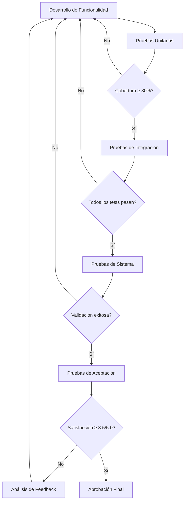
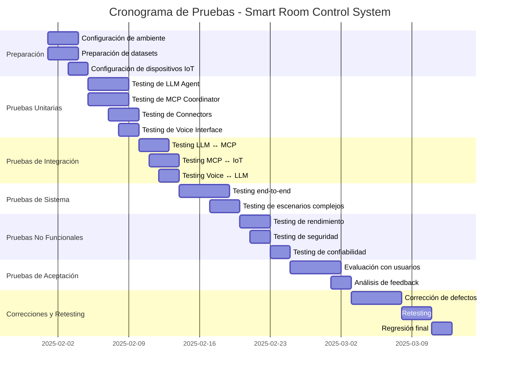

# Plan de Pruebas - Smart Room Control System

**Universidad Tecnológica de Panamá**
**Facultad de Ingeniería de Sistemas Computacionales**
**Proyecto de Tesis**

---

**Autores:**
- Alejandro Mosquera
- Victor Rodríguez

**Versión:** 1.0
**Fecha:** Enero 2025

---

## Tabla de Contenidos

1. [Introducción](#1-introducción)
2. [Estrategia de Testing](#2-estrategia-de-testing)
3. [Casos de Prueba Funcionales](#3-casos-de-prueba-funcionales)
4. [Casos de Prueba No Funcionales](#4-casos-de-prueba-no-funcionales)
5. [Escenarios de Evaluación con Usuarios](#5-escenarios-de-evaluación-con-usuarios)
6. [Métricas y Criterios de Éxito](#6-métricas-y-criterios-de-éxito)
7. [Herramientas y Recursos](#7-herramientas-y-recursos)
8. [Matriz de Trazabilidad](#8-matriz-de-trazabilidad)
9. [Plantillas de Prueba](#9-plantillas-de-prueba)
10. [Cronograma de Pruebas](#10-cronograma-de-pruebas)

---

## 1. Introducción

### 1.1 Propósito

Este documento define la estrategia, metodología y casos de prueba para validar el **Smart Room Control System (SRCS)**. El objetivo es garantizar que el sistema cumple con todos los requisitos funcionales y no funcionales especificados en el documento de SRS.

### 1.2 Alcance

El plan de pruebas cubre:

- **Pruebas unitarias**: Validación de funciones y métodos individuales
- **Pruebas de integración**: Validación de la interacción entre componentes
- **Pruebas de sistema**: Validación del sistema completo end-to-end
- **Pruebas de aceptación**: Validación con usuarios reales
- **Pruebas de rendimiento**: Validación de requisitos de latencia y throughput
- **Pruebas de seguridad**: Validación de autenticación y autorización
- **Pruebas de usabilidad**: Validación de la experiencia del usuario

### 1.3 Objetivos de Calidad

| Métrica | Objetivo | Mínimo Aceptable |
|---------|----------|------------------|
| Cobertura de código | ≥ 80% | 70% |
| Cobertura de requisitos | 100% | 95% |
| Tasa de éxito de pruebas | ≥ 95% | 90% |
| Defectos críticos | 0 | 0 |
| Defectos mayores | ≤ 5 | ≤ 10 |
| Latencia (comandos simples) | ≤ 1500ms | ≤ 2000ms |
| Disponibilidad | ≥ 99% | ≥ 95% |
| Satisfacción de usuarios | ≥ 4.0/5.0 | ≥ 3.5/5.0 |

---

## 2. Estrategia de Testing

### 2.1 Niveles de Prueba

#### 2.1.1 Pruebas Unitarias

**Objetivo**: Validar el correcto funcionamiento de funciones y métodos individuales.

**Componentes a probar**:
- `llm_agent.py`: Procesamiento de comandos NLP
- `mcp_coordinator.py`: Orquestación de llamadas MCP
- `memory_manager.py`: Almacenamiento y recuperación de memoria
- `voice_interface.py`: Transcripción STT y síntesis TTS
- `text_interface.py`: Interfaz CLI
- `preference_learner.py`: Aprendizaje de preferencias
- IoT Connectors: `philips_hue.py`, `nest_thermostat.py`, etc.

**Herramientas**:
- `pytest`: Framework de testing
- `pytest-cov`: Cobertura de código
- `pytest-mock`: Mocking de dependencias
- `pytest-asyncio`: Testing de código asíncrono

**Cobertura objetivo**: ≥ 80%

#### 2.1.2 Pruebas de Integración

**Objetivo**: Validar la interacción entre componentes del sistema.

**Componentes a probar**:
- LLM Agent ↔ MCP Coordinator
- MCP Coordinator ↔ MCP Servers
- MCP Servers ↔ IoT Connectors
- Voice Interface ↔ LLM Agent
- Memory Manager ↔ Database

**Herramientas**:
- `pytest`: Framework de testing
- `testcontainers`: Contenedores Docker para servicios externos
- `wiremock`: Mocking de APIs externas

**Cobertura objetivo**: ≥ 70%

#### 2.1.3 Pruebas de Sistema

**Objetivo**: Validar el sistema completo en un entorno que simula producción.

**Escenarios a probar**:
- Flujos end-to-end de todos los casos de uso (CU-001 a CU-018)
- Interacción con dispositivos IoT reales o simulados
- Ejecución de escenas predefinidas
- Manejo de errores y recuperación
- Concurrencia de usuarios

**Herramientas**:
- `pytest`: Framework de testing
- `docker-compose`: Orquestación de servicios
- Dispositivos IoT de prueba (Philips Hue, termostato simulado)

#### 2.1.4 Pruebas de Aceptación

**Objetivo**: Validar que el sistema cumple con las expectativas de los usuarios finales.

**Participantes**:
- 10-15 usuarios representativos (profesores, estudiantes, personal)

**Metodología**:
- Pruebas guiadas por escenarios (ver sección 5)
- Cuestionarios de satisfacción (SUS, NPS)
- Entrevistas post-prueba

### 2.2 Estrategia de Ejecución



### 2.3 Criterios de Entrada y Salida

#### Criterios de Entrada

- [ ] Código fuente completado y revisado
- [ ] Documentación de diseño actualizada
- [ ] Ambiente de pruebas configurado
- [ ] Datos de prueba preparados
- [ ] Casos de prueba documentados

#### Criterios de Salida

- [ ] Cobertura de código ≥ 70%
- [ ] Tasa de éxito de pruebas ≥ 90%
- [ ] 0 defectos críticos
- [ ] Defectos mayores ≤ 10
- [ ] Requisitos no funcionales validados
- [ ] Reporte de pruebas completo

### 2.4 Manejo de Defectos

#### Clasificación de Defectos

| Severidad | Descripción | Tiempo de Resolución |
|-----------|-------------|----------------------|
| **Crítica** | Sistema no funciona, pérdida de datos, seguridad comprometida | 24 horas |
| **Mayor** | Funcionalidad clave afectada, workaround disponible | 3 días |
| **Menor** | Funcionalidad secundaria afectada, impacto limitado | 1 semana |
| **Trivial** | Problemas cosméticos, mejoras sugeridas | Backlog |

#### Proceso de Gestión

1. **Identificación**: Tester documenta el defecto en GitHub Issues
2. **Triage**: Equipo asigna severidad y prioridad
3. **Asignación**: Desarrollador toma ownership
4. **Corrección**: Implementación del fix
5. **Verificación**: Tester valida la corrección
6. **Cierre**: Defecto cerrado si la verificación es exitosa

---

## 3. Casos de Prueba Funcionales

### 3.1 Procesamiento NLP (CP-001 a CP-010)

#### CP-001: Comando de Voz Simple - Encender Luz

**Requisito**: RF-001, HU-001
**Prioridad**: Crítica
**Precondiciones**:
- Sistema iniciado y LLM Agent listo
- Dispositivo de luz "Sala Principal" registrado y disponible
- Usuario autenticado (id=1)

**Datos de Entrada**:
```
Audio: "Enciende las luces de la sala principal"
Usuario: id=1, name="Usuario Demo"
```

**Pasos**:
1. Usuario pronuncia el comando
2. Whisper STT transcribe el audio
3. LLM Agent procesa el comando
4. MCP Coordinator invoca `light_control.turn_on`
5. Sistema retorna confirmación

**Resultados Esperados**:
- Transcripción correcta del comando
- Dispositivo "Sala Principal" identificado
- Comando `turn_on` ejecutado en MCP Server de iluminación
- Confirmación de voz: "He encendido las luces de la sala principal"
- Latencia total < 2000ms
- Registro en `action_logs` con `result='success'`

**Resultados Obtenidos**: _[A completar durante ejecución]_

**Estado**: _[Pass/Fail]_

---

#### CP-002: Comando de Voz con Parámetros - Ajustar Brillo

**Requisito**: RF-001, HU-001
**Prioridad**: Alta
**Precondiciones**:
- Sistema iniciado
- Dispositivo de luz "Sala Principal" encendido
- Usuario autenticado (id=1)

**Datos de Entrada**:
```
Audio: "Ajusta el brillo de la sala principal al 50%"
Usuario: id=1
```

**Pasos**:
1. Usuario pronuncia el comando
2. Whisper STT transcribe el audio
3. LLM Agent extrae entidades: device="Sala Principal", brightness=50
4. MCP Coordinator invoca `light_control.set_brightness(device_id="Sala Principal", brightness=50)`
5. Sistema retorna confirmación

**Resultados Esperados**:
- Extracción correcta de parámetros (device, brightness)
- Comando ejecutado con parámetros correctos
- Confirmación: "He ajustado el brillo de la sala principal al 50%"
- Latencia total < 2000ms

**Resultados Obtenidos**: _[A completar durante ejecución]_

**Estado**: _[Pass/Fail]_

---

#### CP-003: Comando Ambiguo - Desambiguación

**Requisito**: RF-006, HU-005
**Prioridad**: Alta
**Precondiciones**:
- Sistema iniciado
- Dos dispositivos con nombre similar: "Luz Sala 1", "Luz Sala 2"
- Usuario autenticado (id=1)

**Datos de Entrada**:
```
Audio: "Enciende la luz de la sala"
Usuario: id=1
```

**Pasos**:
1. Usuario pronuncia el comando ambiguo
2. Whisper STT transcribe el audio
3. LLM Agent detecta ambigüedad (2 dispositivos coinciden)
4. Sistema solicita aclaración: "¿Te refieres a la Luz Sala 1 o la Luz Sala 2?"
5. Usuario responde: "Sala 1"
6. Sistema ejecuta el comando

**Resultados Esperados**:
- Detección de ambigüedad
- Solicitud de aclaración clara
- Comando ejecutado tras aclaración
- Registro en `conversation_history` de todo el diálogo

**Resultados Obtenidos**: _[A completar durante ejecución]_

**Estado**: _[Pass/Fail]_

---

#### CP-004: Comando Compuesto - Múltiples Acciones

**Requisito**: RF-002, HU-002
**Prioridad**: Alta
**Precondiciones**:
- Sistema iniciado
- Dispositivos: "Luz Sala", "Termostato", "Persiana"
- Usuario autenticado (id=1)

**Datos de Entrada**:
```
Audio: "Apaga las luces, cierra las persianas y pon la temperatura a 22 grados"
Usuario: id=1
```

**Pasos**:
1. Usuario pronuncia el comando compuesto
2. Whisper STT transcribe el audio
3. LLM Agent descompone en 3 acciones:
   - `light_control.turn_off(device_id="Luz Sala")`
   - `climate_control.set_temperature(device_id="Termostato", target_temp=22)`
   - `window_control.close(device_id="Persiana")`
4. MCP Coordinator ejecuta las 3 acciones en paralelo
5. Sistema retorna confirmación consolidada

**Resultados Esperados**:
- Descomposición correcta en 3 acciones independientes
- Ejecución paralela (latencia < suma de latencias individuales)
- Confirmación: "He apagado las luces, cerrado las persianas y ajustado la temperatura a 22 grados"
- 3 registros en `action_logs`

**Resultados Obtenidos**: _[A completar durante ejecución]_

**Estado**: _[Pass/Fail]_

---

#### CP-005: Comando de Cancelación

**Requisito**: RF-007, HU-007
**Prioridad**: Media
**Precondiciones**:
- Sistema iniciado
- Comando en ejecución (ej: "Aumenta la temperatura a 30 grados")

**Datos de Entrada**:
```
Audio: "Cancela" o "Detente" o "No, olvídalo"
Usuario: id=1
```

**Pasos**:
1. Usuario inicia comando que toma tiempo (ej: calentar a 30°)
2. Usuario pronuncia comando de cancelación antes de que complete
3. LLM Agent detecta intención de cancelación
4. MCP Coordinator cancela la operación en curso
5. Sistema retorna confirmación de cancelación

**Resultados Esperados**:
- Detección de intención de cancelación
- Cancelación exitosa de la operación
- Confirmación: "He cancelado la operación"
- Registro en `action_logs` con `result='cancelled'`

**Resultados Obtenidos**: _[A completar durante ejecución]_

**Estado**: _[Pass/Fail]_

---

#### CP-006: Comando de Consulta - Estado de Dispositivo

**Requisito**: RF-012, HU-012
**Prioridad**: Media
**Precondiciones**:
- Sistema iniciado
- Dispositivo "Termostato Sala" con temperatura actual = 21°C
- Usuario autenticado (id=1)

**Datos de Entrada**:
```
Audio: "¿Cuál es la temperatura actual?"
Usuario: id=1
```

**Pasos**:
1. Usuario pronuncia la consulta
2. Whisper STT transcribe el audio
3. LLM Agent identifica intención de consulta
4. MCP Coordinator invoca `climate_control.get_status()`
5. Sistema recupera temperatura = 21°C
6. Sistema retorna respuesta de voz

**Resultados Esperados**:
- Identificación correcta de intención de consulta (no acción)
- Recuperación de estado real del dispositivo
- Respuesta: "La temperatura actual es de 21 grados"
- Latencia < 2000ms
- No se registra en `action_logs` (es consulta, no acción)

**Resultados Obtenidos**: _[A completar durante ejecución]_

**Estado**: _[Pass/Fail]_

---

#### CP-007: Comando Contextual - Uso de Memoria

**Requisito**: RF-011, HU-011
**Prioridad**: Media
**Precondiciones**:
- Sistema iniciado
- Historial de conversación previo:
  - Usuario: "Enciende las luces de la sala"
  - Sistema: "He encendido las luces de la sala principal"
- Usuario autenticado (id=1)

**Datos de Entrada**:
```
Audio: "Ahora apágalas"
Usuario: id=1
```

**Pasos**:
1. Usuario pronuncia comando con referencia anafórica ("las")
2. Whisper STT transcribe el audio
3. LLM Agent consulta memoria de conversación
4. LLM Agent resuelve "las" → "luces de la sala principal"
5. MCP Coordinator invoca `light_control.turn_off(device_id="Sala Principal")`
6. Sistema retorna confirmación

**Resultados Esperados**:
- Resolución correcta de referencia anafórica
- Comando ejecutado en el dispositivo correcto
- Confirmación: "He apagado las luces de la sala principal"
- Consulta a `conversation_history` registrada

**Resultados Obtenidos**: _[A completar durante ejecución]_

**Estado**: _[Pass/Fail]_

---

#### CP-008: Comando con Preferencia Aprendida

**Requisito**: RF-019, HU-019
**Prioridad**: Media
**Precondiciones**:
- Sistema iniciado
- Preferencia aprendida: `{"user_id": 1, "preference_key": "morning_temperature", "preference_value": {"temperature": 23}}`
- Usuario autenticado (id=1)

**Datos de Entrada**:
```
Audio: "Activa mi temperatura de la mañana"
Usuario: id=1
```

**Pasos**:
1. Usuario pronuncia comando referenciando preferencia
2. LLM Agent consulta `user_preferences` para user_id=1, key="morning_temperature"
3. LLM Agent extrae value = 23°C
4. MCP Coordinator invoca `climate_control.set_temperature(target_temp=23)`
5. Sistema retorna confirmación

**Resultados Esperados**:
- Consulta correcta a `user_preferences`
- Extracción de valor aprendido (23°C)
- Comando ejecutado con el valor de preferencia
- Confirmación: "He ajustado la temperatura a 23 grados, como prefieres por la mañana"

**Resultados Obtenidos**: _[A completar durante ejecución]_

**Estado**: _[Pass/Fail]_

---

#### CP-009: Comando de Texto (CLI) - Sin Voz

**Requisito**: RF-015, HU-015
**Prioridad**: Media
**Precondiciones**:
- Sistema iniciado en modo CLI
- Dispositivo "Luz Sala" disponible
- Usuario autenticado (id=1)

**Datos de Entrada**:
```
Texto: "turn on Luz Sala"
Usuario: id=1
Interface: CLI
```

**Pasos**:
1. Usuario escribe el comando en CLI
2. Text Interface envía el texto directamente al LLM Agent
3. LLM Agent procesa el comando (sin pasar por STT)
4. MCP Coordinator invoca `light_control.turn_on(device_id="Luz Sala")`
5. Sistema retorna confirmación textual

**Resultados Esperados**:
- Procesamiento sin STT (bypass de Whisper)
- Comando ejecutado correctamente
- Confirmación textual: "Light 'Luz Sala' turned on successfully"
- Latencia < 1500ms (sin overhead de STT)

**Resultados Obtenidos**: _[A completar durante ejecución]_

**Estado**: _[Pass/Fail]_

---

#### CP-010: Comando en Español con Acentos y Tildes

**Requisito**: RF-001, RNF-008
**Prioridad**: Media
**Precondiciones**:
- Sistema iniciado
- Modelo Whisper configurado para español
- Dispositivo "Habitación" disponible

**Datos de Entrada**:
```
Audio: "Enciende la iluminación de la habitación y ajústala al máximo"
Usuario: id=1
```

**Pasos**:
1. Usuario pronuncia comando con acentos y vocabulario español
2. Whisper STT transcribe respetando acentos
3. LLM Agent procesa correctamente el español
4. Comando ejecutado

**Resultados Esperados**:
- Transcripción correcta de "iluminación", "habitación", "ajústala", "máximo"
- Procesamiento NLP exitoso en español
- Comando ejecutado correctamente
- Confirmación en español natural

**Resultados Obtenidos**: _[A completar durante ejecución]_

**Estado**: _[Pass/Fail]_

---

### 3.2 Comunicación MCP (CP-011 a CP-020)

#### CP-011: Inicialización de MCP Server

**Requisito**: RF-025, HU-025
**Prioridad**: Crítica
**Precondiciones**:
- MCP Server de iluminación no iniciado
- Configuración de servidor en `mcp_servers` table

**Datos de Entrada**:
```json
{
  "name": "lighting",
  "command": "python",
  "args": ["-m", "mcp_lighting_server"],
  "env": {},
  "enabled": 1
}
```

**Pasos**:
1. MCP Coordinator lee configuración de `mcp_servers`
2. Coordinator spawns proceso con comando especificado
3. Coordinator envía mensaje `initialize` via JSON-RPC sobre stdio
4. MCP Server responde con capabilities
5. Coordinator marca servidor como activo

**Resultados Esperados**:
- Proceso de MCP Server iniciado correctamente
- Handshake `initialize` exitoso
- Capabilities recibidas (lista de tools)
- Estado del servidor = "active" en memoria
- Tiempo de inicialización < 3000ms

**Resultados Obtenidos**: _[A completar durante ejecución]_

**Estado**: _[Pass/Fail]_

---

#### CP-012: Llamada a Tool MCP - turn_on

**Requisito**: RF-001, RF-025
**Prioridad**: Crítica
**Precondiciones**:
- MCP Server de iluminación activo
- Tool `light_control.turn_on` disponible
- Dispositivo "Luz Sala" registrado

**Datos de Entrada**:
```json
{
  "method": "tools/call",
  "params": {
    "name": "light_control.turn_on",
    "arguments": {
      "device_id": "Luz Sala"
    }
  }
}
```

**Pasos**:
1. MCP Coordinator envía mensaje JSON-RPC al MCP Server
2. MCP Server valida parámetros
3. MCP Server ejecuta el tool (llamada a API de Philips Hue)
4. MCP Server retorna resultado
5. Coordinator procesa la respuesta

**Resultados Esperados**:
- Mensaje JSON-RPC bien formado
- Respuesta del servidor:
  ```json
  {
    "content": [{
      "type": "text",
      "text": "Light 'Luz Sala' turned on successfully"
    }],
    "isError": false
  }
  ```
- Latencia de comunicación MCP < 500ms
- Dispositivo físico encendido

**Resultados Obtenidos**: _[A completar durante ejecución]_

**Estado**: _[Pass/Fail]_

---

#### CP-013: Manejo de Error MCP - Dispositivo No Encontrado

**Requisito**: RF-026, HU-026
**Prioridad**: Alta
**Precondiciones**:
- MCP Server de iluminación activo
- Dispositivo "Luz Inexistente" NO registrado

**Datos de Entrada**:
```json
{
  "method": "tools/call",
  "params": {
    "name": "light_control.turn_on",
    "arguments": {
      "device_id": "Luz Inexistente"
    }
  }
}
```

**Pasos**:
1. MCP Coordinator envía mensaje al MCP Server
2. MCP Server intenta encontrar dispositivo
3. MCP Server retorna error (dispositivo no encontrado)
4. Coordinator propaga el error al LLM Agent
5. LLM Agent genera respuesta de error para el usuario

**Resultados Esperados**:
- Respuesta del servidor:
  ```json
  {
    "content": [{
      "type": "text",
      "text": "Error: Device 'Luz Inexistente' not found"
    }],
    "isError": true
  }
  ```
- Registro en `action_logs` con `result='error'`, `error_message='Device not found'`
- Respuesta al usuario: "No he podido encontrar el dispositivo 'Luz Inexistente'"

**Resultados Obtenidos**: _[A completar durante ejecución]_

**Estado**: _[Pass/Fail]_

---

#### CP-014: Timeout de MCP Server

**Requisito**: RNF-006, HU-026
**Prioridad**: Alta
**Precondiciones**:
- MCP Server de climate activo pero lento (simulado con delay)
- Timeout configurado = 5000ms

**Datos de Entrada**:
```json
{
  "method": "tools/call",
  "params": {
    "name": "climate_control.set_temperature",
    "arguments": {
      "device_id": "Termostato",
      "target_temp": 25
    }
  }
}
```

**Pasos**:
1. MCP Coordinator envía mensaje al MCP Server
2. MCP Server demora > 5000ms en responder (simulado)
3. Coordinator detecta timeout
4. Coordinator cancela la operación
5. Coordinator retorna error de timeout

**Resultados Esperados**:
- Detección de timeout tras 5000ms
- Cancelación de la operación
- Error retornado: "MCP Server timeout after 5000ms"
- Registro en `action_logs` con `result='error'`, `error_message='Timeout'`
- Respuesta al usuario: "El dispositivo no está respondiendo, intenta de nuevo más tarde"

**Resultados Obtenidos**: _[A completar durante ejecución]_

**Estado**: _[Pass/Fail]_

---

#### CP-015: Reconexión Automática de MCP Server

**Requisito**: RNF-006, HU-026
**Prioridad**: Alta
**Precondiciones**:
- MCP Server de iluminación activo
- Circuit breaker habilitado

**Datos de Entrada**:
- Acción: Simular crash del MCP Server (kill proceso)
- Comando posterior: "Enciende las luces"

**Pasos**:
1. MCP Server está activo
2. Proceso del servidor se termina (simulado)
3. Usuario envía comando "Enciende las luces"
4. MCP Coordinator detecta que el servidor no responde
5. Coordinator ejecuta reconexión automática
6. Coordinator reintenta el comando
7. Comando ejecutado exitosamente

**Resultados Esperados**:
- Detección de servidor caído
- Reconexión automática exitosa en < 3000ms
- Reintento del comando exitoso
- Respuesta al usuario sin indicación de error (transparente)
- Registro en logs de sistema del incidente

**Resultados Obtenidos**: _[A completar durante ejecución]_

**Estado**: _[Pass/Fail]_

---

#### CP-016: Listado de Tools Disponibles

**Requisito**: RF-025
**Prioridad**: Media
**Precondiciones**:
- MCP Server de iluminación activo
- MCP Server de climate activo

**Datos de Entrada**:
```json
{
  "method": "tools/list",
  "params": {}
}
```

**Pasos**:
1. MCP Coordinator envía mensaje `tools/list` a cada MCP Server
2. Cada servidor retorna lista de tools disponibles
3. Coordinator consolida las listas
4. Coordinator retorna lista completa

**Resultados Esperados**:
- Respuesta del lighting server:
  ```json
  {
    "tools": [
      {"name": "light_control.turn_on", "description": "...", "inputSchema": {...}},
      {"name": "light_control.turn_off", "description": "...", "inputSchema": {...}},
      {"name": "light_control.set_brightness", "description": "...", "inputSchema": {...}}
    ]
  }
  ```
- Respuesta del climate server con sus tools
- Lista consolidada de 10+ tools
- Latencia < 1000ms

**Resultados Obtenidos**: _[A completar durante ejecución]_

**Estado**: _[Pass/Fail]_

---

#### CP-017: Ejecución Paralela de Múltiples Llamadas MCP

**Requisito**: RF-002, RNF-001
**Prioridad**: Alta
**Precondiciones**:
- MCP Server de iluminación activo
- MCP Server de climate activo
- Dispositivos "Luz Sala", "Termostato" disponibles

**Datos de Entrada**:
```
Comando: "Apaga las luces y pon la temperatura a 20 grados"
```

**Pasos**:
1. LLM Agent descompone en 2 acciones independientes
2. MCP Coordinator ejecuta las 2 llamadas en paralelo:
   - `light_control.turn_off(device_id="Luz Sala")`
   - `climate_control.set_temperature(device_id="Termostato", target_temp=20)`
3. Coordinator espera ambas respuestas (asyncio.gather)
4. Coordinator retorna resultado consolidado

**Resultados Esperados**:
- Ejecución paralela (no secuencial)
- Latencia total ≈ max(latencia_luz, latencia_clima) (no suma)
- Ambas acciones exitosas
- 2 registros en `action_logs` con timestamps casi idénticos

**Resultados Obtenidos**: _[A completar durante ejecución]_

**Estado**: _[Pass/Fail]_

---

#### CP-018: Validación de Input Schema

**Requisito**: RF-025
**Prioridad**: Media
**Precondiciones**:
- MCP Server de iluminación activo
- Tool `light_control.set_brightness` con schema:
  ```json
  {
    "type": "object",
    "properties": {
      "device_id": {"type": "string"},
      "brightness": {"type": "integer", "minimum": 0, "maximum": 100}
    },
    "required": ["device_id", "brightness"]
  }
  ```

**Datos de Entrada** (inválidos):
```json
{
  "method": "tools/call",
  "params": {
    "name": "light_control.set_brightness",
    "arguments": {
      "device_id": "Luz Sala",
      "brightness": 150  // INVÁLIDO: > 100
    }
  }
}
```

**Pasos**:
1. MCP Coordinator envía mensaje al MCP Server
2. MCP Server valida parámetros contra schema
3. MCP Server detecta brightness=150 > maximum=100
4. MCP Server retorna error de validación
5. Coordinator propaga el error

**Resultados Esperados**:
- Validación de schema detecta error
- Respuesta:
  ```json
  {
    "content": [{
      "type": "text",
      "text": "Validation error: brightness must be between 0 and 100"
    }],
    "isError": true
  }
  ```
- Registro en `action_logs` con `result='error'`, `error_message='Validation error'`
- Respuesta al usuario: "El valor de brillo debe estar entre 0 y 100"

**Resultados Obtenidos**: _[A completar durante ejecución]_

**Estado**: _[Pass/Fail]_

---

#### CP-019: Deshabilitación de MCP Server

**Requisito**: RF-027, HU-027
**Prioridad**: Media
**Precondiciones**:
- MCP Server de entertainment activo
- Admin autenticado

**Datos de Entrada**:
```
Comando (Admin): "Deshabilita el servidor de entertainment"
```

**Pasos**:
1. Admin envía comando de deshabilitación
2. LLM Agent verifica permisos de admin
3. MCP Coordinator actualiza `mcp_servers` table: `enabled=0` para "entertainment"
4. Coordinator envía señal de shutdown al servidor
5. Coordinator marca servidor como inactivo en memoria

**Resultados Esperados**:
- Actualización en DB: `UPDATE mcp_servers SET enabled=0 WHERE name='entertainment'`
- Proceso del servidor terminado gracefully
- Servidor no disponible para comandos posteriores
- Registro en `action_logs` de la acción de admin

**Resultados Obtenidos**: _[A completar durante ejecución]_

**Estado**: _[Pass/Fail]_

---

#### CP-020: Registro de Nuevo MCP Server

**Requisito**: RF-027, HU-027
**Prioridad**: Baja
**Precondiciones**:
- Sistema activo
- Admin autenticado
- Nuevo servidor MCP desarrollado (ej: "garden_irrigation")

**Datos de Entrada**:
```json
{
  "name": "garden_irrigation",
  "command": "python",
  "args": ["-m", "mcp_garden_server"],
  "env": {"GARDEN_API_KEY": "xxx"},
  "enabled": 1
}
```

**Pasos**:
1. Admin envía comando de registro con configuración
2. Sistema valida formato de configuración
3. Sistema inserta nuevo registro en `mcp_servers`
4. MCP Coordinator inicia el nuevo servidor
5. Coordinator verifica que el servidor responde correctamente

**Resultados Esperados**:
- Inserción en DB exitosa
- Nuevo servidor iniciado y activo
- Tools del nuevo servidor disponibles (via `tools/list`)
- Confirmación al admin: "Servidor 'garden_irrigation' registrado y activo"

**Resultados Obtenidos**: _[A completar durante ejecución]_

**Estado**: _[Pass/Fail]_

---

### 3.3 Control de Dispositivos IoT (CP-021 a CP-030)

#### CP-021: Control de Luz Philips Hue - Encender

**Requisito**: RF-001, HU-001
**Prioridad**: Crítica
**Precondiciones**:
- Philips Hue Bridge configurado (IP: 192.168.1.100)
- Luz registrada en bridge (id=1, name="Sala Principal")
- Connector de Philips Hue activo

**Datos de Entrada**:
```python
device_id = "Sala Principal"
action = "turn_on"
```

**Pasos**:
1. MCP Server invoca `PhilipsHueConnector.send_command("turn_on", {"device_id": "Sala Principal"})`
2. Connector mapea "Sala Principal" → light_id=1
3. Connector envía HTTP PUT a `http://192.168.1.100/api/{username}/lights/1/state` con body `{"on": true}`
4. Hue Bridge responde con éxito
5. Connector retorna resultado

**Resultados Esperados**:
- HTTP request exitoso (status=200)
- Respuesta del bridge:
  ```json
  [{"success": {"/lights/1/state/on": true}}]
  ```
- Luz física encendida
- Latencia de comunicación con bridge < 300ms

**Resultados Obtenidos**: _[A completar durante ejecución]_

**Estado**: _[Pass/Fail]_

---

#### CP-022: Control de Luz Philips Hue - Cambiar Color

**Requisito**: RF-001, HU-001
**Prioridad**: Alta
**Precondiciones**:
- Philips Hue Bridge configurado
- Luz RGB registrada (id=2, name="Ambiente")
- Connector de Philips Hue activo

**Datos de Entrada**:
```python
device_id = "Ambiente"
action = "set_color"
parameters = {"color": "red"}  # o hue=0, sat=254
```

**Pasos**:
1. MCP Server invoca `PhilipsHueConnector.send_command("set_color", {"device_id": "Ambiente", "color": "red"})`
2. Connector mapea "red" → hue=0, sat=254
3. Connector envía HTTP PUT con body `{"on": true, "hue": 0, "sat": 254}`
4. Hue Bridge responde con éxito
5. Luz cambia a color rojo

**Resultados Esperados**:
- Mapeo correcto de color textual a valores HSV
- HTTP request exitoso
- Luz física en color rojo
- Latencia < 300ms

**Resultados Obtenidos**: _[A completar durante ejecución]_

**Estado**: _[Pass/Fail]_

---

#### CP-023: Control de Termostato Nest - Ajustar Temperatura

**Requisito**: RF-003, HU-003
**Prioridad**: Crítica
**Precondiciones**:
- Termostato Nest configurado (device_id="Living Room Thermostat")
- Nest API credentials válidos
- Connector de Nest activo

**Datos de Entrada**:
```python
device_id = "Living Room Thermostat"
action = "set_temperature"
parameters = {"target_temp": 22}
```

**Pasos**:
1. MCP Server invoca `NestConnector.send_command("set_temperature", {"device_id": "Living Room Thermostat", "target_temp": 22})`
2. Connector autentica con Nest API (OAuth2)
3. Connector envía HTTP POST a `https://smartdevicemanagement.googleapis.com/v1/enterprises/{project_id}/devices/{device_id}:executeCommand` con body:
   ```json
   {
     "command": "sdm.devices.commands.ThermostatTemperatureSetpoint.SetHeat",
     "params": {"heatCelsius": 22}
   }
   ```
4. Nest API responde con éxito
5. Termostato físico ajusta temperatura

**Resultados Esperados**:
- Autenticación OAuth2 exitosa
- HTTP request exitoso (status=200)
- Termostato ajustado a 22°C
- Latencia < 1000ms (incluye latencia de API externa)

**Resultados Obtenidos**: _[A completar durante ejecución]_

**Estado**: _[Pass/Fail]_

---

#### CP-024: Control de Cámara ONVIF - Obtener Snapshot

**Requisito**: RF-009, HU-009
**Prioridad**: Media
**Precondiciones**:
- Cámara ONVIF configurada (IP: 192.168.1.50, port: 80)
- Credenciales de cámara válidos (user/pass)
- Connector de ONVIF activo

**Datos de Entrada**:
```python
device_id = "Camera Entrada"
action = "get_snapshot"
```

**Pasos**:
1. MCP Server invoca `ONVIFConnector.send_command("get_snapshot", {"device_id": "Camera Entrada"})`
2. Connector autentica con ONVIF (WS-UsernameToken)
3. Connector envía SOAP request para obtener snapshot URI
4. Connector descarga imagen desde URI
5. Connector retorna imagen en base64

**Resultados Esperados**:
- Autenticación ONVIF exitosa
- Snapshot URI obtenido
- Imagen descargada (formato: JPEG, tamaño: < 500KB)
- Imagen retornada en base64
- Latencia < 2000ms

**Resultados Obtenidos**: _[A completar durante ejecución]_

**Estado**: _[Pass/Fail]_

---

#### CP-025: Integración con Home Assistant - Ejecutar Script

**Requisito**: RF-010, HU-010
**Prioridad**: Media
**Precondiciones**:
- Home Assistant configurado (URL: http://192.168.1.200:8123)
- Access token válido
- Script "good_morning" definido en Home Assistant
- Connector de Home Assistant activo

**Datos de Entrada**:
```python
action = "execute_script"
parameters = {"script_name": "good_morning"}
```

**Pasos**:
1. MCP Server invoca `HomeAssistantConnector.send_command("execute_script", {"script_name": "good_morning"})`
2. Connector envía HTTP POST a `http://192.168.1.200:8123/api/services/script/good_morning` con header `Authorization: Bearer {token}`
3. Home Assistant ejecuta el script (enciende luces, abre persianas, etc.)
4. Home Assistant retorna éxito
5. Connector retorna resultado

**Resultados Esperados**:
- HTTP request exitoso (status=200)
- Script ejecutado en Home Assistant
- Respuesta:
  ```json
  [{"entity_id": "script.good_morning", "state": "running"}]
  ```
- Latencia < 500ms

**Resultados Obtenidos**: _[A completar durante ejecución]_

**Estado**: _[Pass/Fail]_

---

#### CP-026: Manejo de Error IoT - Dispositivo Offline

**Requisito**: RNF-006, HU-026
**Prioridad**: Alta
**Precondiciones**:
- Dispositivo "Luz Garage" registrado pero desconectado (offline)
- Connector de Philips Hue activo

**Datos de Entrada**:
```python
device_id = "Luz Garage"
action = "turn_on"
```

**Pasos**:
1. MCP Server invoca `PhilipsHueConnector.send_command("turn_on", {"device_id": "Luz Garage"})`
2. Connector envía HTTP request al bridge
3. Bridge retorna error: dispositivo no alcanzable
4. Connector detecta error y retorna mensaje descriptivo
5. MCP Server propaga error al Coordinator

**Resultados Esperados**:
- HTTP request retorna error o timeout
- Connector retorna error: "Device 'Luz Garage' is offline or unreachable"
- Registro en `action_logs` con `result='error'`, `error_message='Device offline'`
- Respuesta al usuario: "El dispositivo 'Luz Garage' no está disponible en este momento"

**Resultados Obtenidos**: _[A completar durante ejecución]_

**Estado**: _[Pass/Fail]_

---

#### CP-027: Manejo de Error IoT - Credenciales Inválidas

**Requisito**: RNF-006, RNF-010
**Prioridad**: Alta
**Precondiciones**:
- Termostato Nest configurado con token inválido o expirado
- Connector de Nest activo

**Datos de Entrada**:
```python
device_id = "Living Room Thermostat"
action = "get_status"
```

**Pasos**:
1. MCP Server invoca `NestConnector.send_command("get_status", {"device_id": "Living Room Thermostat"})`
2. Connector intenta autenticar con Nest API
3. Nest API retorna HTTP 401 Unauthorized
4. Connector detecta error de autenticación
5. Connector retorna error descriptivo

**Resultados Esperados**:
- HTTP request retorna status=401
- Connector retorna error: "Authentication failed: Invalid or expired credentials"
- Registro en `action_logs` con `result='error'`, `error_message='Auth failed'`
- Respuesta al usuario: "No se puede conectar con el termostato. Verifica la configuración"
- Alert al administrador para renovar credenciales

**Resultados Obtenidos**: _[A completar durante ejecución]_

**Estado**: _[Pass/Fail]_

---

#### CP-028: Retry con Exponential Backoff

**Requisito**: RNF-006
**Prioridad**: Media
**Precondiciones**:
- Dispositivo temporalmente no disponible (simular intermitencia)
- Circuit breaker configurado con max_retries=3, backoff=exponential

**Datos de Entrada**:
```python
device_id = "Luz Intermitente"
action = "turn_on"
```

**Pasos**:
1. MCP Server invoca comando
2. Connector intenta enviar request → falla (timeout)
3. Circuit breaker detecta fallo, espera 1s, reintenta
4. Segundo intento falla, espera 2s, reintenta
5. Tercer intento exitoso
6. Connector retorna éxito

**Resultados Esperados**:
- 3 intentos realizados
- Tiempos de espera: 1s, 2s (exponencial)
- Tercer intento exitoso
- Latencia total ≈ 1000 + 2000 + tiempo_request ≈ 3500ms
- Registro en logs de los reintentos

**Resultados Obtenidos**: _[A completar durante ejecución]_

**Estado**: _[Pass/Fail]_

---

#### CP-029: Circuit Breaker - Apertura tras Fallos Consecutivos

**Requisito**: RNF-006
**Prioridad**: Media
**Precondiciones**:
- Dispositivo permanentemente no disponible
- Circuit breaker configurado con failure_threshold=5

**Datos de Entrada**:
- 5 comandos consecutivos a "Dispositivo Roto"

**Pasos**:
1. Usuario envía 5 comandos al mismo dispositivo roto
2. Primeros 5 comandos intentan ejecutarse y fallan
3. Circuit breaker detecta 5 fallos consecutivos
4. Circuit breaker abre el circuito (estado: OPEN)
5. Sexto comando es rechazado inmediatamente sin intentar ejecutar

**Resultados Esperados**:
- Primeros 5 comandos: intentos reales que fallan (latencia normal)
- Sexto comando: rechazado inmediatamente (latencia < 100ms)
- Estado del circuit breaker: OPEN
- Respuesta al usuario: "El dispositivo no está disponible. Reintenta más tarde"
- Registro en logs del cambio de estado del circuit breaker

**Resultados Obtenidos**: _[A completar durante ejecución]_

**Estado**: _[Pass/Fail]_

---

#### CP-030: Consulta de Estado de Múltiples Dispositivos

**Requisito**: RF-012, HU-012
**Prioridad**: Media
**Precondiciones**:
- 3 dispositivos registrados: "Luz Sala", "Termostato", "Cámara Entrada"
- Todos los dispositivos online

**Datos de Entrada**:
```
Comando: "¿Cuál es el estado de todos los dispositivos?"
```

**Pasos**:
1. LLM Agent identifica intención de consulta múltiple
2. MCP Coordinator invoca `get_status()` en cada MCP Server en paralelo
3. Cada connector consulta estado de sus dispositivos
4. Coordinator consolida los resultados
5. LLM Agent genera resumen de voz

**Resultados Esperados**:
- 3 llamadas paralelas ejecutadas
- Respuestas recibidas:
  - Luz Sala: ON, brightness=80
  - Termostato: 21°C, mode=heat
  - Cámara Entrada: recording=true
- Latencia total ≈ max(latencias) ≈ 1500ms (no suma)
- Respuesta al usuario: "La luz de la sala está encendida al 80%, la temperatura es de 21 grados en modo calefacción, y la cámara de entrada está grabando"

**Resultados Obtenidos**: _[A completar durante ejecución]_

**Estado**: _[Pass/Fail]_

---

### 3.4 Interfaz de Usuario (CP-031 a CP-040)

#### CP-031: Interfaz de Voz - Transcripción STT

**Requisito**: RF-013, HU-013
**Prioridad**: Crítica
**Precondiciones**:
- Whisper model cargado (base o small)
- Micrófono configurado y disponible

**Datos de Entrada**:
```
Audio file: "enciende_las_luces.wav" (3 segundos, 16kHz, mono)
Contenido: "Enciende las luces de la sala"
```

**Pasos**:
1. Voice Interface lee el archivo de audio
2. Voice Interface invoca Whisper STT: `whisper.transcribe(audio_data, language="es")`
3. Whisper procesa el audio y retorna transcripción
4. Voice Interface retorna el texto

**Resultados Esperados**:
- Transcripción correcta: "Enciende las luces de la sala" (tolerancia: 95% WER)
- Latencia < 500ms (para modelo base)
- Sin errores de encoding (UTF-8)
- Acentos y tildes preservados

**Resultados Obtenidos**: _[A completar durante ejecución]_

**Estado**: _[Pass/Fail]_

---

#### CP-032: Interfaz de Voz - Síntesis TTS

**Requisito**: RF-013, HU-013
**Prioridad**: Alta
**Precondiciones**:
- Piper TTS instalado
- Modelo de voz en español configurado

**Datos de Entrada**:
```
Texto: "He encendido las luces de la sala principal"
```

**Pasos**:
1. Voice Interface recibe texto de confirmación
2. Voice Interface invoca Piper TTS: `piper.synthesize(text, voice="es_ES-male")`
3. Piper genera audio
4. Voice Interface reproduce el audio

**Resultados Esperados**:
- Audio generado correctamente (formato: WAV, 22kHz)
- Pronunciación natural del español
- Latencia < 1000ms
- Audio reproducido sin distorsión

**Resultados Obtenidos**: _[A completar durante ejecución]_

**Estado**: _[Pass/Fail]_

---

#### CP-033: Interfaz CLI - Comando Simple

**Requisito**: RF-015, HU-015
**Prioridad**: Media
**Precondiciones**:
- Sistema iniciado en modo CLI
- Usuario autenticado

**Datos de Entrada**:
```bash
$ srcs-cli "turn on Luz Sala"
```

**Pasos**:
1. CLI lee el comando desde stdin
2. CLI envía el texto al LLM Agent (bypass de STT)
3. LLM Agent procesa el comando
4. Comando ejecutado
5. CLI imprime confirmación en stdout

**Resultados Esperados**:
- Comando procesado correctamente
- Salida en stdout:
  ```
  ✓ Light 'Luz Sala' turned on successfully
  ```
- Latencia < 1500ms (sin overhead de STT/TTS)
- Exit code = 0

**Resultados Obtenidos**: _[A completar durante ejecución]_

**Estado**: _[Pass/Fail]_

---

#### CP-034: Interfaz CLI - Modo Interactivo

**Requisito**: RF-015, HU-015
**Prioridad**: Media
**Precondiciones**:
- Sistema iniciado en modo CLI interactivo

**Datos de Entrada**:
```bash
$ srcs-cli --interactive
> turn on Luz Sala
> set brightness to 50%
> exit
```

**Pasos**:
1. CLI inicia en modo interactivo (REPL)
2. Usuario escribe primer comando
3. CLI procesa y muestra resultado
4. Usuario escribe segundo comando
5. CLI mantiene contexto de conversación
6. Usuario escribe "exit"
7. CLI termina gracefully

**Resultados Esperados**:
- Modo REPL funcional
- Comandos procesados secuencialmente
- Contexto de conversación preservado entre comandos
- Salida:
  ```
  Smart Room CLI v1.0
  Type 'help' for commands, 'exit' to quit

  > turn on Luz Sala
  ✓ Light 'Luz Sala' turned on successfully

  > set brightness to 50%
  ✓ Brightness set to 50%

  > exit
  Goodbye!
  ```
- Exit code = 0

**Resultados Obtenidos**: _[A completar durante ejecución]_

**Estado**: _[Pass/Fail]_

---

#### CP-035: Detección de Actividad de Voz (VAD)

**Requisito**: RF-013
**Prioridad**: Media
**Precondiciones**:
- Micrófono activo
- VAD (Voice Activity Detection) habilitado

**Datos de Entrada**:
- 5 segundos de silencio
- 3 segundos de habla: "Enciende las luces"
- 2 segundos de silencio

**Pasos**:
1. Voice Interface escucha continuamente con VAD
2. VAD detecta inicio de habla (tras 5s de silencio)
3. Voice Interface comienza a grabar
4. VAD detecta fin de habla (tras 2s de silencio)
5. Voice Interface detiene grabación y procesa

**Resultados Esperados**:
- Detección de inicio de habla correcta (falsos positivos < 5%)
- Detección de fin de habla correcta (no corta palabras)
- Audio grabado = 3 segundos (solo habla, sin silencios)
- Latencia de detección < 500ms

**Resultados Obtenidos**: _[A completar durante ejecución]_

**Estado**: _[Pass/Fail]_

---

#### CP-036: Manejo de Audio con Ruido de Fondo

**Requisito**: RF-013, RNF-008
**Prioridad**: Media
**Precondiciones**:
- Whisper model cargado
- Audio con ruido de fondo (ej: música baja, conversaciones lejanas)

**Datos de Entrada**:
```
Audio file: "comando_con_ruido.wav"
Contenido: "Enciende las luces" + ruido de fondo (SNR ≈ 10dB)
```

**Pasos**:
1. Voice Interface captura audio con ruido
2. (Opcional) Pre-procesamiento de audio (noise reduction)
3. Whisper STT transcribe el audio
4. Transcripción retornada

**Resultados Esperados**:
- Transcripción correcta a pesar del ruido (WER < 10%)
- No se requiere entorno silencioso perfecto
- Latencia < 1000ms

**Resultados Obtenidos**: _[A completar durante ejecución]_

**Estado**: _[Pass/Fail]_

---

#### CP-037: Feedback Visual de Estado (CLI)

**Requisito**: RF-015
**Prioridad**: Baja
**Precondiciones**:
- CLI en modo interactivo
- Comando que toma tiempo (ej: calentar a 30°C)

**Datos de Entrada**:
```bash
> set temperature to 30
```

**Pasos**:
1. Usuario envía comando
2. CLI muestra indicador de progreso: "⏳ Processing..."
3. Comando en ejecución
4. CLI actualiza estado: "✓ Temperature set to 30°C"

**Resultados Esperados**:
- Indicador de progreso visible durante ejecución
- Actualización de estado al completar
- Uso de símbolos Unicode (✓, ✗, ⏳) para claridad

**Resultados Obtenidos**: _[A completar durante ejecución]_

**Estado**: _[Pass/Fail]_

---

#### CP-038: Historial de Comandos (CLI)

**Requisito**: RF-015
**Prioridad**: Baja
**Precondiciones**:
- CLI en modo interactivo
- Usuario ha enviado 3 comandos previos

**Datos de Entrada**:
- Tecla ↑ (flecha arriba) presionada

**Pasos**:
1. Usuario presiona ↑
2. CLI muestra el comando previo
3. Usuario presiona ↑ de nuevo
4. CLI muestra el comando anterior al previo
5. Usuario presiona Enter
6. Comando ejecutado de nuevo

**Resultados Esperados**:
- Navegación por historial funcional
- Comandos previos recuperados correctamente
- Re-ejecución de comandos exitosa

**Resultados Obtenidos**: _[A completar durante ejecución]_

**Estado**: _[Pass/Fail]_

---

#### CP-039: Auto-completado de Comandos (CLI)

**Requisito**: RF-015
**Prioridad**: Baja
**Precondiciones**:
- CLI en modo interactivo
- Dispositivos registrados: "Luz Sala", "Luz Garage"

**Datos de Entrada**:
- Usuario escribe: "turn on Luz S" + Tab

**Pasos**:
1. Usuario escribe comando parcial
2. Usuario presiona Tab
3. CLI muestra sugerencias:
   - Luz Sala
   - (otras opciones si hay)
4. Usuario presiona Tab de nuevo o selecciona opción
5. CLI completa el comando: "turn on Luz Sala"

**Resultados Esperados**:
- Auto-completado funcional
- Sugerencias relevantes basadas en dispositivos registrados
- Navegación por sugerencias fluida

**Resultados Obtenidos**: _[A completar durante ejecución]_

**Estado**: _[Pass/Fail]_

---

#### CP-040: Confirmación de Voz para Comandos Críticos

**Requisito**: RNF-010
**Prioridad**: Media
**Precondiciones**:
- Sistema en modo voz
- Comando crítico configurado: "Apaga todos los dispositivos"

**Datos de Entrada**:
```
Audio: "Apaga todos los dispositivos"
```

**Pasos**:
1. Usuario pronuncia comando crítico
2. LLM Agent detecta que es comando crítico
3. Sistema solicita confirmación: "¿Estás seguro de que quieres apagar TODOS los dispositivos?"
4. Usuario responde: "Sí"
5. Sistema ejecuta el comando

**Resultados Esperados**:
- Detección de comando crítico
- Solicitud de confirmación clara
- Comando ejecutado solo tras confirmación
- Si usuario responde "No", comando cancelado

**Resultados Obtenidos**: _[A completar durante ejecución]_

**Estado**: _[Pass/Fail]_

---

### 3.5 Flujos End-to-End (CP-041 a CP-050)

#### CP-041: Flujo Completo - Comando de Voz Simple

**Requisito**: CU-001, RF-001
**Prioridad**: Crítica
**Precondiciones**:
- Sistema completamente iniciado
- Todos los componentes activos
- Dispositivo "Luz Sala" disponible

**Datos de Entrada**:
```
Audio: "Enciende las luces de la sala"
Usuario: id=1, name="Usuario Demo"
```

**Pasos**:
1. Usuario pronuncia el comando
2. Voice Interface → Whisper STT (transcripción)
3. Voice Interface → LLM Agent (texto)
4. LLM Agent → Ollama (procesamiento NLP)
5. LLM Agent → MCP Coordinator (llamada a tool)
6. MCP Coordinator → MCP Lighting Server (JSON-RPC)
7. MCP Lighting Server → Philips Hue Connector (comando)
8. Philips Hue Connector → Hue Bridge (HTTP API)
9. Hue Bridge → Dispositivo (comando físico)
10. Respuesta propagada de vuelta
11. Voice Interface → Piper TTS (síntesis)
12. Voice Interface → Speaker (reproducción)

**Resultados Esperados**:
- Flujo completo end-to-end exitoso
- Luz física encendida
- Confirmación de voz reproducida
- Latencia total < 2000ms (RNF-001)
- Registros en:
  - `conversation_history`: comando del usuario + respuesta del sistema
  - `action_logs`: acción ejecutada con result='success'

**Resultados Obtenidos**: _[A completar durante ejecución]_

**Estado**: _[Pass/Fail]_

---

#### CP-042: Flujo Completo - Ejecución de Escena

**Requisito**: CU-004, RF-008
**Prioridad**: Alta
**Precondiciones**:
- Sistema iniciado
- Escena "Modo Cine" configurada:
  ```json
  {
    "devices": {
      "lighting": {"brightness": 20, "color": "warm"},
      "climate": {"temperature": 20},
      "entertainment": {"volume": 60}
    }
  }
  ```
- Dispositivos disponibles

**Datos de Entrada**:
```
Audio: "Activa el modo cine"
Usuario: id=1
```

**Pasos**:
1. Usuario pronuncia el comando
2. LLM Agent identifica intención: activar escena "Modo Cine"
3. LLM Agent consulta `scenes` table
4. LLM Agent extrae configuración de la escena
5. MCP Coordinator ejecuta múltiples comandos en paralelo:
   - `light_control.set_brightness(brightness=20, color="warm")`
   - `climate_control.set_temperature(target_temp=20)`
   - `entertainment_control.set_volume(volume=60)`
6. Todos los comandos completados
7. Sistema retorna confirmación

**Resultados Esperados**:
- Escena identificada correctamente
- 3 comandos ejecutados en paralelo
- Todos los dispositivos configurados según la escena
- Confirmación: "He activado el modo cine"
- Latencia total < 3000ms
- Registro en `action_logs` de la acción de escena

**Resultados Obtenidos**: _[A completar durante ejecución]_

**Estado**: _[Pass/Fail]_

---

#### CP-043: Flujo Completo - Aprendizaje de Preferencia

**Requisito**: CU-007, RF-019
**Prioridad**: Media
**Precondiciones**:
- Sistema iniciado
- Usuario autenticado (id=1)
- Historial de acciones:
  - Últimos 5 días: usuario ajusta temperatura a 23°C entre 8-9 AM

**Datos de Entrada**:
- Patrón detectado: temperatura=23°C, time=morning (8-9 AM), frequency=5/5 días

**Pasos**:
1. Preference Learner analiza `action_logs` periódicamente
2. Learner detecta patrón consistente (frequency > 80%)
3. Learner extrae preferencia:
   ```json
   {
     "user_id": 1,
     "preference_key": "morning_temperature",
     "preference_value": {"temperature": 23, "time": "morning"}
   }
   ```
4. Learner inserta/actualiza en `user_preferences`
5. Usuario siguiente día: "Activa mi temperatura de la mañana"
6. LLM Agent consulta preferencia aprendida
7. Comando ejecutado con valor aprendido

**Resultados Esperados**:
- Patrón detectado correctamente
- Preferencia almacenada en DB
- Preferencia aplicada en comando posterior
- Confirmación: "He ajustado la temperatura a 23 grados, como prefieres por la mañana"

**Resultados Obtenidos**: _[A completar durante ejecución]_

**Estado**: _[Pass/Fail]_

---

#### CP-044: Flujo Completo - Manejo de Error con Retry

**Requisito**: CU-009, RNF-006
**Prioridad**: Alta
**Precondiciones**:
- Sistema iniciado
- Dispositivo "Luz Intermitente" temporalmente no disponible (simular)
- Circuit breaker configurado con max_retries=3

**Datos de Entrada**:
```
Audio: "Enciende la luz intermitente"
Usuario: id=1
```

**Pasos**:
1. Usuario pronuncia el comando
2. Comando procesado hasta MCP Server
3. Connector intenta enviar comando → falla (timeout)
4. Circuit breaker detecta fallo, espera 1s, reintenta
5. Segundo intento falla, espera 2s, reintenta
6. Tercer intento exitoso
7. Respuesta de éxito propagada al usuario

**Resultados Esperados**:
- 3 intentos realizados
- Tercer intento exitoso
- Confirmación al usuario (sin detalles de reintentos)
- Latencia total ≈ 3500ms (incluye esperas)
- Registro en logs de los reintentos

**Resultados Obtenidos**: _[A completar durante ejecución]_

**Estado**: _[Pass/Fail]_

---

#### CP-045: Flujo Completo - Comando Contextual Multi-turno

**Requisito**: CU-005, RF-011
**Prioridad**: Media
**Precondiciones**:
- Sistema iniciado
- Historial de conversación vacío

**Datos de Entrada**:
```
Turno 1: "Enciende las luces de la sala"
Turno 2: "Ajusta el brillo al 50%"
Turno 3: "Ahora ponlas en azul"
```

**Pasos**:
1. Usuario envía comando 1 → Ejecutado, luz encendida
2. Sistema almacena en `conversation_history`
3. Usuario envía comando 2 (sin especificar dispositivo)
4. LLM Agent consulta memoria, resuelve "el brillo" → "brillo de la sala"
5. Comando ejecutado
6. Usuario envía comando 3 (sin especificar dispositivo)
7. LLM Agent consulta memoria, resuelve "las" → "luces de la sala"
8. Comando ejecutado

**Resultados Esperados**:
- 3 comandos ejecutados correctamente
- Resolución de contexto en comandos 2 y 3
- Historial de conversación almacenado correctamente
- Confirmaciones coherentes

**Resultados Obtenidos**: _[A completar durante ejecución]_

**Estado**: _[Pass/Fail]_

---

#### CP-046: Flujo Completo - Consulta de Estado y Acción Basada en Estado

**Requisito**: CU-003, RF-012, RF-020
**Prioridad**: Media
**Precondiciones**:
- Sistema iniciado
- Termostato con temperatura actual = 18°C

**Datos de Entrada**:
```
Audio: "Si la temperatura es menor a 20 grados, súbela a 22"
Usuario: id=1
```

**Pasos**:
1. Usuario pronuncia comando condicional
2. LLM Agent identifica condición + acción
3. LLM Agent invoca `climate_control.get_status()` → temp=18°C
4. LLM Agent evalúa condición: 18 < 20 → verdadero
5. LLM Agent ejecuta acción: `climate_control.set_temperature(target_temp=22)`
6. Comando ejecutado
7. Confirmación al usuario

**Resultados Esperados**:
- Comando condicional procesado correctamente
- Consulta de estado ejecutada
- Condición evaluada correctamente
- Acción ejecutada solo si condición es verdadera
- Confirmación: "La temperatura era de 18 grados, la he ajustado a 22"

**Resultados Obtenidos**: _[A completar durante ejecución]_

**Estado**: _[Pass/Fail]_

---

#### CP-047: Flujo Completo - Autenticación por Voz

**Requisito**: CU-014, RF-014
**Prioridad**: Baja (opcional)
**Precondiciones**:
- Sistema con autenticación por voz habilitada
- Usuario "Admin" con voice_profile registrado
- Comando: "Deshabilita el servidor de seguridad" (requiere admin)

**Datos de Entrada**:
```
Audio: "Deshabilita el servidor de seguridad" (voz de Admin)
```

**Pasos**:
1. Usuario pronuncia comando
2. Voice Interface extrae características de voz (voice embedding)
3. Sistema compara con voice_profiles en `users` table
4. Sistema identifica usuario = Admin (match > 80%)
5. Sistema verifica permisos para el comando
6. Comando ejecutado (solo porque es Admin)

**Resultados Esperados**:
- Identificación de usuario por voz exitosa
- Verificación de permisos correcta
- Comando ejecutado solo para usuario con permisos
- Si usuario no es Admin, comando rechazado

**Resultados Obtenidos**: _[A completar durante ejecución]_

**Estado**: _[Pass/Fail]_

---

#### CP-048: Flujo Completo - Registro y Descubrimiento de Nuevo Dispositivo

**Requisito**: CU-011, RF-027
**Prioridad**: Media
**Precondiciones**:
- Sistema iniciado
- Nuevo dispositivo Philips Hue conectado al bridge (id=5, name="Luz Nueva")
- Admin autenticado

**Datos de Entrada**:
```
Comando (Admin): "Busca nuevos dispositivos de iluminación"
```

**Pasos**:
1. Admin envía comando de descubrimiento
2. LLM Agent invoca `light_control.discover_devices()`
3. MCP Lighting Server → Philips Hue Connector
4. Connector consulta bridge: `GET /api/{username}/lights/new`
5. Bridge retorna lista de nuevos dispositivos: [{"id": 5, "name": "Luz Nueva"}]
6. Connector retorna lista al MCP Server
7. MCP Server inserta nuevo dispositivo en `devices` table:
   ```json
   {
     "name": "Luz Nueva",
     "type": "light",
     "server_mcp": "lighting",
     "config": {"hue_id": 5, "bridge_ip": "192.168.1.100"},
     "enabled": 1
   }
   ```
8. Confirmación al admin

**Resultados Esperados**:
- Descubrimiento de nuevo dispositivo exitoso
- Dispositivo insertado en DB
- Dispositivo disponible para comandos posteriores
- Confirmación: "He encontrado 1 nuevo dispositivo: Luz Nueva"

**Resultados Obtenidos**: _[A completar durante ejecución]_

**Estado**: _[Pass/Fail]_

---

#### CP-049: Flujo Completo - Creación de Escena Personalizada

**Requisito**: CU-004, RF-008
**Prioridad**: Media
**Precondiciones**:
- Sistema iniciado
- Usuario autenticado (id=1)
- Dispositivos en configuración deseada:
  - Luz Sala: brightness=60, color=blue
  - Termostato: temperature=19

**Datos de Entrada**:
```
Audio: "Guarda esta configuración como 'Mi escena de estudio'"
Usuario: id=1
```

**Pasos**:
1. Usuario pronuncia comando de creación de escena
2. LLM Agent identifica intención: crear escena
3. LLM Agent consulta estado actual de todos los dispositivos
4. LLM Agent extrae configuración actual:
   ```json
   {
     "devices": {
       "lighting": {"brightness": 60, "color": "blue"},
       "climate": {"temperature": 19}
     }
   }
   ```
5. LLM Agent inserta en `scenes` table:
   ```json
   {
     "name": "Mi escena de estudio",
     "user_id": 1,
     "config": "{...}"
   }
   ```
6. Confirmación al usuario

**Resultados Esperados**:
- Estado actual de dispositivos capturado correctamente
- Escena insertada en DB
- Escena disponible para activación posterior
- Confirmación: "He guardado la configuración como 'Mi escena de estudio'"

**Resultados Obtenidos**: _[A completar durante ejecución]_

**Estado**: _[Pass/Fail]_

---

#### CP-050: Flujo Completo - Consulta de Métricas y Analítica

**Requisito**: CU-018, RF-031
**Prioridad**: Baja
**Precondiciones**:
- Sistema con métricas habilitadas
- Datos en `system_metrics` table:
  - llm_latency: [500, 600, 550, 580, 520] ms (últimas 5 llamadas)
  - mcp_latency: [200, 250, 220] ms
  - total_latency: [1800, 1950, 1850] ms

**Datos de Entrada**:
```
Comando (Admin): "¿Cuál es la latencia promedio del sistema?"
```

**Pasos**:
1. Admin envía consulta de métricas
2. LLM Agent identifica intención: consulta de analítica
3. LLM Agent consulta vista `v_metrics_recent`:
   ```sql
   SELECT metric_name, AVG(metric_value) as avg_value
   FROM system_metrics
   WHERE timestamp >= datetime('now', '-1 day')
   AND metric_name LIKE '%latency%'
   GROUP BY metric_name
   ```
4. Sistema retorna resultados:
   - llm_latency: avg=550ms
   - mcp_latency: avg=223ms
   - total_latency: avg=1866ms
5. LLM Agent genera respuesta de voz

**Resultados Esperados**:
- Consulta SQL ejecutada correctamente
- Métricas calculadas con precisión
- Respuesta al admin: "La latencia promedio del LLM es de 550 milisegundos, del MCP es de 223 milisegundos, y la latencia total del sistema es de 1866 milisegundos"

**Resultados Obtenidos**: _[A completar durante ejecución]_

**Estado**: _[Pass/Fail]_

---

## 4. Casos de Prueba No Funcionales

### 4.1 Pruebas de Rendimiento

#### CNF-001: Latencia de Comando Simple (RNF-001)

**Requisito**: RNF-001
**Objetivo**: Validar que comandos simples se completan en < 2000ms

**Metodología**:
- Ejecutar 100 comandos de voz simples (ej: "Enciende las luces")
- Medir latencia end-to-end (desde inicio de audio hasta confirmación)
- Calcular: promedio, mediana, p95, p99

**Criterios de Éxito**:
- Promedio: ≤ 1500ms
- p95: ≤ 2000ms
- p99: ≤ 2500ms

**Herramientas**:
- `time` command para medición
- Script Python con `time.perf_counter()`

---

#### CNF-002: Latencia de Comando Compuesto (RNF-001)

**Requisito**: RNF-001
**Objetivo**: Validar que comandos compuestos se completan en tiempo razonable

**Metodología**:
- Ejecutar 50 comandos compuestos (ej: "Apaga las luces y sube la temperatura")
- Medir latencia end-to-end
- Comparar con suma de latencias individuales (debe ser menor por ejecución paralela)

**Criterios de Éxito**:
- Promedio: ≤ 3000ms
- p95: ≤ 4000ms
- Latencia < 1.5 * latencia_individual (evidencia de paralelización)

---

#### CNF-003: Throughput de Comandos (RNF-002)

**Requisito**: RNF-002
**Objetivo**: Validar que el sistema soporta ≥ 10 comandos por minuto

**Metodología**:
- Simular 3 usuarios concurrentes enviando comandos
- Ejecutar 50 comandos en 5 minutos (10 cmd/min)
- Medir tasa de éxito y latencia promedio

**Criterios de Éxito**:
- Tasa de éxito: ≥ 95%
- Latencia promedio: ≤ 2500ms (degradación < 25%)
- Sin errores de concurrencia (deadlocks, race conditions)

---

#### CNF-004: Tiempo de Inicialización (RNF-003)

**Requisito**: RNF-003
**Objetivo**: Validar que el sistema se inicia en < 30 segundos

**Metodología**:
- Ejecutar 10 inicializaciones completas del sistema
- Medir tiempo desde `python -m mcp_client_cli` hasta "System ready"
- Incluir: carga de modelo LLM, inicialización de MCP Servers

**Criterios de Éxito**:
- Promedio: ≤ 25 segundos
- Máximo: ≤ 30 segundos

---

#### CNF-005: Uso de Memoria (RNF-004)

**Requisito**: RNF-004
**Objetivo**: Validar que el sistema consume ≤ 4GB RAM

**Metodología**:
- Iniciar sistema y dejar idle por 5 minutos
- Ejecutar 100 comandos variados
- Monitorear uso de memoria con `psutil` o `/proc/meminfo`

**Criterios de Éxito**:
- Memoria idle: ≤ 2GB
- Memoria bajo carga: ≤ 4GB
- Sin memory leaks (memoria estable tras 100 comandos)

---

#### CNF-006: Uso de CPU (RNF-004)

**Requisito**: RNF-004
**Objetivo**: Validar que el sistema usa CPU eficientemente

**Metodología**:
- Ejecutar 100 comandos
- Monitorear uso de CPU con `psutil`

**Criterios de Éxito**:
- CPU idle: ≤ 5%
- CPU durante comando: ≤ 80% (picos breves aceptables)
- CPU promedio: ≤ 30%

---

#### CNF-007: Latencia de Base de Datos

**Requisito**: RNF-001
**Objetivo**: Validar que operaciones de DB son eficientes

**Metodología**:
- Ejecutar 1000 queries comunes:
  - SELECT from users
  - INSERT into action_logs
  - SELECT from conversation_history (last 10)
- Medir latencia de cada query

**Criterios de Éxito**:
- SELECT (indexed): ≤ 10ms
- INSERT: ≤ 20ms
- SELECT (history, last 10): ≤ 50ms

---

#### CNF-008: Escalabilidad de Dispositivos

**Requisito**: RNF-002
**Objetivo**: Validar que el sistema escala a 20+ dispositivos

**Metodología**:
- Registrar 30 dispositivos simulados
- Ejecutar comandos que afectan a múltiples dispositivos
- Medir latencia y tasa de éxito

**Criterios de Éxito**:
- Latencia degrada linealmente (no exponencial)
- Comando a 1 dispositivo: ≤ 2000ms
- Comando a 10 dispositivos (paralelo): ≤ 3000ms
- Comando a 20 dispositivos: ≤ 4000ms

---

### 4.2 Pruebas de Seguridad

#### CNF-009: Autenticación de Usuarios (RNF-010)

**Requisito**: RNF-010
**Objetivo**: Validar que solo usuarios autenticados pueden ejecutar comandos

**Metodología**:
- Intentar enviar comandos sin autenticación
- Intentar enviar comandos con credenciales inválidas
- Enviar comandos con autenticación válida

**Criterios de Éxito**:
- Comandos sin auth: rechazados con HTTP 401
- Comandos con credenciales inválidas: rechazados con HTTP 401
- Comandos con auth válida: ejecutados exitosamente

---

#### CNF-010: Autorización de Comandos (RNF-010)

**Requisito**: RNF-010
**Objetivo**: Validar que usuarios regulares no pueden ejecutar comandos de admin

**Metodología**:
- Usuario regular intenta: "Deshabilita el servidor de seguridad"
- Admin ejecuta el mismo comando

**Criterios de Éxito**:
- Usuario regular: comando rechazado con mensaje "Permisos insuficientes"
- Admin: comando ejecutado exitosamente

---

#### CNF-011: Protección contra SQL Injection

**Requisito**: RNF-010
**Objetivo**: Validar que el sistema es inmune a SQL injection

**Metodología**:
- Enviar comandos con payloads de SQL injection:
  - "Enciende la luz '; DROP TABLE users; --"
  - "Busca dispositivo 1 OR 1=1"
- Verificar que no se ejecutan queries maliciosas

**Criterios de Éxito**:
- Queries maliciosas no ejecutadas
- Payloads tratados como texto literal
- Uso de prepared statements o ORM

---

#### CNF-012: Protección de Credenciales IoT

**Requisito**: RNF-010
**Objetivo**: Validar que credenciales IoT no se exponen

**Metodología**:
- Revisar logs del sistema
- Consultar endpoints de API
- Inspeccionar `devices` table

**Criterios de Éxito**:
- Credenciales encriptadas en DB (no plain text)
- Credenciales no visibles en logs
- Credenciales no retornadas en API responses

---

#### CNF-013: Rate Limiting

**Requisito**: RNF-010
**Objetivo**: Prevenir abuso mediante rate limiting

**Metodología**:
- Enviar 100 comandos en 1 minuto desde mismo usuario
- Verificar que sistema aplica throttling

**Criterios de Éxito**:
- Primeros 20 comandos: ejecutados
- Comandos 21-100: rechazados con HTTP 429 "Too Many Requests"
- Rate limit: 20 comandos/minuto por usuario

---

### 4.3 Pruebas de Usabilidad

#### CNF-014: Comprensión de Comandos en Lenguaje Natural

**Requisito**: RNF-008
**Objetivo**: Validar que el sistema entiende variaciones de lenguaje natural

**Metodología**:
- Enviar 20 comandos con diferentes formulaciones para la misma acción:
  - "Enciende las luces"
  - "Prende la iluminación"
  - "Activa las lámparas"
  - "Pon las luces"

**Criterios de Éxito**:
- Tasa de comprensión: ≥ 90%
- Acción correcta ejecutada en todos los casos

---

#### CNF-015: Satisfacción del Usuario (SUS)

**Requisito**: RNF-008
**Objetivo**: Medir satisfacción mediante System Usability Scale (SUS)

**Metodología**:
- 10-15 usuarios completan tareas guiadas
- Usuarios completan cuestionario SUS (10 preguntas, escala 1-5)

**Criterios de Éxito**:
- Puntaje SUS: ≥ 70 (aceptable)
- Puntaje objetivo: ≥ 80 (bueno)

---

#### CNF-016: Tiempo de Aprendizaje

**Requisito**: RNF-008
**Objetivo**: Validar que usuarios nuevos pueden usar el sistema rápidamente

**Metodología**:
- 5 usuarios sin experiencia previa
- Medir tiempo hasta completar 3 tareas básicas sin ayuda

**Criterios de Éxito**:
- Tiempo promedio: ≤ 10 minutos
- Tasa de éxito: ≥ 80%

---

### 4.4 Pruebas de Confiabilidad

#### CNF-017: Disponibilidad del Sistema (RNF-006)

**Requisito**: RNF-006
**Objetivo**: Validar disponibilidad ≥ 95%

**Metodología**:
- Ejecutar sistema continuamente por 24 horas
- Monitorear uptime y downtime
- Simular 5 fallos de componentes (MCP Server crash)

**Criterios de Éxito**:
- Uptime: ≥ 95% (22.8 horas / 24 horas)
- Recuperación automática tras crash: < 5 minutos
- Máximo downtime por incidente: 10 minutos

---

#### CNF-018: Recuperación ante Fallos

**Requisito**: RNF-006
**Objetivo**: Validar que el sistema se recupera de fallos

**Metodología**:
- Simular fallos:
  - Crash de MCP Server
  - Dispositivo IoT offline
  - Base de datos no disponible temporalmente
- Medir tiempo de recuperación

**Criterios de Éxito**:
- Recuperación automática: 100% de los casos
- Tiempo de recuperación: < 3 minutos
- Sin pérdida de datos

---

#### CNF-019: Manejo de Carga Sostenida

**Requisito**: RNF-002
**Objetivo**: Validar que el sistema mantiene rendimiento bajo carga sostenida

**Metodología**:
- Ejecutar 500 comandos en 1 hora (≈ 8 comandos/minuto)
- Monitorear latencia, memoria, CPU

**Criterios de Éxito**:
- Latencia promedio: ≤ 2500ms (degradación < 25%)
- Sin memory leaks
- Sin degradación progresiva de rendimiento

---

#### CNF-020: Integridad de Datos

**Requisito**: RNF-010
**Objetivo**: Validar que datos persisten correctamente

**Metodología**:
- Ejecutar 100 comandos
- Verificar que todos se registren en `action_logs`
- Verificar que `conversation_history` está completo
- Reiniciar sistema y verificar que datos persisten

**Criterios de Éxito**:
- 100% de comandos registrados en `action_logs`
- 100% de conversaciones en `conversation_history`
- Datos persisten tras reinicio

---

## 5. Escenarios de Evaluación con Usuarios

### 5.1 Escenario 1: Uso Diario - Profesor Preparando Clase

**Contexto**: Profesor llega al salón 10 minutos antes de clase.

**Tareas**:
1. Activar escena "Modo Presentación" mediante voz
2. Ajustar temperatura a 21°C
3. Consultar si el proyector está encendido
4. Cambiar iluminación a 80% de brillo

**Métricas**:
- Tiempo total para completar tareas: ≤ 3 minutos
- Número de comandos necesarios: ≤ 6
- Tasa de éxito: 100%
- Satisfacción del usuario: ≥ 4/5

**Observaciones a Registrar**:
- Comandos que requirieron repetición
- Errores de comprensión del sistema
- Comentarios del usuario sobre naturalidad de interacción

---

### 5.2 Escenario 2: Creación de Escena Personalizada - Estudiante de Noche

**Contexto**: Estudiante quiere crear una escena personalizada para estudiar de noche.

**Tareas**:
1. Ajustar luces a 60%, color blanco cálido
2. Poner temperatura a 19°C
3. Guardar configuración como "Mi escena de estudio nocturno"
4. Probar activar la escena guardada

**Métricas**:
- Tiempo total: ≤ 5 minutos
- Escena creada correctamente: Sí/No
- Escena activada correctamente: Sí/No
- Satisfacción: ≥ 4/5

**Observaciones a Registrar**:
- Claridad del proceso de creación de escenas
- Facilidad para recordar el nombre de la escena

---

### 5.3 Escenario 3: Resolución de Problema - Dispositivo No Responde

**Contexto**: Usuario intenta encender luces que no responden.

**Tareas**:
1. Intentar encender "Luz Garage" (dispositivo offline)
2. Interpretar mensaje de error del sistema
3. Consultar estado de todos los dispositivos
4. Reportar problema al administrador (simulado)

**Métricas**:
- Tiempo para identificar el problema: ≤ 2 minutos
- Claridad del mensaje de error: ≥ 4/5
- Usuario entiende el problema: Sí/No
- Satisfacción con manejo de error: ≥ 3/5

**Observaciones a Registrar**:
- Claridad de mensajes de error
- Sugerencias del usuario para mejorar feedback

---

### 5.4 Escenario 4: Uso Avanzado - Comandos Condicionales

**Contexto**: Usuario avanzado quiere automatizar basado en condiciones.

**Tareas**:
1. "Si la temperatura es menor a 20 grados, súbela a 22"
2. "Si las luces están apagadas, enciéndelas al 50%"
3. "Cada día a las 8 AM, activa el Modo Trabajo" (configuración de rutina)

**Métricas**:
- Comandos condicionales ejecutados correctamente: ≥ 2/3
- Tiempo para completar: ≤ 5 minutos
- Satisfacción: ≥ 4/5

**Observaciones a Registrar**:
- Dificultad para formular comandos condicionales
- Sugerencias para sintaxis más natural

---

### 5.5 Escenario 5: Evaluación de Interfaz CLI vs. Voz

**Contexto**: Usuario prueba ambas interfaces para las mismas tareas.

**Tareas** (realizar con voz y luego con CLI):
1. Encender luces de la sala
2. Ajustar temperatura a 23°C
3. Consultar estado de dispositivos
4. Activar escena "Modo Cine"

**Métricas**:
- Tiempo con voz: [medido]
- Tiempo con CLI: [medido]
- Preferencia del usuario: Voz/CLI/Ambas
- Satisfacción con voz: ≥ 4/5
- Satisfacción con CLI: ≥ 3.5/5

**Observaciones a Registrar**:
- Ventajas/desventajas de cada interfaz según usuario
- Contextos preferidos para cada interfaz

---

## 6. Métricas y Criterios de Éxito

### 6.1 Métricas Cuantitativas

| Categoría | Métrica | Objetivo | Método de Medición |
|-----------|---------|----------|-------------------|
| **Rendimiento** | Latencia promedio (cmd simple) | ≤ 1500ms | `time.perf_counter()` |
| | Latencia p95 (cmd simple) | ≤ 2000ms | Análisis estadístico |
| | Throughput | ≥ 10 cmd/min | Contador de comandos |
| | Tiempo de inicialización | ≤ 30s | `time` command |
| **Recursos** | Uso de memoria (idle) | ≤ 2GB | `psutil.virtual_memory()` |
| | Uso de memoria (carga) | ≤ 4GB | `psutil.virtual_memory()` |
| | Uso de CPU (promedio) | ≤ 30% | `psutil.cpu_percent()` |
| **Calidad** | Cobertura de código | ≥ 80% | `pytest-cov` |
| | Tasa de éxito de tests | ≥ 95% | pytest report |
| | Defectos críticos | 0 | GitHub Issues |
| **Confiabilidad** | Disponibilidad | ≥ 95% | Uptime monitoring |
| | Tiempo de recuperación | ≤ 5 min | Manual timing |
| **Precisión** | WER (Word Error Rate) STT | ≤ 5% | Whisper evaluation |
| | Tasa de comprensión NLP | ≥ 90% | Test dataset |
| | Tasa de ejecución correcta | ≥ 95% | Test results |

### 6.2 Métricas Cualitativas

| Categoría | Métrica | Objetivo | Método de Medición |
|-----------|---------|----------|-------------------|
| **Usabilidad** | SUS Score | ≥ 70 | Cuestionario SUS |
| | Net Promoter Score (NPS) | ≥ 50 | Cuestionario post-evaluación |
| | Tiempo de aprendizaje | ≤ 10 min | Observación de usuarios |
| **Satisfacción** | Claridad de mensajes | ≥ 4/5 | Escala Likert |
| | Naturalidad de voz | ≥ 4/5 | Escala Likert |
| | Utilidad percibida | ≥ 4/5 | Escala Likert |

### 6.3 Criterios de Aprobación Final

Para que el sistema sea aprobado, debe cumplir:

✅ **Criterios Obligatorios (Must Have)**:
- [ ] Cobertura de código ≥ 70%
- [ ] Tasa de éxito de tests ≥ 90%
- [ ] 0 defectos críticos
- [ ] Latencia p95 ≤ 2000ms
- [ ] Disponibilidad ≥ 95%
- [ ] SUS Score ≥ 70

✅ **Criterios Deseables (Should Have)**:
- [ ] Cobertura de código ≥ 80%
- [ ] Tasa de éxito de tests ≥ 95%
- [ ] ≤ 5 defectos mayores
- [ ] Latencia promedio ≤ 1500ms
- [ ] SUS Score ≥ 80

---

## 7. Herramientas y Recursos

### 7.1 Herramientas de Testing

| Herramienta | Propósito | Instalación |
|-------------|-----------|-------------|
| **pytest** | Framework de testing | `pip install pytest` |
| **pytest-cov** | Cobertura de código | `pip install pytest-cov` |
| **pytest-mock** | Mocking de dependencias | `pip install pytest-mock` |
| **pytest-asyncio** | Testing asíncrono | `pip install pytest-asyncio` |
| **pytest-timeout** | Timeouts en tests | `pip install pytest-timeout` |
| **hypothesis** | Property-based testing | `pip install hypothesis` |
| **locust** | Load testing | `pip install locust` |
| **bandit** | Security linting | `pip install bandit` |
| **safety** | Dependency vulnerability check | `pip install safety` |

### 7.2 Datasets de Prueba

#### Dataset 1: Comandos de Voz (100 ejemplos)
- 40 comandos de iluminación
- 30 comandos de climatización
- 20 comandos de seguridad
- 10 comandos de entretenimiento

**Ubicación**: `tests/data/voice_commands.json`

#### Dataset 2: Audio para STT (50 archivos)
- 25 audios en español (voz masculina)
- 25 audios en español (voz femenina)
- Formato: WAV, 16kHz, mono

**Ubicación**: `tests/data/audio_samples/`

#### Dataset 3: Configuraciones de Dispositivos
- 20 dispositivos simulados (Philips Hue, Nest, ONVIF)
- Configuraciones válidas e inválidas

**Ubicación**: `tests/data/devices.json`

### 7.3 Ambiente de Pruebas

#### Configuración de Hardware

**Mínimo**:
- CPU: Intel i5 o equivalente
- RAM: 8GB
- Almacenamiento: 20GB SSD
- GPU: No requerida (CPU only)

**Recomendado**:
- CPU: Intel i7 o AMD Ryzen 7
- RAM: 16GB
- Almacenamiento: 50GB SSD
- GPU: NVIDIA GTX 1660 o superior (para aceleración de LLM)

#### Configuración de Software

```bash
# Crear ambiente virtual
python -m venv venv
source venv/bin/activate  # En Windows: venv\Scripts\activate

# Instalar dependencias de desarrollo
pip install -r requirements-dev.txt

# Instalar herramientas de testing
pip install pytest pytest-cov pytest-mock pytest-asyncio

# Inicializar base de datos de pruebas
sqlite3 database/smart_room_test.db < database/schema.sql
```

#### Dispositivos IoT de Prueba

**Opción 1: Dispositivos Reales**
- Philips Hue Starter Kit (bridge + 2 luces)
- Termostato simulado (software)
- Cámara ONVIF (opcional)

**Opción 2: Simuladores**
- `hue-simulator`: Mock de Philips Hue Bridge
- `nest-simulator`: Mock de Nest API
- `onvif-mockup`: Mock de cámara ONVIF

---

## 8. Matriz de Trazabilidad

### 8.1 Requisitos → Casos de Prueba

| Requisito | Descripción | Casos de Prueba | Cobertura |
|-----------|-------------|-----------------|-----------|
| **RF-001** | Control por voz | CP-001, CP-002, CP-010, CP-031, CP-041 | 100% |
| **RF-002** | Comandos compuestos | CP-004, CP-017, CNF-002 | 100% |
| **RF-003** | Control de clima | CP-023, CP-046 | 100% |
| **RF-006** | Desambiguación | CP-003 | 100% |
| **RF-007** | Cancelación | CP-005 | 100% |
| **RF-008** | Gestión de escenas | CP-042, CP-049 | 100% |
| **RF-009** | Control de cámaras | CP-024 | 100% |
| **RF-010** | Integración Home Assistant | CP-025 | 100% |
| **RF-011** | Memoria contextual | CP-007, CP-045 | 100% |
| **RF-012** | Consulta de estado | CP-006, CP-030, CP-046 | 100% |
| **RF-013** | Interfaces de voz | CP-031, CP-032, CP-035, CP-036 | 100% |
| **RF-014** | Autenticación por voz | CP-047 | 100% |
| **RF-015** | Interfaz CLI | CP-033, CP-034, CP-037, CP-038, CP-039 | 100% |
| **RF-019** | Aprendizaje de preferencias | CP-008, CP-043 | 100% |
| **RF-025** | Comunicación MCP | CP-011, CP-012, CP-016, CP-018 | 100% |
| **RF-026** | Manejo de errores | CP-013, CP-026, CP-027, CP-044 | 100% |
| **RF-027** | Gestión de dispositivos | CP-019, CP-020, CP-048 | 100% |
| **RF-031** | Métricas y analítica | CP-050 | 100% |
| **RNF-001** | Latencia | CNF-001, CNF-002 | 100% |
| **RNF-002** | Throughput | CNF-003, CNF-008 | 100% |
| **RNF-003** | Inicialización | CNF-004 | 100% |
| **RNF-004** | Recursos | CNF-005, CNF-006 | 100% |
| **RNF-006** | Disponibilidad | CP-014, CP-015, CP-028, CP-029, CNF-017, CNF-018 | 100% |
| **RNF-008** | Usabilidad | CNF-014, CNF-015, CNF-016 | 100% |
| **RNF-010** | Seguridad | CP-040, CNF-009, CNF-010, CNF-011, CNF-012, CNF-013 | 100% |

### 8.2 Historias de Usuario → Casos de Prueba

| Historia | Descripción | Casos de Prueba | Estado |
|----------|-------------|-----------------|--------|
| **HU-001** | Control de iluminación por voz | CP-001, CP-002, CP-021, CP-022 | ✅ |
| **HU-002** | Comandos compuestos | CP-004 | ✅ |
| **HU-003** | Control de temperatura | CP-023 | ✅ |
| **HU-005** | Desambiguación | CP-003 | ✅ |
| **HU-007** | Cancelación | CP-005 | ✅ |
| **HU-009** | Control de cámaras | CP-024 | ✅ |
| **HU-010** | Integración Home Assistant | CP-025 | ✅ |
| **HU-011** | Memoria contextual | CP-007, CP-045 | ✅ |
| **HU-012** | Consulta de estado | CP-006, CP-030, CP-046 | ✅ |
| **HU-013** | Interfaces de voz | CP-031, CP-032 | ✅ |
| **HU-015** | Interfaz CLI | CP-033, CP-034 | ✅ |
| **HU-019** | Aprendizaje de preferencias | CP-008, CP-043 | ✅ |
| **HU-025** | Comunicación MCP | CP-011, CP-012 | ✅ |
| **HU-026** | Manejo de errores | CP-013, CP-026, CP-027 | ✅ |
| **HU-027** | Gestión de dispositivos | CP-019, CP-020, CP-048 | ✅ |

---

## 9. Plantillas de Prueba

### 9.1 Plantilla de Reporte de Defecto

```markdown
## Defecto #[ID]

**Título**: [Descripción breve del defecto]

**Severidad**: [Crítica / Mayor / Menor / Trivial]

**Prioridad**: [Alta / Media / Baja]

**Reportado por**: [Nombre del tester]

**Fecha**: [YYYY-MM-DD]

**Caso de Prueba**: [CP-XXX]

**Ambiente**:
- OS: [Windows 11 / Ubuntu 22.04 / macOS]
- Python: [3.11.x]
- Versión del sistema: [v1.0.0]

**Pasos para Reproducir**:
1. [Paso 1]
2. [Paso 2]
3. [Paso 3]

**Resultado Esperado**:
[Descripción del resultado esperado]

**Resultado Obtenido**:
[Descripción del resultado actual]

**Logs/Screenshots**:
[Adjuntar logs, capturas de pantalla, etc.]

**Notas Adicionales**:
[Cualquier información adicional relevante]
```

### 9.2 Plantilla de Reporte de Prueba

```markdown
## Reporte de Prueba - [Nombre del Módulo]

**Fecha de Ejecución**: [YYYY-MM-DD]

**Tester**: [Nombre]

**Versión del Sistema**: [v1.0.0]

### Resumen

| Métrica | Valor |
|---------|-------|
| Total de casos ejecutados | [X] |
| Casos exitosos | [X] |
| Casos fallidos | [X] |
| Casos bloqueados | [X] |
| Tasa de éxito | [X%] |

### Casos de Prueba Ejecutados

| ID | Descripción | Estado | Severidad de Defectos |
|----|-------------|--------|-----------------------|
| CP-001 | Comando de voz simple | ✅ Pass | N/A |
| CP-002 | Comando con parámetros | ❌ Fail | Mayor (#42) |
| CP-003 | Comando ambiguo | ✅ Pass | N/A |
| ... | ... | ... | ... |

### Defectos Encontrados

| ID | Título | Severidad | Estado |
|----|--------|-----------|--------|
| #42 | Error en extracción de parámetros | Mayor | Abierto |
| #43 | Timeout en Whisper STT | Menor | Abierto |

### Métricas de Rendimiento

| Métrica | Valor | Objetivo | Estado |
|---------|-------|----------|--------|
| Latencia promedio | 1650ms | ≤ 1500ms | ⚠️ |
| Cobertura de código | 85% | ≥ 80% | ✅ |

### Recomendaciones

1. [Recomendación 1]
2. [Recomendación 2]

### Conclusión

[Resumen general de la sesión de pruebas]
```

### 9.3 Plantilla de Checklist de Regresión

```markdown
## Checklist de Pruebas de Regresión

**Versión**: [v1.x.x]
**Fecha**: [YYYY-MM-DD]

### Funcionalidades Críticas

- [ ] **Control de Voz**: Comandos simples ejecutados correctamente
- [ ] **Control de Iluminación**: Philips Hue responde a comandos
- [ ] **Control de Clima**: Termostato ajusta temperatura
- [ ] **Ejecución de Escenas**: Escenas predefinidas funcionan
- [ ] **Memoria Contextual**: Sistema recuerda comandos previos
- [ ] **Interfaz CLI**: Comandos de texto funcionan

### Casos de Regresión Específicos

- [ ] CP-001: Comando de voz simple
- [ ] CP-004: Comando compuesto
- [ ] CP-011: Inicialización de MCP Server
- [ ] CP-021: Control de Philips Hue
- [ ] CP-041: Flujo end-to-end

### Verificación de No Funcionales

- [ ] Latencia < 2000ms (CNF-001)
- [ ] Memoria ≤ 4GB (CNF-005)
- [ ] Disponibilidad ≥ 95% (CNF-017)

### Verificación Post-Deploy

- [ ] Sistema se inicia correctamente
- [ ] Todos los MCP Servers conectados
- [ ] Base de datos accesible
- [ ] Logs del sistema sin errores críticos

**Estado General**: [✅ Aprobado / ❌ Rechazado / ⚠️ Con Reservas]

**Aprobado por**: [Nombre]
**Fecha**: [YYYY-MM-DD]
```

---

## 10. Cronograma de Pruebas

### 10.1 Fases de Testing



### 10.2 Hitos de Validación

| Hito | Fecha Objetivo | Criterios de Salida |
|------|----------------|---------------------|
| **M1: Pruebas Unitarias Completas** | 2025-02-09 | Cobertura ≥ 70%, 0 defectos críticos |
| **M2: Pruebas de Integración Completas** | 2025-02-14 | Todos los componentes integrados, ≤ 5 defectos mayores |
| **M3: Pruebas de Sistema Completas** | 2025-02-20 | Flujos end-to-end exitosos, latencia < 2000ms |
| **M4: Pruebas No Funcionales Completas** | 2025-02-25 | Todos los RNF validados |
| **M5: Evaluación de Usuarios Completa** | 2025-03-02 | SUS ≥ 70, NPS ≥ 50 |
| **M6: Aprobación Final** | 2025-03-13 | Todos los criterios de aprobación cumplidos |

---

## Referencias

1. **IEEE 829**: Standard for Software Test Documentation
2. **ISO/IEC 25010**: Software Quality Model
3. **pytest Documentation**: https://docs.pytest.org/
4. **System Usability Scale (SUS)**: https://www.usability.gov/how-to-and-tools/methods/system-usability-scale.html
5. **MCP Protocol Specification**: https://modelcontextprotocol.io/docs
6. **Philips Hue API**: https://developers.meethue.com/
7. **Nest API**: https://developers.google.com/nest/device-access
8. **ONVIF Specification**: https://www.onvif.org/

---

**Fin del Documento**

_Versión 1.0 - Enero 2025_

_Autores: Alejandro Mosquera, Victor Rodríguez_

_Universidad Tecnológica de Panamá_
